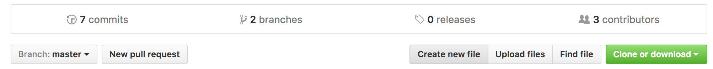
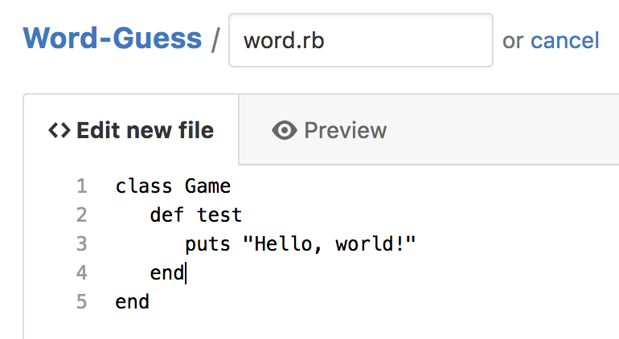
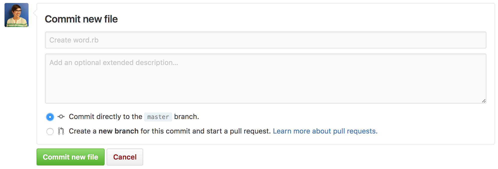
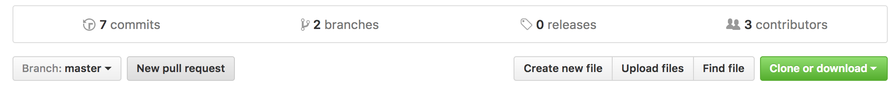
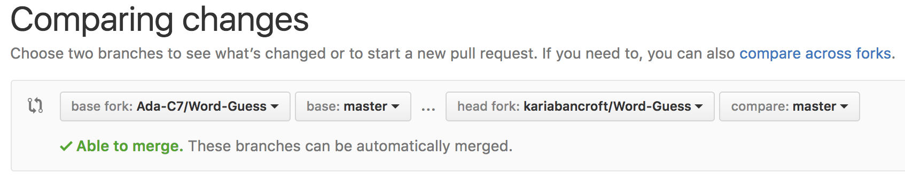
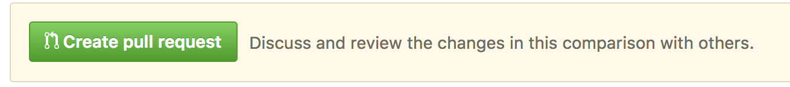
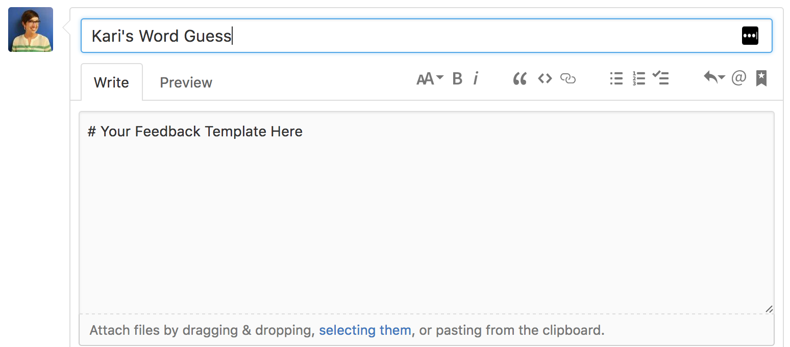
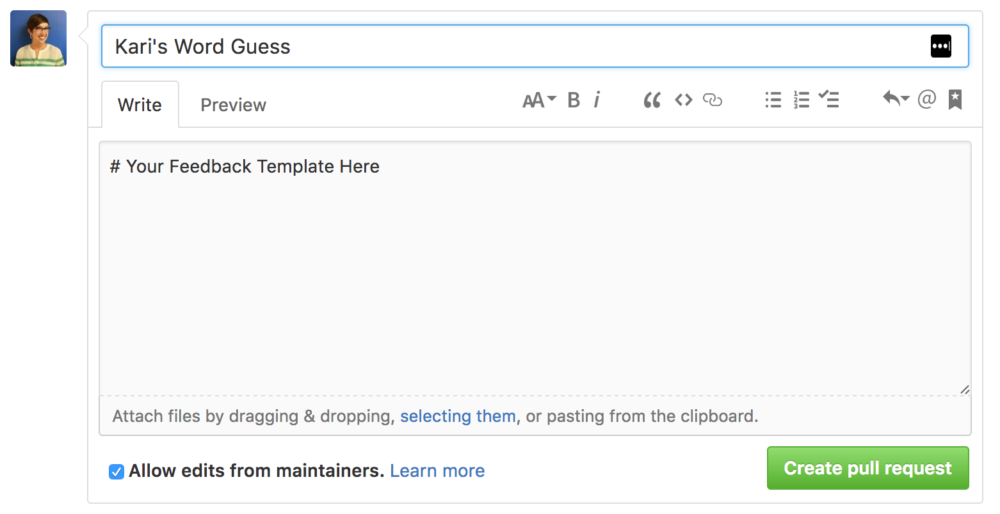

# Submitting Your Projects via GitHub

We utilize GitHub for all of our curriculum and project submissions. Before we learn how to use GitHub via the command line (terminal) we will need to be able to submit our projects using a process where we'll only use the web interface. Bookmark this page!

### Vocabulary
**Repository**: The term that GitHub uses for a collection of files that are all part of the same project. Every repository on GitHub is owned by an individual (e.g. [Hamled/dotnvim](https://github.com/Hamled/dotnvim)) or an organization (e.g. [github/hub](https://github.com/github/hub)).

**Fork**: A copy of the repository (right now, mostly just a `README` file) on your own personal GitHub account. For example [AdaGold/Word-Guess](https://github.com/AdaGold/Word-Guess) is the repository for the Word Guess project and [Hamled/Word-Guess](https://github.com/Hamled/Word-Guess) is Hamled's _fork_ of that repository.

**Pull Request**: For our immediate purpose, this is the step which your instructors will check for your submission. In practice in the general programming universe, this is where you submit your code to someone to review and then include in the overall project.

### Steps
These steps should be executed once you are **complete** with your assignment. There are ways to edit/modify the files, but it will be easier if you just do this last to prevent any confusion.

#### Add the file
1. Fork from the Ada-CX repository  
**Debugging Notes**: `AdaGold` _should definitely not_ be in the URL or header of GitHub  

1. Check: Are you on your fork?  

1. Create a new file  

1. Give it a name with a file extension

1. Paste in your code  

1. Commit the new file. (You may use all of the default settings here)

**Note**: This saves the file to your personal fork. Next step allows it to become visible to your instructors.

#### Create a Pull Request

1. Create a New Pull Request

1. Check: Is it all of the correct settings?
**Ada-C7** should be on the left under "base fork". Your user name should be on the right under "head fork".

1. Check: Is your file there?
If you scroll down you should see the contents of the file you pasted in _green_.

1. Create the Pull Request

1. Personalize your Pull Request header and description with feedback

1. **FINALLY** Create the Pull Request by pressing the green button!

