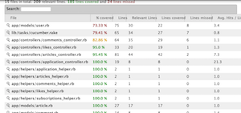
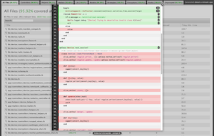
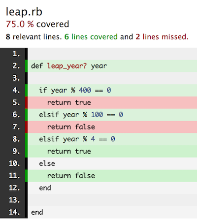

# Code Coverage Using SimpleCov

## Learning Goals

By the end of this lesson you should be able to:

-  Explain the concept of code coverage
-  Run SimpleCov along with your Minitest specs
-  Read and use a SimpleCov report

## Introduction

**Code coverage** is a term that is used to describe how much application code is executed when a particular test suite is run.  A test suite with a high percentage of coverage is likely to be testing more throughly and have fewer bugs.  A code coverage tool can partner with your testing suite to give you a report illustrating the coverage of your tests.  

## Enter SimpleCov

The [SimpleCov](https://github.com/colszowka/simplecov) gem is one such tool which allows you to get a report on the code coverage of your tests.  

To add SimpleCov to your test suite first run `gem install simplecov` in the terminal.  

Then in your spec file add the following lines **to the top** of the file.

```ruby
require 'simplecov'
SimpleCov.start
```


## Code Coverage Reports

SimpleCov places a report inside a directory helpfully named `coverage` which has an HTML page listing the code coverage.  







## Sample SimpleCov Run

Thinking back to Weekend Warrior, if we have this `leap_year?` method.

```ruby
def leap_year? year
  if year % 400 == 0
    return true
  elsif year % 100 == 0
    return false
  elsif year % 4 == 0
    return true
  else
    return false
  end
end
```

And this testing suite:

```ruby
require 'simplecov'
SimpleCov.start

require 'minitest/pride'
require 'minitest/autorun'


require_relative 'leap'

describe "Leap Year Test" do
  it "Test on 1996" do
    expect(leap_year?(1996)).must_equal true
  end

  it "Checking non leap year" do
    expect(leap_year?(1997)).wont_equal true
  end
end
```

We get the following:



Notice that it's telling us we're not testing two of the conditions.  


## So If I have 100% Coverage I'm Good Right?  No Bugs?

Ummm... no.  SimpleCov measures which statements were executed via your tests, not every combination of possible values.  It also can't guarantee your tests are 100 error free as well.  So, bugs can creep in.  However a good amount of code coverage does provide you with insights into your testing.  

It can:

-  Help identify code that may be unnecessary
-  Help identify "blind spots" in testing

So code coverage is a tool that's a useful indicator of the test quality, but having high code coverage doesn't guarantee that your testing is perfect.  It can be especially useful if you don't write tests first, as it can be easy to forget to test some functionality and code coverage reports can help you identify areas without testing.  

While it's not a pancea code coverage is helpful as one indicator of quality in your tests, just don't assume if you have high coverage you'll have perfect code.  

Some teams require a certain percentage of code coverage and it's likely you will encounter coverage requirements in your career.  


### Exercise

Add code coverage to your Robot Name Weekend-Warrior exercise.      


## Spec Helpers

You may have noticed that you have a lot of repeated require statements at the top of your spec files.

```ruby
# any_spec.rb
require 'minitest'
require 'minitest/autorun'
require 'minitest/reporters'
require 'minitest/pride'

require 'simplecov'
...
```

We can simplify this down a bit by creating a `specs/spec_helper.rb`.  So now all our requires are in the same place and simplecov is only needed in one file.  It also makes it easier to adjust how our output looks with minitest-reporters because we only have to change one file.  

```ruby
# specs/spec_helper.rb
require 'minitest'
require 'minitest/autorun'
require 'minitest/reporters'
require 'minitest/pride'

require 'simplecov'
SimpleCov.start

# Require any classes 
# ex require_relative 'lib/foo.rb'

Minitest::Reporters.use! Minitest::Reporters::SpecReporter.new
```

Now our spec files can simply `require_relative 'spec_helper'`!  That should DRY up our spec files a bit!


## Resources
- [SimpleCov Github Page](https://github.com/colszowka/simplecov)
- [SimpleCov: how to add it to your tool belt and (the 5) why(s)](http://www.mariusbutuc.com/simplecov-tool-for-coverage-analysis)
