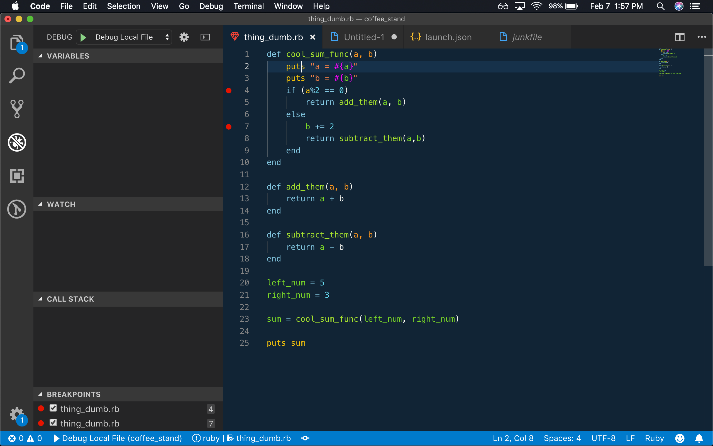
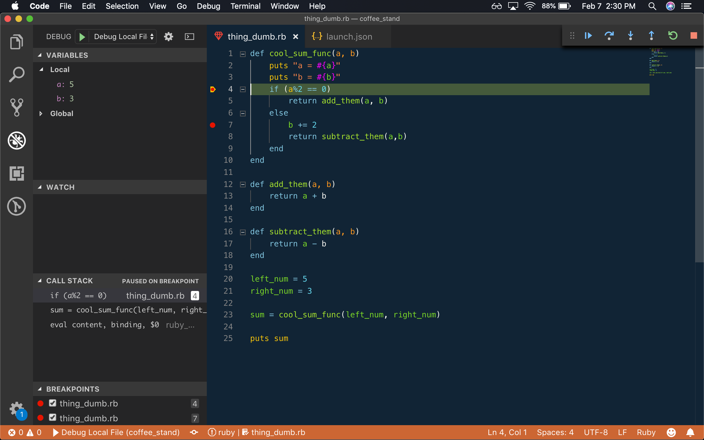
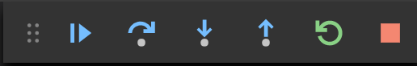
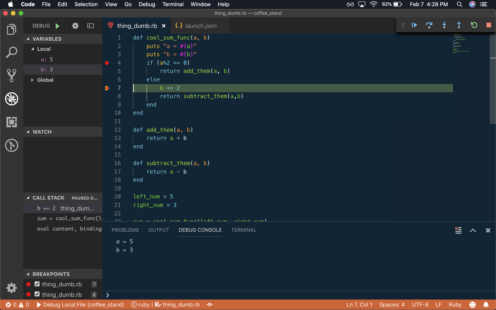
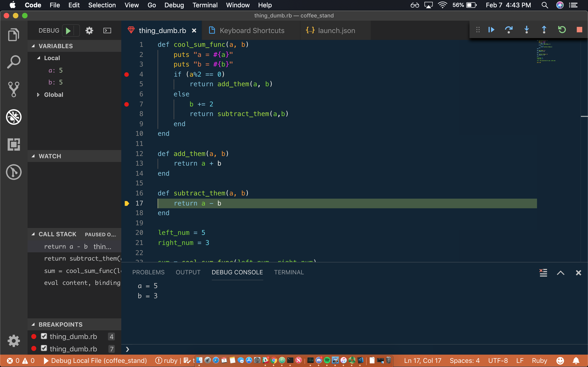

# Debugging in VS Code
## Learning Goals
- Know how to set up break points and use the step functions
- Understand what debugging is, why to do it, and how to do it

## Prerequisite
This lessons is written assuming all students have done the prework documented in [Setting Up the VSCode Debugger](setting-up-vs-code-debugger.md)

## Setting Up
The relationship between VS Code and Ruby is still in its infancy, so many of the tools that we regularly use in other languages (such as C++, Javascript or Ook) aren't immediately accessible. Our process will be:

1. Set up the file we want to debug
1. Make sure we have the proper gems on our machine
1. Configure our `launch.json` in our `.vscode` folder
1. Set our breakpoint
1. Debug our code

Copy and paste the following code into a new filed named `my_efficient_and_clever_program.rb`:

```ruby
# my_efficient_and_clever_program.rb

# definitely always sums the two numbers you give it.
def cool_sum_func(a, b)
  puts "a = #{a}"
  puts "b = #{b}"

  #completely necessary if-else
  if a % 2 == 0
    return add_them(a, b)
  else
    b += 2
    return subtract_them(a, b)
  end
end

#adds two numbers
def add_them(a, b)
  return a + b
end

#subtracts b from a
def subtract_them(a, b)
  return a - b
end


left_num = 5
right_num = 3

sum = cool_sum_func(left_num, right_num)

puts sum
```

This is some very dopey code, but it will show us a lot about how the debugger gives us information.

## Setting A Breakpoint 

Now that we have the debugger prepped, we need to add a `breakpoint`. Breakpoints are like stop-signs alongside your code; they aren't written into the text of the code itself, but they tell the program to halt before continuing to the next command.

We add them in VS Code by clicking on a line number that we want to stop on. In our current file, lines 4 and 7 are potentially interesting to us. Click to the left of the line number, or get the cursor to the line and use `f9` to add the breakpoint. When you've finished, you should see 2 red circles near the code, and the text next to the green play button should read "Debug Local File", see below:



## Running the Debugger

With all that done, it's time to see this tool in action. Click the green play button, or use `f5` to start the debugger. Your screen may look something like this:



There are a few things to highlight here. Firstly, the code has paused on the highlighted line (line 4). The breakpoint has stopped the code here before it finished executing.

Next, the left hand side of our window has been filled with various useful information. The top pane stores all sorts of useful information about variables that are accessible in the current scope. 

The watch window is useful, but for now we will ignore it.

Below the watch window is the Call Stack. The call stack shows every method we had to call in order to get here (especially useful if you have a function that is called in more than one place). 

Finally the lower left of the pane shows us a list of all the breakpoints we have set. If we want to skip one of them, we can click its checkbox in order to ignore it for the time being.

In the top right of our screen, we see a new drop-down tray:



From Left to Right, here's what they do, and a hotkey to do them without clicking:

- Move this UI element by clicking-and-dragging (No Keyboard Shortcut)
- Continue the program until the next breakpoint, AKA `Continue`. `f5` 
- "Step" to the next line of code on the same 'level', AKA `Step Over`. `f10`
- "Step" into a method called on the current line or a loop initiated on the current line. If there are multiple possible functions, it will step into the one that is evaluated first. AKA `Step Into`. `f11`
- "Step" out of the current function or loop. Any code that hasn't yet been run in the function will finish, and you are returned to the line where the function was called. AKA `Step Out` `⇧f11`
- Restart the debugging from the beginning, AKA `Restart`. (No Keyboard Shortcut)
- Stop the current program without finishing. `⇧f5`

_NOTE:_ you may have issues with these default settings, as the people at Microsoft writing VS Code are doing so on -surprise, surprise- Windows machines! If you need to change these hotkeys, use `⌘K ⌘S` to open up your hotkey settings.

Let's run through these tools to help us debug our current program.

## Using the Debugger

As above, we should see a screen that looks something like this:


As we can see, the fourth line is highlighted. This is the "active line" of code that we are _about to run_. If we want to run it, we can either perform some sort of `Step`, or we can `Continue` to the next breakpoint (or the end of the program, whichever comes first). While we are here, we can hover our cursor over any variables in the line to see their current value. This information is also available in the Variables pane on the left. For now, let's `Continue` to the next breakpoint.



As you can see, we skipped ahead to the next line that had a breakpoint. if we check the value of `b` here, we can see that it is still 3. Let's try `Stepping Over`, using the third button from the left or by using `f10`.

<details>
    <summary>
    Question: What changed?
    </summary>
    We can see that the value of `b` is now 5. This only happened once we moved to the next line. In other words, the code on each line is only executed when we Step Over the line.
</details>

Okay, so we have stepped forward, and we've seen a change right before our eyes. Let's see what happens when we `Step Into` another method.



`Step Into` is great when we call a lot of functions in our code. As long as you have the source file for the function being called, you should be able to look at the code that is being executed. **NOTE:** If more than one function is being called on the same line, debuggers `Step Into` functions in the order that they are called, from inner-most to outer-most. Usually, this means that if you are interested in the outer most nested function, you will either need to step in and out of the line several times, or set a breakpoint inside the function that you actually care about.

At this point, we would use the information we gathered during our debugging to fix the code, or, if the problem didn't arise, we might try again with new parameters.

## Why do I care about this?
Great! So now we understand how to start experimenting with the VS Code debugger. Why do we even want to do that? 

Using a debugger is the go-to tool for most Software Engineers when they want to identify a bug or when they simply want to clarify their understanding of how the program runs. Any time you find yourself wondering why a program isn't doing what you expect, make use of the VS Code debugger to help you answer that question as you step through the code line-by-line.

## Wrapping Up

Hopefully at this point you feel comfortable enough with VS Code's debugger that you could set it up on your own machine and make use of it the next time you run into issues. 

We encourage you to take some time experimenting with it and getting comfortable with how each debugger button works before you ever even run into a bug.

Remember:

1. Set Up Your Code
1. Configure the Debugger
1. Set Breakpoints
1. Step Through Your Code 

A more complete debugging json:

[Grab me for debugging spec files](source/sample_launch.json)