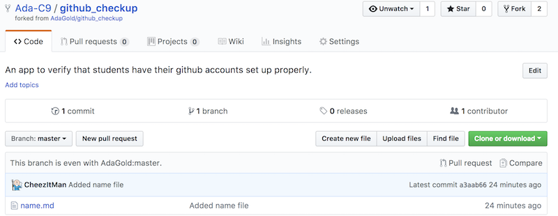
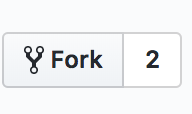
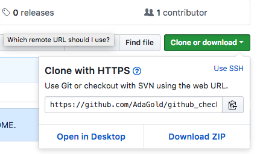
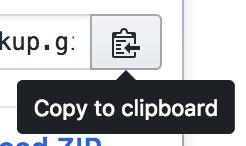
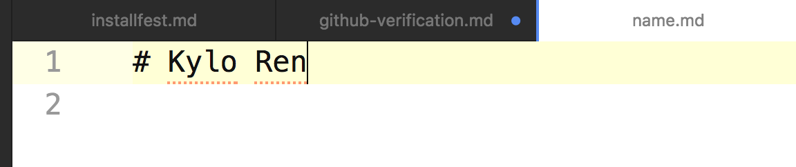
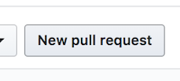
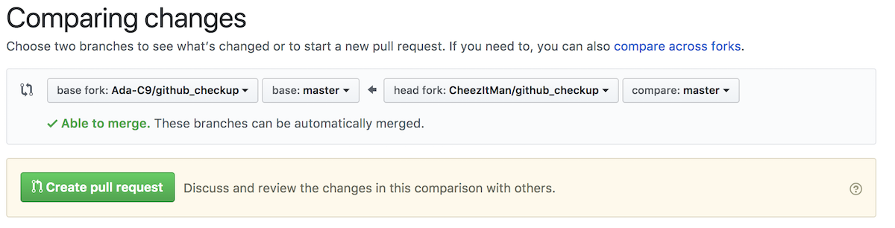
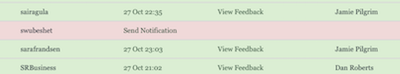

# Verify Your Github Account

## Overview

We want to verify that we have the right github name for you and that your git and the Github website communicate properly.  There are some brief commands explained, but we will get into those commands in depth later, just follow along.

## 1.  Find The Sample Repository

Go to [the sample repository](https://github.com/Ada-C9/github_checkup).



## 2.  Then Click On The `Fork` Button



This will make a copy of the repository onto your github account.  

## 3.  Copy the Clone Link

Next you need to get a link to connect git and github.  To get it Click on the Clone or Download Button and select.  Make sure you have the **https** link.



Then click on the clipboard to copy the link.



Now you have a link to use cloning the repository.

## 4.  Clone The Repository

Next we will copy the contents of the repository to your computer with the commands in terminal.  **Replace PASTEURLHERE** with the link you just copied.  

```bash
$  git clone PASTEURLHERE
```

This will create a folder on your computer named `github_checkup`

## 5.  Then Enter The Folder

Next change into the folder

```bash
$ cd github_checkup
```

## 6.  Next Edit The File With Atom

Now we will edit `name.md` and put your name in the file.

```bash
$  atom name.md
```

Put your name in the file.



## 7.  Then Tell Git To Track And Save The Changes To Github

These commands tell Git to track the changes you just made to the file, and push those changes up to the website.

```bash
$  git add name.md
$  git commit -m "I put my name in"
$  git push origin master
```
## 8.  Next Make a Pull Request

Then click on **New Pull Request** on your fork of the repository.



You should see a summary of your changes to the file.

Lastly Click on **Create Pull Request**



Then check with your instructor, the request should register and they should be able to verify that you have.

You should see your name highlighted in **yellow** on the instructor's screen.  They may need to refresh their browser.



## What if it doesn't work!!!

First, don't panic!


Go back through the [installfest](../installfest.md) instructions for git and make sure the email address and username match what's in the profile of your github account.  

You can also grab help from an instructor or classmate.
