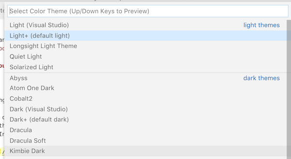

# Get to Know Your Friendly Text Editor

Most of our time coding will be spent in a text editor. When we are more familiar with our tools, we should get the following benefits:

- save time, so we're not spending so much time figuring out where a button is or how to do something with our text, cursor, or mouse manually
- give us comfort and a familiar home
- have confidence and power to adjust our workflow when we learn that something should change and be better
- give us the ability to focus on the other programming tasks at hand

## VS Code

We will use the text editor VS Code at Ada in the classroom portion. [VS Code](https://code.visualstudio.com/) is a text editor built by Microsoft. We've chosen to use VS Code specifically because:

- it supports features that are important to us (language support, debugging tools that we will use in the future, and more)
- it is lightweight (it has the right number of features)
- it has plenty of support and documentation should we ever need help
- it's customizable, allowing us to be flexible in case something changes
- it's free!

### There are a lot of other editors.

And every person you ask will have a favorite with a very personal list of reasons why their choice is right. Take these with a grain of salt. Use what makes the most sense to you. It's likely you'll change editors every couple of years anyway.  The most important thing is that the editor works for you and meshes with your workflow.

### Adoption at Ada

Beginning in C11, the Ada Developers Academy classroom portion is converting from using the text editor [Atom](https://atom.io/) to the text editor [VS Code](https://code.visualstudio.com/).

Please note that if there are any mentions of `Atom` or the command `atom .`, that the document is outdated. With a few exceptions, you should be able to think of them interchangeably.

## Installing the `code` command to open VS Code

It will be powerful for us to master the flow of going from our Terminal to going to our text editor, and back.

Let's say that we're in Terminal, and we're in a project directory that has files for our project, such as `assignment.rb`. We want to open that folder that contains `assignment.rb` in VS Code. VS Code lets us open files by using the `File > Open` menu in the top left corner of our laptop, or `⌘O` as a shortcut, but we have an even better way: using the command line command.

First, we need to install this command. Below is the instructions copied/pasted from [the official VS Code documentation on how to do it](https://code.visualstudio.com/docs/setup/mac):

1. Launch VS Code.
1. Open the Command Palette (⇧⌘P) and type 'shell command' to find the **Shell Command: Install 'code' command in PATH** command.
1. Restart the terminal for the new `$PATH` value to take effect. You'll be able to type '`code .`' in any folder to start editing files in that folder.

To "restart the terminal," you can just quit (or `⌘Q`) the terminal application, and then reopen it.

Now, you can navigate back to your cool folder that has `assignment.rb` in the Terminal, and then use the command `code .` to use the `code` command and give it the parameter of the current directory (`.`)!

## More About VS Code

### Themes

Themes change the way your editor looks. You can configure, install, remove themes to suit your liking.

To quickly open the list of your installed themes, use `⌘K ⌘T`. This lets you switch themes on the fly. Try out a few themes, and if none of them are to your liking,  you can scroll to the bottom of the list and click on 'Install Additional Color Themes'.

This list includes things beyond just basic themes (such as icon styling), but most of them do provide screenshots so you can see what they look like. Once you click the green install button, you should be able to find them through `⌘K ⌘T`.

Being able to switch themes quickly is useful to us, as the screen settings that are comfortable for our eyes when we are working aren't necessarily the same ones that we want for using on the projector.

### Extensions

One of the most powerful parts of VS Code is the ability to install custom extensions. These can add features as weird and varied as:

- Linters (spellchecker for code)
- Autocomplete for common patterns
- A tool to let you pick colors
- Adding fireworks to your code

We'll add some of these as they become relevant. Feel free to look some up if they interest you, but for now just know that they exist.

## Awesome Keyboard Shortcuts

Shortcut | Effect
---      | ---
`⌘⇧P` or `F1`   | Open the _Command Palette_ to execute commands in the editor
`⌘P`     | Search files, open in a new tab
`⌘C` (nothing highlighted)    | Copy the current line
`⌥up` & `⌥down` | Move the active line up or down
`⌘D`     | Select the next instance of the highlighted string
`⌘/`     | Comment out the current line
`⇧⌘E` | Show Explorer
`⇧⌘D` | Show Debug
`⌘B`  | Hide Sidebar Elements
`⌘K V`  | Toggle Zen Mode (just the editor)
**`⇧⌥F`**   | **Auto Fix Your Indentation**
`⌘K`  `V`  | Open Markdown Preview
`⌘⇧K`    | Delete the current line
`⌘⌥up` & `⌘⌥down` | add a cursor in the same position on the line above/below. Press `esc` to get back to a single cursor. This does interfere with Spectacle.

Remember that normal macOS keyboard shortcuts will work here too!

Shortcut | Effect
---      | ---
`⌥left` & `⌥right` | Jump left or right by one word
`⌘left` & `⌘right` | Jump to the beginning or the end of the current line
`⌘up` & `⌘down` | Jump to the top or the bottom of the document
`⌘⇧[` & `⌘⇧]` | Switch tabs left or right
`⌘,`     | Open the settings page
`⌘w`     | Close the current tab
`⌘⇧w`    | Close the current window (all tabs)

## Adding Custom Extensions

Sometimes the functionality that ships with VS Code doesn't quite get us where we want. In that case, we can rely on the developer community that supports VS Code to make tools that fill in the gaps where Microsoft hasn't gone yet.

Currently, the our Auto-Indent functionality doesn't know how to indent Ruby, so we need to fix that.

1. Use `⌘⇧X` to open the extensions bar.
1. Search for RuFo (ruby formatter). The result we are looking for has about 14k downloads.
1. Install the extension using the green install button.
1. Open your terminal and download the rufo gem using `gem install rufo`
1. Once both have finished installing, you should have the option to reload your current VS Code window. From that point on, formatting should be as easy as `⇧⌥F`!!

Automatic indentation isn't just to make code look good, it's also a powerful tool that allows your human eyes to find problems like a forgotten `end` statement. Use it regularly, and please don't turn in assignments with sloppy indentation!

### Mandatory Plugins

Below are plugins we at Ada feel are very important to programming productively in Ruby & Javascript with VS Code.  

| Plugin Name  |  Plugin Description  |
|---|---|
| [Ruby](https://marketplace.visualstudio.com/items?itemName=rebornix.Ruby)  | Visual Studio Code Ruby Extension  |
| [erb](https://marketplace.visualstudio.com/items?itemName=CraigMaslowski.erb)  | A syntax highlighting plugin useful with Rails ERB files.  |
| [Eslint](https://marketplace.visualstudio.com/items?itemName=dbaeumer.vscode-eslint)  | Syntax highlighting and style guide for JavaScript  |
| [Markdown Preview Github Styling](https://marketplace.visualstudio.com/items?itemName=bierner.markdown-preview-github-styles) | A plugin to help you write markdown and preview how it will appear on Github. |
| [HTML CSS Support](https://marketplace.visualstudio.com/items?itemName=ecmel.vscode-html-css) | A handy plugin to help with syntax highlighting for HTML and CSS documents

### Optional Plugins

Below are plugins we at Ada feel can be very helpful using VS Code, but are not essential.  

| Plugin Name  |  Plugin Description  |
|---|---|
| [Spell Right](https://marketplace.visualstudio.com/items?itemName=ban.spellright)  | Multilingual, Offline and Lightweight Spellchecker for Visual Studio Code  |
| [Material Icon Theme](https://marketplace.visualstudio.com/items?itemName=PKief.material-icon-theme) | Places an icon next to each file indicating what type of file they are.
| [Bracket Pair Colorizer](https://marketplace.visualstudio.com/items?itemName=CoenraadS.bracket-pair-colorizer-2)  | A plugin which will help you identifying matching brackets with colors.  |
| [Git Lens](https://marketplace.visualstudio.com/items?itemName=eamodio.gitlens)  | A way to visualize code authorship at a glance via git and VS Code  |
| [NPM Intellisense](https://marketplace.visualstudio.com/items?itemName=christian-kohler.npm-intellisense) | A handy plugin which will help autocomplete JavaScript npm modules as you code. |
| [Auto Close Tag](https://marketplace.visualstudio.com/items?itemName=formulahendry.auto-close-tag) | A plugin to automatically close HTML tags.

## Resources
  - [Egghead.io Video on VS Code](https://egghead.io/lessons/egghead-vs-code-for-javascript-with-burke-holland)
<!-- -  [Atom & Sublime Compared](https://www.codementor.io/mattgoldspink/best-text-editor-atom-sublime-vim-visual-studio-code-du10872i7) -->
Some decent text editors:
  <!-- - [Microsoft's Visual Studio Code](https://code.visualstudio.com/) -->
  - [Sublime Text](https://www.sublimetext.com/)
  - [Atom](https://atom.io/)
<!-- -  [Youtube video on 10 Essential Atom Packages](https://www.youtube.com/watch?v=aiXNKHKWlmY) -->
