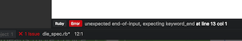

# Get to Know Your Friendly Text Editor

## Atom
[Atom](https://atom.io/) is a powerful new text editor created by Github. It's build using node.js and other web technologies.

## Sublime Text
[Sublime Text](https://www.sublimetext.com/) is another text editor you can use.  Unlike Atom it's not free, you can use it without paying, but it will provide you with reminders about payment.  

## There are lots of other editors.
And every person you ask is gonna have a favorite with a very, very personal list of reasons why their choice is right. Take these with a grain of salt. Use what makes the most sense to you. It's likely you'll change editors every couple of years anyway.  The most important thing is that the editor works for you and meshes with your workflow.  

## More About Atom
### Packages
We can install add-ons in Atom through it's internal package manager.

1. Open the preferences pane from the app menu `Atom > Preferences...` (or press `⌘,`).
2. Click on the `Packages` tab in the left menu. This will show you the packages that are installed by default.
3. Click on the '+Install' tab in the left menu. Search and install the following packages:
    - Autoclose HTML
    - Color Picker
    - Linter
    - Linter jshint
    - Linter ruby
    - Linter CSSlint
    - Atom Zurb Foundation
    - Sublime Style Column Selection  
    

#### Term:  Linter

*  A Linter is a name for a program that flags suspicious code that are probably errors.  You'll see the error message at the bottom of your text editor like this:




### Themes
Themes change the way your editor looks, similar to packages
enter the `Preference` and click on the `Themes` tab, browse, and install.

### Customizing Themes
There are many ways to customize Atom, but most simple is to edit the stylesheet

- Open the Command Pallet (`⌘⇧p`) and type "open your stylesheet", and press enter.
- Try writing some CSS (don't worry we'll learn it in the future):

```css
.editor {
  background-color: red;
}
```

Press `⌘s` to save and you should see the change instantly!

You can select any part of the application to manipulate with CSS.
To browse the CSS selectors for the app open the debug console with `⌘⌥i`

## More About Sublime Text
Sublime Text is a bit more complicated to customize. Fortunately, many of the packages folks just installed for Atom are built into Sublime by default.

### Packages
There's a pretty awesome package manager for Sublime called [Package Control](https://packagecontrol.io/installation). It's not fun to install, but otherwise it's a pleasure to use.

1. After installing Package Control, open the _Command Palette_ with `⌘⇧p`. Type in the box to filter the available options.
2. Start typing _install_ and the list will filter to `Package Control: Install Packages`. Pressing enter will prompt Package Control to update it's list of available packages and present them as another filtering list.
3. Type the name of the package you'd like to install and press enter. Here's a few worth having:
    - GitGutter (will be handy later)
    - rspec
    - sass
    - colorsublime
4. Enjoy your new package.

### Themes
Themeing Sublime can get kinda painful, but the _colorsublime_ package really makes it a lot easier. Check our the list of available themes on their [website](http://colorsublime.com/). When you find one you like (I'm partial to _Afterglow_), you can install it by opening the _Command Pallete_ and typing/selecting _Colorsublime: Install Theme_. That'll update the list of available themes, then present you a list to choose from. Scroll through the list for magic.

## Awesome Keyboard Shortcuts
These work for both Sublime Text and Atom.

- `⌘⇧p`: Open the _Command Palette_ to execute commands in the editor
- `⌘t`: Search files, open in a new tab
- `⌘w`: Close the current tab
- `⌘⇧w`: Close the current window (all tabs)
- `⌘l`: Select the current line
- `⌘⇧d`: Copy the current line
- `⌃⇧k`: Delete the current line
- `⌘^up` & `⌘^down`: Move the active line up or down
- `⌘d`: Select the next instance of the highlighted string
- `⌃⇧up` & `⌃⇧down`: add a cursor in the same position on the line above/below. Press `esc` to get back to a single cursor.

## Resources
-  [Atom & Sublime Compared](https://www.codementor.io/mattgoldspink/best-text-editor-atom-sublime-vim-visual-studio-code-du10872i7)
-  [Youtube video on top-5 Atom packages](https://www.youtube.com/watch?v=DmKNDxlNLoE)
