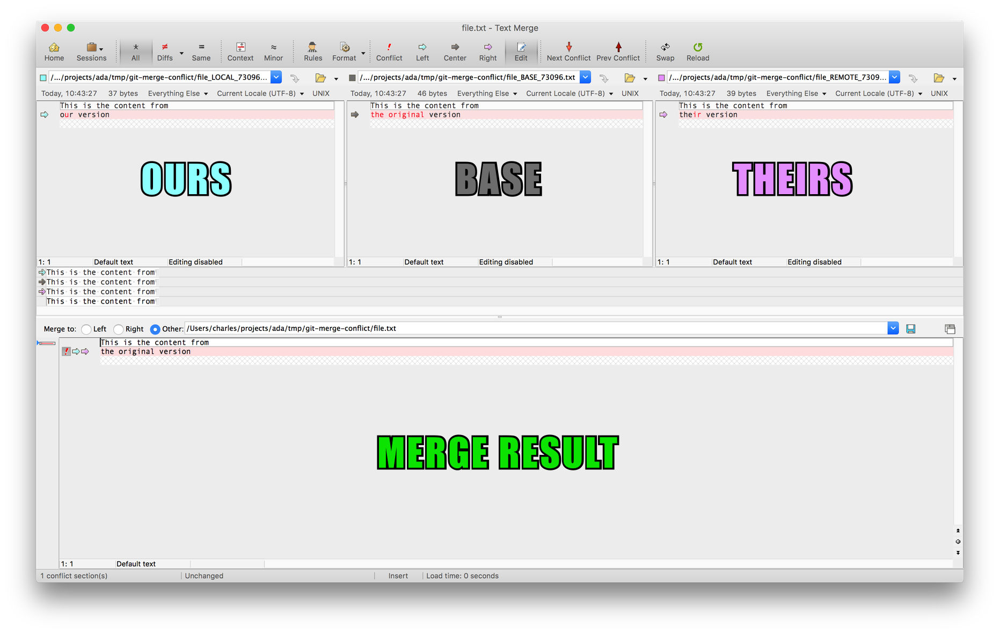

# More About Merge Conflicts
## Learning Goals
After reading through this document and participating in the associated activity you should be able to:
- Identify a few techniques for avoiding merge conflicts
- Name the three versions of the code that are involved in any merge conflict
- Understand how Git uses conflict markers to call out conflicted sections of a file and present different versions of the code
- Resolve merge conflicts by choosing one version of the code to use or creating a synthesis of multiple versions
- Safely exit out of any merge conflict resolution without committing to any changes

## Overview
Merge conflicts are a natural part of any version control mechanism that allows independent modification of files (as Git does). Becoming comfortable with merge conflict situations is therefor a valuable skill for developers to build.

Below we lay out some strategies for dealing with merge conflicts, both by avoiding them and by resolving them when they're unavoidable.

## Dealing with merge conflicts
### Avoiding them
The simplest way to deal with a merge conflict is to not get into one in the first place! This sounds flippant perhaps, but there are a number of techniques you can use to proactively avoid conflicts and we encourage you to use them as much as possible. In fact, they're the same suggestions we've been making about Git since it was first introduced:

- **Make small commits**: Smaller commits are easier for Git to automatically merge. Even when it's not possible to automatically merge a change in, if the change is small it'll be easier to figure out the appropriate resolution.
- **Push often**: When you share your latest commits with the rest of your team it does open up the potential for a merge conflict on their end. Paradoxically though, if you push those commits more often it reduces the likelihood that they will actually encounter a conflict. The reason for that is in the next suggestion...
- **Pull often**: Consider this scenario: you have been working all day to refactor the `cool_stuff` method, but when you go to push it you find that in the mean time someone updated it to do five more things and renamed it to `extra_cool_stuff`. Certainly Sandy Metz would have a lot to say about those changes, but in the present moment you're faced with an unfortunate reality -- your refactor is no longer relevant to the code as it now exists.

  Fundamentally a merge conflict is a result of you or another team member working on an outdated version of the code. However if your team is following the above suggestions and pushing their changes frequently, and you're pulling from GitHub frequently, the window during which you're working on an outdated version of the code shrinks.
  
  Even though pulling might trigger a merge conflict that you need to resolve it's better to deal with it sooner rather than later. It's very rare that a conflict becomes smaller and easier to resolve just by waiting.

### Resolving conflicts
So what do you do when there's a conflict that cannot be avoided? One approach is to back out one or the other set of changes entirely, however that is rarely the correct choice. Instead, most of the time you must manually resolve the conflict by examining the **three versions of the code** that exist in any merge and choosing the appropriate synthesis of them all.

#### Three versions of the code
As mentioned above there are three versions of code involved in any merge. Consequently, when resolving a merge conflict it is useful to examine them all to get a complete understanding of how the code has changed over time and split into different timelines. The three versions of the code are:

- **Base**: This is the original version of the code, which both your version and the other person's version modified.
- **Theirs (aka Remote)**: This is the version of the code that the other person (or GitHub) currently has. It may be the result of multiple commits made ontop of the **base** version.
- **Ours (aka Local)**: This is the version of the code that you have created. It may be the result of multiple commits made ontop of the **base** version.

There are dedicated tools for manually resolving conflicts which are generally known as _three-way merge tools_. They are a bit like simplified text editors with specialized view layouts for displaying all three versions. Here's an example of merging a file with one such tool, [Beyond Compare](http://www.scootersoftware.com/):


#### Resolving conflicts in Git
Git's built-in approach for manually resolving conflicts does not require any specialized software, because it directly inserts _conflict markers_ into the conflicted file(s). By default however, it uses a two-way merge setup which shows only the **ours** and **theirs** versions. The simplest way to look at the **base** version is to go onto GitHub and look at a commit in the [repository's commit history](https://help.github.com/articles/differences-between-commit-views/).

Here is the same file being merged, but with Git's conflict markers and the two versions it shows by default:

```
This is the content from
<<<<<<< HEAD
our version
=======
their version
>>>>>>> c157db99220f47abfcb63547bfb8765ba571e19d
```

The conflict markers are the lines that start with `<<<<<<<`, `=======`, or `>>>>>>>`. All of the lines between the left-pointing brackets and the equals signs are the **ours** version, and all of the lines between the equals signs and the right-facing brackets are the **theirs** version.

When manually resolving a merge conflict you need to figure out which version of each _conflict section_ should be used, or create a new version that mixes the two together. Determining which of these options to go with requires understanding the context of the code being changed, and the intention behind each of the changes. If you are unsure of how to resolve a conflict you should **discuss the situation with your teammate who made the other change**.

Once you've determined what you need for the new, merged version of the code you should adjust the file to have exactly that code. **IMPORTANT**: You must also remove the conflict marker lines, as Git will not do so for you.

#### If things go sideways
It's possible that you'll encounter a merge conflict that your whole team is unsure about how to resolve. Maybe you're encountering a conflict against outdated code and doing `git pull` would make the conflict resolution much simpler. Or possibly in the process of resolving the conflict manually you've accidentally deleted a bunch of the file and can't undo it.

In those cases Git provides you with a simple, effective escape hatch:
```bash
$ git merge --abort
```

This command will reset any changes made by Git or by you as part of a merge conflict. Everything will be put back exactly as it was before you ran the command that started the merge (generally either `git pull` or `git merge`).

## Additional Resources
- The makers of the [Tower](https://www.git-tower.com/) GUI Git client have an e-book on Git which [covers merge conflicts](https://www.git-tower.com/learn/git/ebook/en/command-line/advanced-topics/merge-conflicts)
- Git Immersion has two labs on merge conflicts: [creating them](http://gitimmersion.com/lab_29.html) and [resolving them](http://gitimmersion.com/lab_30.html)
- The [Pro Git](https://git-scm.com/book/en/v2) book features both a [basic guide](https://git-scm.com/book/en/v2/Git-Branching-Basic-Branching-and-Merging#_basic_merge_conflicts) and an incredibly thorough [advanced guide](https://git-scm.com/book/en/v2/Git-Tools-Advanced-Merging) to merge conflict resolution
