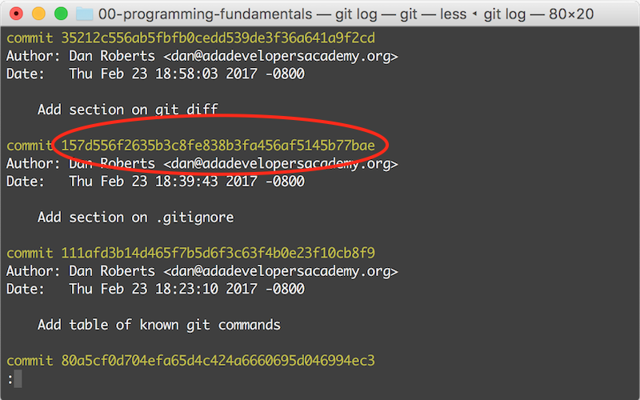

# Using Git to Collaborate

So far we've used git to track our changes and mirror them to GitHub. However, some of git's most useful features revolve around collaborating with other people and working on projects together. In this lecture we will set up our environment for collaboration via git, and learn about a couple of these powerful tools.

## Learning Goals
By the end of this lesson, students should be able to...

- Instruct git to _ignore_ certain files
- Use the `git show` and `git diff` commands to review changes
- _Pull_ down someone else's changes to a git repository from GitHub
- Resolve simple _merge conflicts_

## Preliminaries

### Changing Your Default Editor

Many git commands will drop you into an editor. We've seen this with `git commit` - without the `-m "<commit message>"` option, it opens up your shell's editor to compose a commit message. By default this editor is Vim, which isn't very helpful to us since Vim requires a whole bunch of specialized knowledge to use.

So far we've been able to work around this, but as we introduce more complicated git workflows having a functional editor is a must. So let's change our shell's default editor! Run the following command in your terminal:

```bash
$ git config --global core.editor "atom --wait"
```

Now, whenever git wants to drop you into an editor, it will open a new window of Atom instead of using Vim. Let's test it out now. Create and `cd` into an empty git repository to play with, create and `git add` a file, and `git commit` without the `-m` flag.

```bash
$ cd ~/Ada/classwork/
$ mkdir git-sandbox
$ cd git-sandbox/
$ git init
$ touch git-atom-test.txt
$ git add git-atom-test.txt
$ git commit
```

Git will wait for you to save the file and close the window, and then use whatever you wrote as the commit message. If you close the window without saving, git will assume you've changed your mind and abort the commit. Pretty slick!

### The `.gitignore` File

Git is a pretty useful tool, but every once in a while there's a file you don't want it to track. Maybe it's a big file that is generated automatically (like a log file), or maybe it's full of sensitive data that you don't want on GitHub (this will be important when we get to Rails). Fortunately git has a solution to this problem.

First, let's create a file we don't want git to know about. Assuming you're still in the `git-sandbox` repository from before

```bash
$ touch secret-secrets.txt
```

If you run `git status`, you should see the file marked as `untracked`. This is a good start, but we want git to ignore it entirely. To do so, we'll create a file called `.gitignore`. Note the leading `.`, which marks this as a hidden file, meaning it won't show up in Finder or in the results of `ls` without the `-a` option. Git looks for this file in the project root, and anything listed there will be completely ignored. Create the file at the project root

```bash
$ touch .gitignore
```

And add the following lines to it

```gitignore
# Don't push secrets to GitHub!
secret-secrets.txt
```

And then add the `.gitignore` file to git, like you would any other file

```bash
$ git add .gitignore
$ git commit -m "Add .gitingore file, ignore secret-secrets.txt"
```

Now if you run `git status`, you shouldn't see your secrets file at all. Perfect!

## Reviewing Changes

Often when you're working with git, it's useful to see what's changed since your last commit, or what a previous commit looked like. To do so we'll use the `git diff` and `git show` commands.

### Viewing Uncommitted Work

The `git diff` command is used to view uncommitted changes. Since a diff can be quite large, `git diff` will drop you into a pager, just like `man` or `git log`. Remember, use the arrow keys to scroll up and down, `/` to search, and `q` to quit.

There are two different versions of `git diff`. The first, with no options, shows _unstaged_ changes (changes that haven't been `git add`ed). Let's see it in action

```bash
$ touch file.txt
$ atom file.txt # Make and save some changes
$ git diff
```

You should see all the changes you've made, organized by file. Lines you've added will have a plus in front of them and appear in green, while lines you've removed will be prefixed with a minus and appear in red. Git counts any change to a line as a removing the old line and adding the new one, even if you only changed a single character.

If you `git add` the file, you'll notice that `git diff` no longer displays any changes. That's where the second version of `git diff` comes in. With the `--staged` flag, git will display all staged (`git add`ed) changes. Other than that, the output format will be the same.

```bash
$ git add file.txt
$ git diff          # Displays no changes
$ git diff --staged # Displays expected changes
```

Both versions of `git diff` are particularly useful when you're writing a commit message, and trying to remember what the heck you just did.

### Viewing Commits

The `git show` command displays an existing commit. Its output is very similar to `git diff`, except that the commit message is shown on top.

With no arguments, `git show` displays the most recent commit

```bash
$ git commit -m "Added file.txt to test out git diff"
$ git show
```

`git show` can display a commit other than the most recent one, but it takes a little work. We'll need to copy the **commit hash**, that long string of numbers and letters, that corresponds to our commit. You can find the commit hash using `git log`. Go ahead and copy it to your clipboard.



Note that your commit hash will look different than the one in the image. To show that commit use `git show <paste-commit-hash-here>`

```bash
$ git show 157d556f2635b3c8fe838b3fa456af5145b77bae
```

## Collaborating with Git

We've talked about using `git push` to send local changes to GitHub, but when using git to collaborate with others it's likely that you'll end up in the opposite situation, where there are changes on GitHub you don't have locally. Git provides the `git pull` command to handle this.

To demonstrate `git pull`, we've provided a repository to work with. Follow these instructions to get started:

1. Find a partner
1. **One** partner should fork [this repository](https://github.com/Ada-C8/git-pull-activity).
1. Whoever forked the repo should add the other partner as a collaborator.
1. **Both** partners should clone the forked repo.
1. **Both** partners should open `pull_practice.rb` in Atom.

### Pulling Changes From GitHub

Look at `Task 1` in the `pull_practice.rb`.

1. **Partner 1** should uncomment the `duck_noise` method and save the file.
1. **Partner 1** should then `git add` the file, `git commit`, and `git push`. You should now be able to see the changes on GitHub.
1. **Partner 2** should run `git pull`. This will retrieve all commits from GitHub that aren't yet on the local repository.
1. You should now be able to see the `duck_noise` method uncommented in partner 2's copy of the repo.

Switch roles and do the same thing for `Task 2`, the `truck_noise` method.

Running `git pull` when you don't have any changes is also known as performing a _fast-forward merge_.

### Merging Changes

What happens if both partners have made changes? Turns out git is pretty intelligent about putting together work from different sources. Most of the time, even if you're working in the same file, it can figure out the right thing to do.

Turn your attention to `Task 3` in the activity. Here are your instructions:

1. **Partner 1** should uncomment the `robot_noise` method and save the file.
1. **Partner 1** should then `git add` the file, `git commit`, and `git push`. You should now be able to see the changes on GitHub.
1. **Without pulling**, **Partner 2** should now uncomment the `train_noise` method and save the file.
1. **Partner 2** should then `git add` the file and `git commit`.
1. If **Partner 2** tries to `git push`, they should see an error message something like this:

    ```
    $ git push
    To https://github.com/droberts-ada/git-pull-activity.git
     ! [rejected]        master -> master (non-fast-forward)
    error: failed to push some refs to 'https://github.com/droberts-ada/git-pull-activity.git'
    hint: Updates were rejected because a pushed branch tip is behind its remote
    hint: counterpart. Check out this branch and integrate the remote changes
    hint: (e.g. 'git pull ...') before pushing again.
    hint: See the 'Note about fast-forwards' in 'git push --help' for details.
    ```

    Git won't let you push if there are changes on the server that you don't have locally. This is a good thing! It reduces the chance of something going wrong.
1. **Partner 2** should now `git pull`. These two changes should be compatible, but git will still need to do some work to put them together. Like any other piece of work, the merge needs to have a commit, so git will open up Atom to ask you for a commit message. The default is fine, so save and close Atom. This will allow the pull to finish.
1. After doing a merge, it's always wise to check git's work. **Partner 2** should open up the file and verify that the two commits were merged cleanly. Both methods should be uncommented. In the real world, you would run your tests and make sure nothing broke.
1. **Partner 2** is now free to push their work to GitHub.

### Merge Conflicts

As clever as Git may be, sometimes there's not an obvious right way to merge two changes. This situation is called a _merge conflict_. In this case the only way forward is for a human to do the merge by hand.

`Task 4` demonstrates a merge conflict. Instructions are as follows:

1. **Partner 1:** Change the `clock_noise` method to `puts "tick"`, save, add, commit and push.
1. **Partner 2:** **Before pulling**, change `clock_noise` to `puts "tock"`, and save, add and commit.
1. **Partner 2:** Try to push. As before, git should warn you that your local copy is out of date.
1. **Partner 2:** Now run `git pull`. Git should tell you that there's a merge conflict! It has also modified `pull_practice.rb` to tell you what the conflict is. The `clock_noise` method should now read as follows:

    ```ruby
    def clock_noise
    <<<<<<< HEAD
      puts "tock"
    =======
      puts "tick"
    >>>>>>> master
    end
    ```

    Git has included both versions of the method, and labeled where they came from. `HEAD` is the local copy, and `master` is the version from GitHub.
1. **Partner 2:** Work with your partner to resolve the conflict.
    - Using Atom, pick which of the versions you want to use, and remove all the extra stuff that GitHub added. The end result should be valid ruby code.

      ```ruby
      def clock_noise
        puts "tick tock"
      end
      ```

    - Use `git add pull_practice.rb` to mark the conflict as resolved.
    - Use `git commit` to finish the merge.
1. **Partner 2:** Is now free to push their work to GitHub.

This one was simple, but in the real world merge conflicts can get _really_ hairy. But as weird as it can be, without git collaboration would be a thousand times more difficult. We'll talk more about resolving merge conflicts in another lecture.

## Git Commands

Here's a handy table of all the git commands we've learned so far.

| Command             | Description |
|---------------------|-------------|
| `git init`          | Initialize an empty git repository
| `git clone <URI>`   | Initialize a git repository from the GitHub repository at the URI
| `git remote -v`     | See where you cloned this repository from
| `git status`        | See the current state of a git repo
| `git diff`          | Show unstaged changes
| `git add <file>`    | Stage (mark as ready to commit) a file
| `git diff --staged` | Show staged changes
| `git commit`        | Commit all staged files. Will drop into an editor unless the `-m <message>` option is provided.
| `git log`           | See a summary of all previous commits
| `git show`          | Show the most recent commit
| `git show <hash>`   | Show the commit with that hash
| `git pull`          | Pull down all new commits from GitHub
| `git push`          | Push all local commits to GitHub

## What Did We Accomplish?

- Change our shell's default editor to Atom
- Tell git to ignore files using the `.gitignore` file
- View uncommitted work using `git diff`
- View previous commits using `git show`
- Pull down changes from GitHub using `git pull`
- Resolve a simple merge conflict

## Additional Resources

- [Git Tower on reading diffs](https://www.git-tower.com/learn/git/ebook/en/command-line/advanced-topics/diffs)
- [Git documentation on pull](https://git-scm.com/docs/git-pull)
