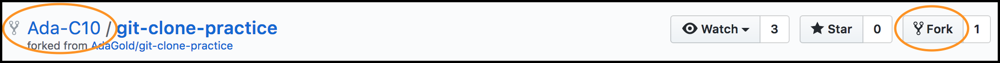
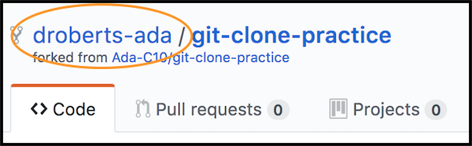
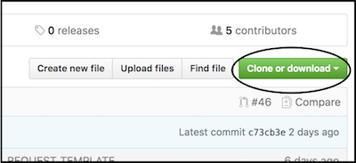
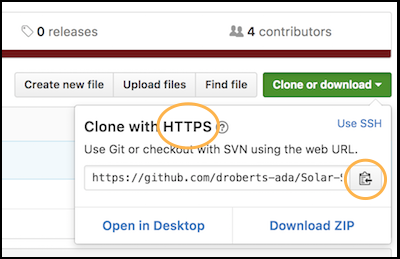
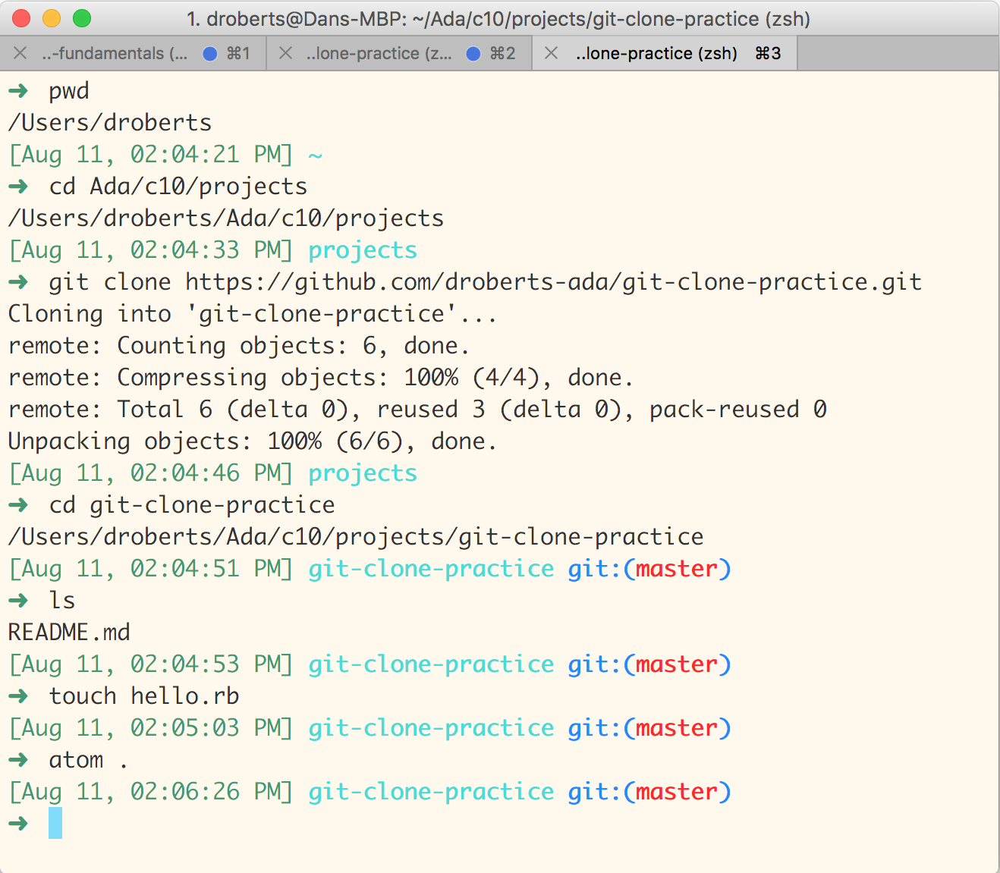

# Intro to Git
## Learning Goals
- Learn the What, Why, and How of Version Control
- Make a local copy of a repository by _cloning_ it
- Track changes to files with Git
- Document our change in with a good commit message

## Introduction

This lesson consists of three sections.

- First we'll go over some high level concepts and vocabulary
- Second we'll see how to copy files from GitHub to our computer by _cloning_ a repository
- Third we'll use git to track the changes we make to our local copy of the repository

### Version Control
Git is a "distributed version control" system:

- **Distributed**: used in opposition to Centralized. This means that there is no single "correct" computer for the source code to exist upon. Each person who uses or writes the code will have their own copy of the code and its history.
- **Version**: This refers to the idea that source code files change over time. When you save a file, that is a single version of the file. When you add a new line of code and save it again, that is a new version of the file.
- **Control**: The Git system is used to control or manage the process of creating new Versions of source code files, and the process of distributing those versions to other people.

### But Why???
_Version Control_ is used in software development because we have multiple people working together to build a single project, and we need to coordinate that process of working together to ensure it is reliable and efficient. While most of our work until now has been individual, it's important to recognize that the "multiple people" in the above statement may also refer to you and yourself *in the future*.

As an analogy, it might help to consider the case of a group of artists working on a gigantic mural. To ensure that the overall design and intention of the mural is achieved, the artists must coordinate amongst themselves to avoid painting over each others' work. A similar dynamic exists for multiple programmers working on a set of files for a programming project.

## Cloning a GitHub Repository

_Cloning_ in git means making a copy of a repository on your personal computer. This is the procedure you'll follow at the beginning of almost every project you work on. To practice, we'll be using the `git-clone-practice` repository. You should find a link to your cohort's version of this repo in the calendar.

1. Fork the repository under your own GitHub account
    
    - This is the same as what we've done previously when submitting homework
    - Make sure you're forking from the `Ada-CX` version, _not_ from `AdaGold`
1. Check the address bar and repo title, and verify you're now on your fork
  
1. In the middle left, just above the list of files, click the green `Clone or Download` button
  
1. In the popup box, make sure it says `Clone with HTTPS`, and the URI starts with `https://`. If it doesn't, click the blue `Use HTTPS` link to change it. Copy the address (or click the `Copy to clipboard` button).
  
1. Open a terminal, and navigate to your `projects` folder
1. _Clone_ your fork of the repository to your computer using the `git clone` command:
    ```
    $ git clone <paste the URI here>
    ```
1. The `git clone` command should have created a directory with the same name as the repo. `cd` into it.
    - Git has automatically downloaded all the files associated with the project into this folder, including the README and any starter code we've supplied.
1. Proceed to work on your project
  

## Tracking Changes with Git

Now that we've used git to download a repository, our next step is to use it to track the changes we make as we work. This image presents a high-level overview of how git works.
[](https://git-scm.com/book/en/v2/Getting-Started-Git-Basics)

On the far right is the `.git` directory. This is an actual directory in the repo - you can see it with `ls -a`. Git stores all the information about the history of this repo in this directory. Most of the time you don't need to worry about how that works.

"Working Directory" on the far left refers to the files in the repo as they currently are on your computer. As you make changes with Atom, your files will get further and further away from what's in the history.

Taking the changes we've made and adding them to git's history is what we're about to discuss. This is a two-step process: first you _stage_ the changes, and then you _commit_ them to the history. Let's see how it works in action.

### Adding a new file

We've cloned the repository and have all the starting files on our computer. Our next step is to create a file where we can work on the project. You could create this file through Atom, but we'll use the `touch` command.

```bash
$ touch hello.rb
```

##### Status

Let's see what git thinks about this by using the `git status` command. This command makes git tell us what is going on in the repository we're currently in. Quite useful!

```bash
$ git status
On branch master
Your branch is up to date with 'origin/master'.

Untracked files:
  (use "git add <file>..." to include in what will be committed)

	hello.rb

nothing added to commit but untracked files present (use "git add" to track)
```

Look, there's our file! Git is telling us that it's _untracked_, which means git can see it but isn't paying any attention to it yet. This is the default state for all new files.

Git thinks of adding a new file as a change that is made to the repository. In order to record this change in git we'll need to go through two steps:
- _Stage_ the change
- _Commit_ the change

##### Stage

To make git pay attention to our new file we must _stage_ it with the command `git add <filename>`. Once we've run the command, we'll run `git status` again to see what's changed.

```bash
$ git add hello.rb
$ git status
On branch master
Your branch is up to date with 'origin/master'.

Changes to be committed:
  (use "git reset HEAD <file>..." to unstage)

	new file:   hello.rb

```

Our file isn't "untracked" any more. Instead git has identified it as a "new file", and listed it under "Changes to be committed".

As we'll see later, we can use the same `git add` command to stage old files that have been modified since the last time we committed.

##### Commit

Here we see that Git is telling us we have a pending change to the repository -- adding a new file named `first-file.txt`. However, that change is not yet part of the repository! We can affirm to Git that we really want to do make this change by using `commit`:

```bash
$  git commit -m "Add empty file hello.rb"
[master 8d52d53] Add empty file hello.rb
 1 file changed, 0 insertions(+), 0 deletions(-)
 create mode 100644 hello.rb
```

__Note:__ Your computer may say something different for the `e88b5ce` part.

The reason we used the `-m "Add empty file hello.rb"` option for the `git commit` command is because Git is a real stickler about documenting all of your changes!

When you `commit` a change, Git requires that you explain yourself. This is highly important, as it will help other people (and your future self!) understand what changes you made without having to read the complete details.

Let's run `git status` again to see what's changed.

```bash
$ git status
On branch master
Your branch is ahead of 'origin/master' by 1 commit.
  (use "git push" to publish your local commits)

nothing to commit, working tree clean
```

Git tells us that there are no outstanding changes. It also tells us that we're ahead of something called `origin/master` by one commit. What might this mean?

### Viewing your History in Git
Now that we've committed a change to Git we can take a look at the history of our repository, which shows all of the changes that have been committed, in reverse chronological order:

##### Log

```bash
$ git log
commit 8d52d53672e175f1ea3f33d3a09b51cb1a0a0f60 (HEAD -> master)
Author: Ada Student <ada@adadevelopersacademy.org>
Date:   Sat Aug 11 14:25:05 2018 -0700

    Add empty file hello.rb

commit b8caea083a450f1db24d972cebc0b8c7e51634a9 (origin/master, origin/HEAD)
Author: Dan Roberts <dan@adadevelopersacademy.org>
Date:   Sat Aug 11 13:49:08 2018 -0700

    Make a small project readme

commit 750c0713558575cde54f4c3641d06fd96b5172bb
Author: Dan Roberts <dan@adadevelopersacademy.org>
Date:   Sat Aug 11 13:46:05 2018 -0700

    Initial commit
```

At the top we can see the commit we just made, where we added a new file. Below that is the full history of this repository, including all the work that's been done in the past. You can see the work that one of the instructors did setting up this project.

### Changing an Existing File
So far, we've created a commit by adding a new file. What happens if we change a file instead? Open up the file in Atom and write the ruby code needed to complete the "project":

```ruby
# hello.rb
puts "Hello World!"
```

Make sure to save it!

Now we'll use the git commands we learned earlier to _stage_ and _commit_ this change.

```bash
$ git status
On branch master
Your branch is ahead of 'origin/master' by 1 commit.
  (use "git push" to publish your local commits)

Changes not staged for commit:
  (use "git add <file>..." to update what will be committed)
  (use "git checkout -- <file>..." to discard changes in working directory)

	modified:   hello.rb

no changes added to commit (use "git add" and/or "git commit -a")
$ git add hello.rb
$ git status
On branch master
Your branch is ahead of 'origin/master' by 1 commit.
  (use "git push" to publish your local commits)

Changes to be committed:
  (use "git reset HEAD <file>..." to unstage)

	modified:   hello.rb

$ git commit -m "Print hello world when the program is run"
[master 625d46e] Print hello world when the program is run
 1 file changed, 2 insertions(+)
$ git status
On branch master
Your branch is ahead of 'origin/master' by 2 commits.
  (use "git push" to publish your local commits)

nothing to commit, working tree clean
```

This process looks pretty similar to the previous one in which we added `second-file.txt`. The only important differences are where Git is telling us about the change that we're making:
- `modified:   hello.rb`
- `1 file changed, 2 insertions(+)`

With these two lines Git is showing us first what file we have modified in our pending change, before we commit it. And second (after we commit it), what the actual modification to that file was -- we added two new lines (the comment and the `puts` statement).

If we were to run `git log` again, we would see our new commit at the top of the list.

## Commit Early, Commit Often
Commits, ideally, should be _atomic_. That is, any single commit should include changes that encompass a single idea. This is a habit that must be built. It's easy to "get in the zone" while programming and, before, you know it, you've got fifty changes in ten files and you're not sure how you ended up there. Making _commits_ is fast and provides you a history of how you got from there to here. Here's some good examples of when to _commit_:

- you finish a new feature
- you write code that necessitates two or more lines of comments to explain
- you make a change to one file that necessitates a change in another
- you change the _method signature_ of a method that's already in Git

## Resources
- [More in-depth article on Git](https://codeburst.io/git-good-part-a-e0d826286a2a)
