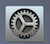
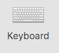
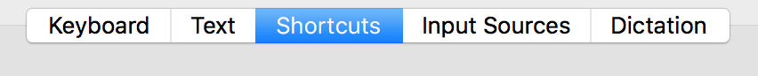
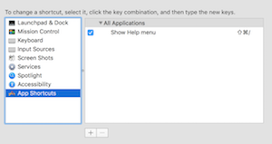

# How to OS X: An Ode to Keyboard Shortcuts

The mouse is slow, especially on a laptop. There are *tons* of hotkeys, tricks, and techniques, to make your usage fast and efficient entirely from the keyboard. You will certainly learn many of these during your career, we'll start by learning just a few.  

## Learning Goals
By the end of this you should:
*  Be able to explain the important modifier keys such as control, shift, command, option on the OSX keyboard.
*  Use the keyboard alone to close windows, quit applications, switch applications and switch tabs within a browser.
*  Be able to page up & down, jump the cursor to the beginning and end of a line of text, cut, paste, copy, delete, undo, redo, find & replace using keyboard shortcuts.  
*  Remember that you **can** create your own keyboard shortcuts.  
*  Have this page bookmarked for reference :)

## Overview

* [Learning the Menu Symbols](#learning-the-menu-symbols)
* [Common Hotkeys that will save your life!](#common-hotkeys-that-will-save-your-life)
	* [Text Editing Keyboard Combos](#text-editing-keyboard-combinations)
	* [System Navigation Keyboard Combinations](#system-navigation)
* [A Word About Mice](#a-word-about-mice)
* [Taking Screenshots](taking-screenshots)
* [Creating Your Own Shortcuts](#custom-shortcuts)

## Learning the Menu Symbols

Whenever you open a menu, it will use these symbols to show you which keyboard shortcuts you can use to run the menu option at hand. It can be quite helpful to make a set of flashcards to remember these. I thought they were really _weird_ at first, and flashcards were a quick and easy method for me to test whether I'd learned the symbols correctly.

Button | Mac Symbol | How To Remember It
-------|:----------:|------------------
Command | ⌘ | Ah, here's where I left those four robots I can command to open menus / do other computer stuff for me.
Option | ⌥ | Sliding down a bookcase lined with options & picking the first one that looks good.
Control | ⌃ | The magic button I need to press to gain control of a robot.
Shift | ⇧ | Hey, you short lowercase letter, come up here!
Caps Lock | ⇪ | And stay up! Here's a box to help. You can stand on it. :)

^<a href="#overview">top</a>

## Common Hotkeys that will save your life

### Text Editing Keyboard Combinations

Below are a series of keyboard shortcuts that will help you in a text-editor writing code.

Hot Key Combo | Mac Symbols | What It Does
--------|:----------:|------------------
Command-s  | `⌘s` | Save code in the text editor!  **Do this a lot!**
Command-c  | `⌘c` | Copy the text currently highlighted (ctrl-c in windows).
Command-x  | `⌘x` | Remove the text highlighted and save it in the clipboard.
Command-v  | `⌘v` | Paste last copied content from clipboard.  
Command-z  | `⌘z` | Undo the last action (repeat to undo multiple things).
Command-shift-z | `⌘⇧z` | Redo the last undo.
Command-a  | `⌘a` | Select everything in the window.
Command-l  | `⌘l`| Select the current line.
Command-Arrow | `⌘<directional arrow>` | Move the cursor to the maximum point in the given direction.  
Option-left-or-right-arrow | `⌥<left or right arrow` | Move the cursor one word in either direction
Shift-Arrow | `⇧<cursor movement command>` | Highlight from the start and end of the cursor

### System Navigation

These keyboard shortcuts work with a variety of applications to let you navigate within an application or between applications.  

Hot Key Combo | Mac Symbols | What it does
--------|:----------:|------------------
Command-w | `⌘w`     | Close the Current tab.
Command-shift-w | `⌘⇧w`     | Close the Current window (all the tabs).
Command-q | `⌘q`     | Quit the application (`⌘⇧w` keeps the application running).
Command-tab | `⌘⇥`   | Switch between applications.  Continue to hold the `⌘` button to display all open programs each tap on `⇥` will switch to the next app.  You can use `⌘⇧⇥` to switch to the previous app.
Command-backtick | ⌘ backtick | Switch between windows in the same application.  
Command-Space | `⌘␣` | Turn on spotlight.  Spotlight lets you search applications, files and do basic functions like math & conversions.
Command-Shift-leftbracket | `⌘⇧[` | Move one tab to the left.
Command-Shift-rightbracket | `⌘⇧]` | Move one tab to the right.
Command-Shift-t | `⌘⇧t` | open the last closed item.
Command-f  | `⌘f`  | Find.  Opens a panel to search for a term.
Command-shift-f | `⌘⇧f` | Find all.  Searches all files (text editors like Atom & Sublime only).
Command-n | `⌘n` | Opens a new window (or file depending on the application).
Command-t | `⌘t` | Opens a new tab in a browser
Command-r | `⌘r` | Reloads the page in a browser
Command-comma | `⌘,` | Opens an app's preferences page.
Command-/ | `⌘/` | Make either the current line or a selection of text a comment (Sublime or Atom only)
Control-Command-f | `^⌘f` | Fullscreen

## A Word About Mice

Steve Jobs had a [weird thing](http://www.cultofmac.com/269222/steve-jobs-hated-idea-multi-button-mouse-designer-claims/) about single-button mice.  Trust me, it's bizarre.  Over time Apple's added 2-button mouse functionality to MacOS, mostly to open rarely accessed sub-menus, and you'll be surprised how little you actually use it, if you think about it at all.  You can make a right click on your laptop trackpad by either by clicking and holding the control (⌃) key down, or pressing with two fingers on the trackpad.  Or... you can just plug in a regular PC mouse and it'll work fine.  

## Split Screen
When you write code on a laptop, it is often important to be able to see documentation and code side-by-side. The latest version of Mac OS allows you to do this without any additional apps. Apps like [Spectacle](https://www.spectacleapp.com/) will give you even more control over this, if desired.

1. Click and hold on the green maximize icon in the upper left corner of an app until it responds (by shrinking)

2. Drag the window to one side of your screen

3. Choose the second app from your open apps to display on the other side of the screen

There are a number of other ways to accomplish this same behavior, so be sure to play around with this. **It will be necessary**, so if it's challenging now, just keep practicing!

## Taking Screenshots

Screenshots on a Mac are very cool. By default, they save a file to the desktop. If you add Control (⌃) to the shortcut, the screenshot will be copied to the clipboard instead.

Behavior / PC Key | Mac Keyboard Shortcut | In Symbols!
------------------|-----------------------|------------
Print Screen (full screen, saved to desktop) | Command + Shift + 3 | ⌘⇧3 (⌘#)
Print Screen (full screen, copied to clipboard) | Control + Command + Shift + 3 | ⌃⌘⇧3 (⌃⌘#)
Print Screen (select area, saved to desktop) | Command + Shift + 4 | ⌘⇧4 (⌘$)
Print Screen (select area, copied to clipboard) | Control + Command + Shift + 4 | ⌃⌘⇧4 (⌃⌘$)
Print Screen (application window, PC: Alt + Print Screen) | Command + Shift + 4, Space-bar, Click on Window | ⌘⇧4 (⌘$), {Space}, Click on Window

## Custom Shortcuts

You can add custom shortcuts by going to System Preferences and Selecting Keyboard.

Then select the shortcuts tab.

Then select the **App Shortcuts** and use the `+` sign to add a shortcut.  You will need to give it a name & use the keyboard shortcut in the little box provided.  You can create shortcuts for a particular app or all apps in general.  If two conflicting shortcuts exist MacOS will use the one for the more specific application.  So if there's a general shortcut and one for Chrome, Mac will use the Chrome specific shortcut for that app.

---
## Source of much of this material
*  [Jeri's Guide to Going from PC to Mac](https://gist.github.com/drvonnjerryxlii/9898254abef2d184c659)
