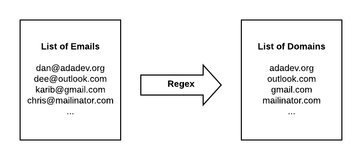
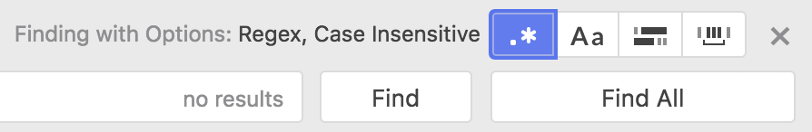

# Introduction to Regular Expressions
## Learning Goals
Be able to answer the following questions:  
- What is a regular expression?
- How can I write a regular expression to match on a specific pattern?
- How can I use regular expressions to speed up my development workflow?

## Introduction  

Regular expressions are a great tool for working with text. Using regular expressions (AKA Regex) you can **identify and process patterns** of text. Many people find regular expressions difficult to understand and use, but they can make a variety of tasks much easier, like validating that a phone number or zip code is in the right format.

You will likely only use a limited number of expressions during your time at Ada, but understanding Regex can simplify your code, and Regex is useful across multiple languages.

## Regular Expression Basics

Like `String` and `Integer`, a regular expression is a data type in Ruby, defining a pattern of characters.  

You can form a Regex variable like this:

```ruby
pattern = /ada/
```

`/ada/` is a RegEx literal representing a pattern matching any String with the letters "ada" inside it.  The two forward slashes indicate a regular expression, or a pattern of text.   Anything put between the slashes forms the pattern of text we can match strings against.  

You can think of it like a String, but instead of specifying a specific list of characters by enclosing  them with quotes (""), instead it defines a **pattern** of characters by enclosing  them with forward slashes.

You can test a String against the regular expression with the Regex's `match` method.  The `match` method compares the string to the pattern, character-by-character and will return a `MatchData` object upon a match and `nil` if the String does not match the pattern.  It's important to note that `match` will return a `MatchData` object if any substring matches the pattern, not necessarily the entire String.

For example:

```ruby
pattern = /ada/
if pattern.match("ada lovelace")
  puts "The String has ada in it!"
else
  puts "It doesn't match"
end
```
The above snippet will print out "The String has ada in it!"  

Regular Expressions can also be compared using the `=~` operator.  The `=~` operator returns the index of the first match in the string  For example:  `pattern =~ 'ada'` will return 0, while `pattern =~ "learn at ada academy."` will return 9.

Both `match` and `=~` will return a truthy result if any substring matches the pattern.  That's an important issue to remember.  If you want to match a pattern exactly, the regular expression needs to be more specific using special characters to indicate the start and end of the string.  

On the other hand what if you wanted to match either "Ada" or "ada."  To handle both lower and upper case "Ada," we need to provide our pattern options to match against.  To provide a list of possible characters we can use Character sets.

## Character Sets

A **character set**, also called a **character class** is a way to tell the regex engine to match only one out of several characters.  We define a character set with square brackets.  For example `/[Ss]/` will match both capital and lowercase S.  Combining the character set with the previous larger literal, `[Aa]da` will match both "Ada" and "ada".  

You can also adjust the character set to accept a range of characters.  For example:  `/[A-Z]/`  will accept a single character in the range A to Z (must be capitalized), while `/[0-9]/` will accept a single digit.  If you wanted to accept any alphabetic characters you could use `/[A-Za-z]/`.

![/[A-Aa-z]/](images/regex1.png)

### Practice

How could you match any alphanumeric digit like "a", "W", or "0"?

[Check your answer here](solutions/regex.md#Character%20Sets)

## The Wildcard and Quantifiers

Sometimes you will want to accept any character.  For that purpose you can use the _wildcard_ character, a period (`.`).

Another common need is for characters that are optional or can repeat. For this there are several helpful symbols called _quantifiers_: `*`, `+` and `?`.

These characters are summarized in the following table.

Character | Meaning            | Example
---       | ---                | ---
`.`       | Any one character  | `/a.a/` matches `ada`, `ava`, and `a!a`
`*`       | Preceding token may occur **zero** or more times | `/ad*a/` matches `aa`, `ada`, and `adddda`<br><br>`/[0-9]*/` matches `1`, `345`, and the empty string<br><br>`.*` matches any string
`+`       | Preceding token may occur **one** or more times. | `/ad+a/` matches `ada` and `adddda` but **not** `aa`<br><br>`/[0-9]+/` matches `1` and `345` but **not** the empty string<br><br>`.+` matches any string **except for** the empty string
`?`       | Preceding token is optional (may occur zero or one times) | `/ad?a/` matches `aa` and `ada`<br><br>`/[0-9]/` matches `2` and the empty string but not `27` or `356`<br><br>`.?` matches any one character or the empty string

### Practice

Write a regular expression to match a valid email of form `name@domain.tld`
- Matches `dee@adadev.org`, `adalovelace@gmail.com`, `magictavern@puppies.supplies`
- Rejects `dan@adadev.`, `charles.com`, `@adadev.org`, `sarah@.org`
- Use `\.` for a literal period (more on this later)

[Check your answer here](solutions/regex.md#Wildcards%20and%20Quantifiers)

## The NOT `^` Character

Sometimes you want to exclude a certain group of characters, or sometimes it's easier to exclude a type of character rather than list all the valid possibilities.  In that case you need the `^` character and the square brackets.  

For example:  `/[^abc]/` excludes a, b and c.

Another example would be `/[^0-9]/` which would exclude any digit or `/Ada is number [^2-9^a-z^A-Z^0]` which would exclude any letter or digit, except `1`.

### Practice

How can you write a regex which would accept `dog`, `sog`, and `hog`, but exclude `bog`?

[Check your answer here](solutions/regex.md#Not)

## Escape characters

There are lots of characters that have special meanings in a Regex (such as the `+` or `*` characters).  Just like Strings you can use the backslash character to select the exact character in the text.  It can also be used as a shortcut for common classes of characters.

Some examples include:

| Escape Character |  |  
| --- | --- |
| `\n`  |  newline character |
| `\s`  |  Any whitespace character (space, tab, newline) |
| `\S`  |  Any non-whitespace character |
| `\d`  |  Any digit |
| `\D`  |  Any non-digit |
| `\.`, `\+`, `\*`, etc.  | The literal character following the backslash, for example `\\` searches the String for a backslash, while `\.` looks for a period.  |

Practical Example:

-  If we wanted a Regex to validate a US phone number in the format (ddd) ddd-dddd.
  -  `/\(\d\d\d\) \d\d\d\-\d\d\d\d/`


  - This regular expression takes 3 digits inside parentheses followed by a space, then three digits a dash and then 4 digits.  We will see how to simplify this a bit later.

### Practice

Write a regex for any amount of US currency, for example it should match `$3.25`, `$102.73`, and `$0.25`.

[Check your answer here](solutions/regex.md#Escape%20Characters)

## Start and End of a String

By default a regex will match a string if any part of the string matches. Sometimes you want your regex to be at the very beginning or very end of a string, or to match the whole string with nothing left over. In this case you can use the special characters `^` and `$`.

`^`, when placed at the beginning of a regex, will match the beginning of the string. If the string has characters before the match begins, it's not a match
- `/^ada/` matches `ada` and `ada end` but not `start ada`

`$`, when placed at the end of a regex, will match the end of the regex. If there are characters in the string after the match ends, it's not a match.
- `/ada$/` matches `ada` and `start ada` but not `ada end`

It is common to combine `^` and `$` in order to match an entire string.

### Practice

Write a regex that will match only strings without any leading whitespace.
- `"ada"`, `"ada academy"` and `"ada "` all match
- `"  ada"`, `"  ada "` and `" "` do not match

[Check your answer here](solutions/regex.md#Start%20and%20End)

## Repetitions

The `*` and `+` characters allow a token to be repeated, but often, such as for a zip code, you will want to limit a token to a specific number of repetitions.  For that you can use the curly braces (`{}`).  A number placed in the curly braces will indicate how many times the preceding token can be repeated.  So for example `/[abc]{3}/` will allow the letters `a`, `b` or `c` to be repeated three times, so `"aaa"` would match, as would `"abc"` and `"cab"`.

A range of repetitions can also be repeated by using two parameters in the curly braces.  For example `/[abc]{3, 5}/` would allow the characters to repeat between 3 and 5 times.

An example using repetitions in our phone number example would include:  `/\(\d{3}\) \d{3}\-\d{4}/`

If you want to match a token a variable number of times you can place a comma inside the `{ }`. So `/a{2, 3}/` would match 2 to 3 `"a"`'s.

## Capture Groups

A _capture group_ is a group of characters that we want to treat as a unit. Any quantifiers apply to the whole group, instead of individual characters.

We construct capture groups using parentheses.  For example `/(ada *)+/` would match one or more `"ada"` strings separated by 0 or more spaces.  So `"ada ada"`, `"ada"`, and `"ada ada   ada"` would all match. However, you need to have the full `ada` in order to match, so `adada` does _not_ match.

Another example: `/a(ab)*a/` would match the strings:  `"aaba"`, `"aa"`, `"aababa"` because it requires an `"a"` followed by zero or more `"ab"` blocks and ending with an `"a"`.


### Practice

Write a regular expression for these patterns:

1. An IP address like 127.0.0.1, or 206.190.36.45, Only worry about the numbers being a max of 3 digits.
1. "Ada", "Ada Academy" or "Ada Developers Academy", but not "Ada Developers" by itself. Should be case-insensitive (so both "Ada" and "ada" are OK).
    - Note that capture groups can be nested

[Check your answer here](solutions/regex.md#Capture%20Groups)

## Search and Replace

### In Ruby

So far we've only used regex to check whether a string matches a pattern. While this is certainly useful, regex can also be used to transform strings. To do so, we will _capture_ part of the string using a capture group, and then use the captured data to create a new string.

Let's use our email regex from a previous example to illustrate. We might imagine an application where we need to know all the different domains (like `adadev.org` in `dan@adadev.org`) where users have addresses.


<!-- https://www.lucidchart.com/documents/edit/c08de5b5-36a9-47bd-a702-326196e81c5e/0?driveId=1Wzk-dUvh8MxvkyQKRQeEiGLa8TG5mSCJ -->

First we write a regex that will match an email and _capture_ the data we want:

```ruby
email_regex = /.+@(.+\..+)/
match_result = "dan@adadev.org".match(email_regex)
```

We have two ways to get access to the capture groups. The first is to index into the value returned by `.match`:

```ruby
puts match_result[1]
# => adadev.org
```

Note that capture groups start at index 1. For historical reasons index 0 stores the part of the string that matched the pattern.

Your other option is to use the special variables named `$1`, `$2`, etc. We'll see this technique used when we talk about using regex with Atom below.

Now that we've got access to the captured data, we can make use of it. Here is a slightly more complex version of the same program:

```ruby
emails = ['dan@adadev.org', 'dee@adadev.org', 'karib@gmail.com']
email_regex = /.*@(.*\..*)/

# Create a new hash where missing values are initialized to 0
domain_counts = Hash.new(0)

emails.each do |email|
  match_result = email.match(email_regex)
  next unless match_result # skip strings that don't match
  domain = match_result[1]
  domain_counts[domain] += 1
end

domain_counts.each do |domain, count|
  puts "#{domain}: #{count}"
end
```

#### Practice
Imagine that you have a long list of phone numbers typed by users, like the following:

```ruby
phone_numbers = [
  "(206) 555-1234",
  "425-555-9999",
  "406.555.1818",
  "+1 206 555 8888",
  "4255558872",
]
```

These phone numbers are formatted very differently: some have the `+1` country code, some have parentheses around the area code, some have dots instead of dashes, etc. Our job is to write some Ruby code to normalize these numbers, so that they all look like `(206) 555-1234`.

**Questions:**
- What regex will you need to match all these numbers?
- What characters will you need to capture? How many groups do you need?
- How will you use the captured data to fill in the final string?

[Check your answer here](solutions/regex.md#Phone%20Numbers)

### Search and Replace in Atom

One of the most common ways to use regex search and replace is through your text editor. Here are a few examples of when this might be useful:
- You need to change a variable name throughout your code base, without changing a similarly named method
- Your mentor left you a comment on your code review that, according to the company's style guide, you need to change all your single-quoted strings to use double quotes
- You have a big list of data that you copy-pasted from the internet, and you need to transform it into something usable in Ruby

Atom allows you to use regexes and capture groups when you search and replace. Let's see how to use it. Imagine that we have a file full of differently formatted phone numbers:

```
# phone_numbers.txt
(206) 555-1234
425-555-9999
406.555.1818
+1 206 555 8888
4255558872
```

1. Open a new file in Atom and paste in the above list of numbers
1. Press `cmd+f` to open Atom's search tool
1. In the upper right corner of the search bar, click the `.*` button to enable regex search
    
1. In the find bar, copy-paste the regex we used in the previous example: `^.*(\d{3}).*(\d{3}).*(\d{4})$`
    - You should not include the `/` characters at the beginning and end
1. In the replace bar, we have access to the capture groups using `$n`, where `n` is the group number (starting at 1). We can use `($1) $2-$3` to format the phone numbers the way we want.
1. Click the `Replace All` button. Now all the phone numbers are beautifully formatted!

#### Practice

Remember back to the original RideShare project from the first week of class. We provided a [CSV file full of ride information](https://raw.githubusercontent.com/AdaGold/ride-share/master/rides.csv), and you had to manually build up a data structure of nested arrays and hashes to manage that data.

Manually copying data is a tedious, error-prone process. It would be much better if we could use our tools to do this transformation automatically. Fortunately Atom's regex search-and-replace tool is perfectly suited to this task.

We will build a regex search-and-replace pattern to transform CSV data like this

```csv
DR0004,3rd Feb 2016,5,RD0022,5
```

into a Ruby hashes like this

```ruby
{
  driver_id: "DR0004",
  date: "3rd Feb 2016",
  cost: 5,
  rider_id: "RD0022",
  rating: 5,
},
```

1. Create a new empty file called `ride_share_regex.rb`
1. Paste in the CSV data from the file linked above
1. Open up Atom's search-and-replace tool, and turn on regex mode
1. In the search bar, build a regex to match the lines from the CSV file.
    - What pieces of data will you need to capture?
1. In the replace bar, build a template and fill it in with the capture groups from your regex.
    - Remember that Atom stores captured data in variables named `$1`, `$2`, etc.
    - You can use `\n` for a newline
    - Which parts can be hard-coded in the template, and which come from the original CSV data?
1. Click `Replace All` (or hit `cmd+enter`)
1. Does the result look right? If not, study the output and figure out where you made a mistake. Make your edits to the regex and template string, then click back to the editor pane and use `cmd+z` to undo the transformation. Retry with your new regex. Repeat as needed.
1. Once you've correctly transformed the data, add in a little Ruby boilerplate at the beginning and end to group the hashes into an array.
    ```ruby
    rideshare_data = [
      {
        driver_id: "DR0004",
        date: "3rd Feb 2016",
        cost: 5,
        rider_id: "RD0022",
        rating: 5,
      },
      # ... more hashes ...
    ]
    ```

[Check your answer here](solutions/regex.md#CSV%20to%20Hash)

## Conclusion

Regular expressions are a powerful tool that works in almost all languages. The same syntax with minimal changes can work in JavaScript, Ruby, Python, Java, C++, shell scripts... you get the idea.

Because Regex is almost universal there are a **lot** of tools available to compose them and a variety of pre-made Regular Expressions. Some tools are listed below.

It is also common to find pre-made regular expressions online, for example on Stack Overflow. Having a strong understanding of regex fundamentals will allow you to combine these and tweak them to your needs.

### Regex Tools

There a number of tools you can use to compose regular expressions.

-  [Regexpal](http://regexpal.com.s3-website-us-east-1.amazonaws.com/?_ga=2.249565263.813004562.1495485737-848749570.1493938714) - A useful tool for composing Regular Expressions
- [Rubular](http://rubular.com/) - similar to Regexpal, a site you can use to compose a regular expression with a handy reference table on the page.
- [Regexper](https://regexper.com/) - a fantastic tool to generate a visual diagram of a regular expression.


## List of Regex Special Characters

| Character | Name  |  Description |
| --- | --- | --- |
|   \	|   Backslash	|   The backslash gives special meaning to the character following it. For example, the combination "\n" stands for the newline, one of the control characters. 	|
|   ^	|   Caret	|   The caret is the start of line anchor or the negate symbol.  Example: "^a" matches "a" at the start of a line.  Example: "[^0-9]" matches any non digit.	|
|   $	|   Dollar	|   $ the dollar is the end of line anchor.	|
|   \A	|   Beginning of String	|   \A indicates the beginning of the String, not the beginning of a line.	|
|   \Z	|   End of String	|   \Z matches the end of the String, not line.	|
|   {}	|   Curly Braces	|   { } the open and close curly bracket are used as range quantifiers.	|
|   []	|   Square Brackets	|    Open and close square bracket define a character class to match a single token inside the brackets.	|
|   ()	|   Parentheses 	|   The open and close parenthesis are used for grouping characters	|
|   .	|   Dot	|   the dot matches any character except the newline.	|
|   *	|   Star	|   The star is the match-zero-or-more quantifier.	|
|   +	|   Plus	|   The plus is the match-one-or-more quantifier.	|
|   ?	|   Question Mark	|   The question mark	 is the match-one-or-more quantifier.	|
|   &#124;	|   Pipe	|   The vertical pipe separates a series of alternatives.	|
|  < > 	|   Anchors	|   The smaller and greater signs are anchors that specify a left or right word boundary.	|
|  - 	|   Minus	|   the minus indicates a range in a character class (when it is not at the first position after the "[" opening bracket or the last position before the "]" closing bracket. For example "[A-Z]" matches any uppercase character.	|
| & | Ampersand | The and is the "substitute complete match" symbol. |

## Resources
-  [Regex in Wikipedia](https://en.wikipedia.org/wiki/Regular_expression)
-  [Regular Expressions in rubylearning.com](http://rubylearning.com/satishtalim/ruby_regular_expressions.html)
