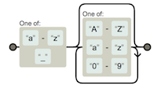
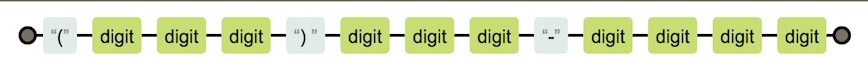
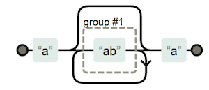

# Introduction to Regular Expressions
## Learning Goals
Be able to answer the following questions:  
- What is a regular expression?
- How can I write a regular expression to match on a specific pattern?


## Introduction  

Regular expressions are a great tool for working with text. Using regular expressions (AKA Regex) you can **identify and process patterns** of text. Many people find regular expressions difficult to understand and use, but they can make a variety of tasks much easier, like validating that a phone number or zip code is in the right format.

You will likely only use a limited number of expressions during your time at Ada, but understanding Regex can simplify your code, and Regex is useful across multiple languages.

## Regular Expression Basics

Like `String` and `Integer`, a regular expression is a data type in Ruby, defining a pattern of characters.  

You can form a Regex variable like this:

```ruby
pattern = /ada/
```

`/ada/` is a RegEx literal representing a pattern matching any String with the letters "ada" inside it.  The two forward slashes indicate a regular expression, or a pattern of text.   Anything put between the slashes forms the pattern of text we can match strings against.  

You can think of it like a String, but instead of specifying a specific list of characters by enclosing  them with quotes (""), instead it defines a **pattern** of characters by enclosing  them with forward slashes.

You can test a String against the regular expression with the Regex's `match` method.  The `match` method compares the string to the pattern, character-by-character and will return a `MatchData` object upon a match and `nil` if the String does not match the pattern.  It's important to note that `match` will return a `MatchData` object if any substring matches the pattern, not necessarily the entire String.

For example:

```ruby
pattern = /ada/
if pattern.match("ada lovelace")
  puts "The String has ada in it!"
else
  puts "It doesn't match"
end
```
The above snippet will print out "The String has ada in it!"  

Regular Expressions can also be compared using the `=~` operator.  The `=~` operator returns the index of the first match in the string  For example:  `pattern =~ 'ada'` will return 0, while `pattern =~ "learn at ada academy."` will return 9.

Both `match` and `=~` will return a truthy result if any substring matches the pattern.  That's an important issue to remember.  If you want to match a pattern exactly, the regular expression needs to be more specific using special characters to indicate the start and end of the string.  

On the other hand what if you wanted to match either "Ada" or "ada."  To handle both lower and upper case "Ada," we need to provide our pattern options to match against.  To provide a list of possible characters we can use Character sets.

## Character Sets

A **character set**, also called a **character class** is a way to tell the regex engine to match only one out of several characters.  We define a character set with square brackets.  For example `/[Ss]/` will match both capital and lowercase S.  Combining the character set with the previous larger literal, `[Aa]da` will match both "Ada" and "ada".  

You can also adjust the character set to accept a range of characters.  For example:  `/[A-Z]/`  will accept a single character in the range A to Z (must be capitalized), while `/[0-9]/` will accept a single digit.  If you wanted to accept any alphabetic characters you could use `/[A-Za-z]/`.

![/[A-Aa-z]/](images/regex1.png)

### Practice

How could you match any alphanumeric digit like "a", "W", or "0"? [Click here to see a solution.](https://gist.github.com/CheezItMan/2d445458f7c25eee37f5fd5b212077f4)


## The Wildcard and Special Characters

Sometimes you will want to accept any character.  For that purpose you can use the wildcard character the period (.).  For example the regex `/ada./` will match ada followed by any single character.  Another common need is for characters that can repeat.  For this there are several helpful symbols to use.  These special characters indicate how often a pattern can appear in matching strings.  The plus (+) symbol indicates one or more instances, while the asterix (*) indicates zero or more instances and the question mark (?) indicates a the item before it, called the token, is optional in that it might appear once or not at all.

| Special Character | Meaning |
| --- | --- |
|  .  |  Matches any character |
|  *  |  Matches if the preceeding token occurs zero or more times.  For example `/[0-9]*/` matches zero or more digits so `""`,  `"123"`, and `"5"` would match. |  
|  +  |  Matches if the preceeding token occurs one or more times.  For example `/[0-9]+/` matches one or more digits so both `"1"` and `"345"` would match.  |
|  ?  |  Marks the preceeding token optional.  So `/example[0-9]?/` matches `"example"` followed by one or no digits, thus `"example"`, `"example1"` and `"example13"` all match.  |


Examples:  

- `.+`  - Matches one or more of any characters.  
-  `/[0-9]+/` - Matches one or more digits
-  `/[A-Z]*/` - Matches zero or more capital letters.
-  `/[a-z_][A-Za-z0-9]*/`  - Matches a lower case letter or underscore followed by zero or more alphanumeric characters.  



## The NOT `^` Character

Sometimes you want to exclude a certain group of characters, or sometimes it's easier to exclude a type of character rather than list all the valid possibilities.  In that case you need the `^` character and the square brackets.  

For example:  `/[^abc]/` excludes a, b and c.

Another example would be `/[^0-9]/` which would exclude any digit or `/Ada is number [^2-9^a-z^A-Z^0]` which would exclude any letter or digit, except `1`.

### Practice

How can you write a regex which would accept, `dog`, `sog`, and `hog`, but exclude `bog`?  Click [here](https://gist.github.com/CheezItMan/f06518f248df19b44febd1871a95fd92) to see one answer.

## Escape characters

There are lots of characters that have special meanings in a Regex (such as the + or * characters).  Just like Strings you can use the backslash character to select the exact character in the text.  It can also be used as a shortcut for common classes of characters.


Some examples include:

| Escape Character |  |  
| --- | --- |
| `\n`  |  newline character |
| `\s`  |  Any whitespace character (space, tab, newline) |
| `\S`  |  Any non-whitespace character |
| `\d`  |  Any digit |
| `\D`  |  Any non-digit |
| `\\.`, `\\+`, `\\*`  | The literal character following the backslash, for example `\\` searches the String for a backslash, while `\.` looks for a period.  |

Practical Example:

-  If we wanted a Regex to validate a US phone number in the format (ddd) ddd-dddd.
  -  `/\(\d\d\d\) \d\d\d\-\d\d\d\d/`


  - This regular expression takes 3 digits inside parentheses followed by a space, then three digits a dash and then 4 digits.  We will see how to simplify this a bit later.

### Practice

Try to write a regex for any amount of US currency, for example it should match `$3.25`, `$102.73`, and `$0.25`.  You can see an answer [here](https://gist.github.com/CheezItMan/09f422c21e5c30ac69cc6d64bb16c3a0).

## Repetitions

The * and + characters allow a token to be repeated, but often, such as for a zip code, you will want to limit a token to a specific number of repetitions.  For that you can use the curly braces ({}).  A number placed in the curly braces will indicate how many times the preceding token can be repeated.  So for example `/[abc]{3}/` will allow the letters a, b or c to be repeated three times, so "aaa" would match, as would "abc" as would "cab".

A range of repetitions can also be repeated by using two parameters in the curly braces.  For example `/[abc]{3, 5}/` would allow the characters to repeat between 3 and 5 times.

An example using repetitions in our phone number example would include:  `/\(\d{3}\) \d{3}\-\d{4}/`

## Capture Groups

We can also construct groups of characters which can be combined with special characters using the parentheses.  For example `/(ada *)+/` would match one or more "ada" strings separated by 0 or more spaces.  So "ada ada", "ada", and "ada ada   ada" would all match.

So `/a(ab)*a/` would match the strings:  "aaba", "aa", "aababa" because it requires an a followed by zero or more "ab" blocks and ending with an "a".


Similarly, `/\$(\d)+\.(\d){2}` would match us currency, like you were asked to deduce above requiring a dollar sign followed by one or more digits, followed by a period and ending with 2 digits.  


### Practice

Write a regular expression for these patterns:

1. A 5 digit number
1. An IP address like 127.0.0.1, or 206.190.36.45, Only worry about the numbers being a max of 3 digits.

[Sample Solutions](https://gist.github.com/CheezItMan/54e39aa4a355aa5a24bb281d5d360121)


## Conclusion

Regex is a powerful topic that works in almost all languages.  The same syntax, sometimes with minimal changes can work in JavaScript, Ruby, Python and more.  Because Regex is almost universal there are a **lot** of tools available to compose them and a variety of pre-made Regular Expressions.  Some tools are listed below.  You can also find lots of sample Regular Expressions, but it's important to know how to read them, so you can verify a sample regular expression performs as advertised and so you can tweak existing regular expressions to meet your needs.  

### Regex Tools

There a number of tools you can use to compose regular expressions.

-  [Regexpal](http://regexpal.com.s3-website-us-east-1.amazonaws.com/?_ga=2.249565263.813004562.1495485737-848749570.1493938714) - A useful tool for composing Regular Expressions
- [Rubular](http://rubular.com/) - similar to Regexpal, a site you can use to compose a regular expression with a handy reference table on the page.
- [Regexper](https://regexper.com/) - a fantastic tool to generate a visual diagram of a regular expression.


## List of Regex Special Characters

| Character | Name  |  Description |
| --- | --- | --- |
|   \	|   Backslash	|   The backslash gives special meaning to the character following it. For example, the combination "\n" stands for the newline, one of the control characters. 	|
|   ^	|   Caret	|   The caret is the start of line anchor or the negate symbol.  Example: "^a" matches "a" at the start of a line.  Example: "[^0-9]" matches any non digit.	|
|   $	|   Dollar	|   $ the dollar is the end of line anchor.	|
|   \A	|   Beginning of String	|   \A indicates the beginning of the String, not the beginning of a line.	|
|   \Z	|   End of String	|   \Z matches the end of the String, not line.	|
|   {}	|   Curly Braces	|   { } the open and close curly bracket are used as range quantifiers.	|
|   []	|   Square Brackets	|    Open and close square bracket define a character class to match a single token inside the brackets.	|
|   ()	|   Parentheses 	|   The open and close parenthesis are used for grouping characters	|
|   .	|   Dot	|   the dot matches any character except the newline.	|
|   *	|   Star	|   The star is the match-zero-or-more quantifier.	|
|   +	|   Plus	|   The plus is the match-one-or-more quantifier.	|
|   ?	|   Question Mark	|   The question mark	 is the match-one-or-more quantifier.	|
|   &#124;	|   Pipe	|   The vertical pipe separates a series of alternatives.	|
|  < > 	|   Anchors	|   The smaller and greater signs are anchors that specify a left or right word boundary.	|
|  - 	|   Minus	|   the minus indicates a range in a character class (when it is not at the first position after the "[" opening bracket or the last position before the "]" closing bracket. For example "[A-Z]" matches any uppercase character.	|
| & | Ampersand | The and is the "substitute complete match" symbol. |


## Resources
-  [Regex in Wikipedia](https://en.wikipedia.org/wiki/Regular_expression)
-  [Regular Expressions in rubylearning.com](http://rubylearning.com/satishtalim/ruby_regular_expressions.html)
