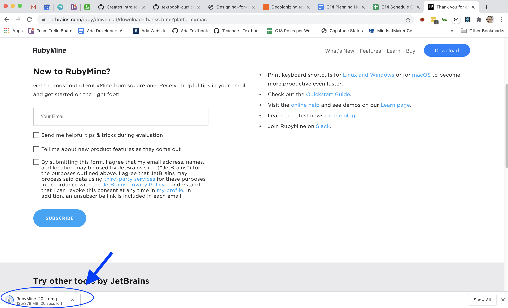
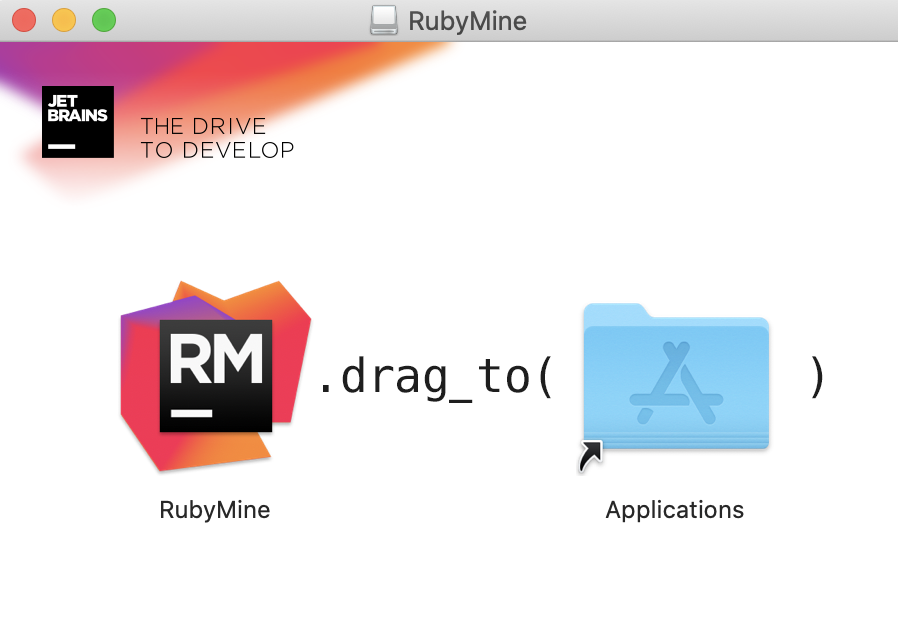
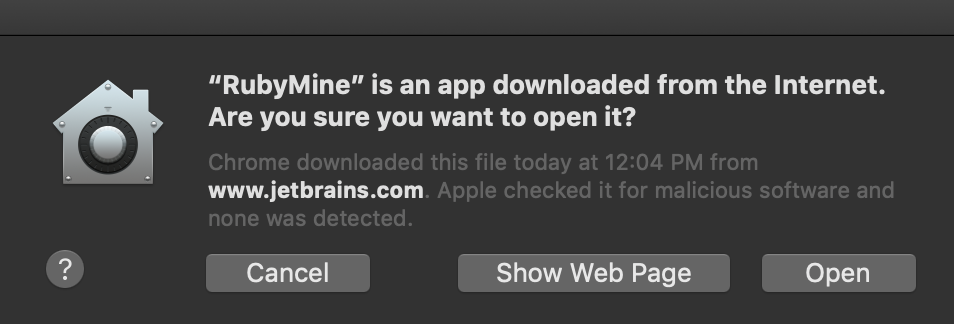
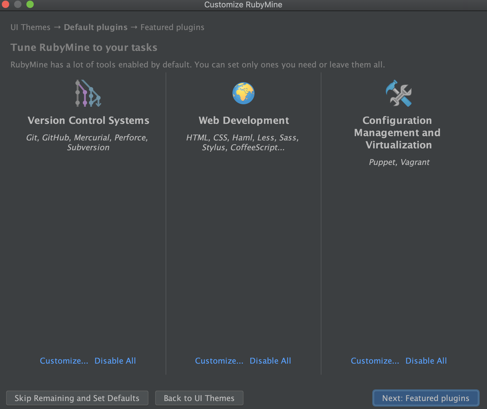

# Introduction to RubyMine

RubyMine will be the application we use to read and write Ruby code from now on. It is referred to as an Integrated Development Environment for Ruby (or Ruby IDE, for short). In other words, it's more than a text editor.
We have started to get familiar with VS Code, which we will use again later on in the curriculum, but before we spend a lot of time with Ruby, we want to get comfortable with a heftier tool that understands how to read Ruby and is able to help us _debug_ Ruby programs (something we will learn how to do very soon). 

VS Code is to RubyMine what a paper map is to a GPS. We _can_ build big projects in Ruby with VS Code. However, RubyMine is a tool that enables us to focus less on missing that right turn so that we can focus more on understanding the big picture of where we want to go.

### Adoption at Ada

Full disclosure: previous cohorts have used VS Code for the full Ruby curriculum. C14 is the first cohort to use RubyMine. We are making the switch because RubyMine will give us the ability to debug in a way we aren't able to with VS Code, which is an important skill we will learn and practice throughout the curriculum.

Please note that if there are any mentions of `VS Code` or the command `code .` during the Ruby portions of the curriculum, that the document is outdated. If something in the Ruby curriculum is talking about VS Code, it is probably meant to be talking about RubyMine.

### Installation

To install, go to https://www.jetbrains.com/ruby/download/#section=mac and click "Download".

Once the application is downloaded, you should be able to click the little icon at the bottom of your browser to open it.

You should then see a window that looks like this. 

Click and drag RubyMine into the Applications folder. Then, double-click the Applications folder to open it. You should see RubyMine in there. Double-click on it to open it.

Your Mac will ask to make sure you trust this application. It's important to be cautious about this stuff but in this case, we trust JetBrains enough, so we'll click "Open".

You'll then be prompted to select a theme. Pick whichever you prefer. (There is research that suggests dark-themed screens are much better for your eyes when working on a computer in most indoor environments.)

You should then see a screen that looks like this:

There are a lot of plugins it will offer to install for you. For the sake of reducing noise, we recommend that the only plugins you install are the "Git" and "Github" plugins. 

To do this:
1. Click "Disable All" under "Web Development" and "Configuration Management". 
1. Click "Customize" under "Version Control Systems" to uncheck everything other than "Git" and "Github". 

Lastly, you'll be prompted to activate your RubyMine license. Feel free to copy/paste the license code you should've received in an email. The license will last 6 months, which is just long enough for the Ada curriculum. If you feel inclined to get an extra free month, you can select "Evaluate for free" for now and enter your license code in a month when your evaluation period expires.

That's it! You're all set!

## Awesome Keyboard Shortcuts
Since you'll be spending a lot of time this RubyMine, you'll probably eventually want to know a few shortcuts. The table below is something that you won't want to bother trying to memorize but you may want to bookmark this page in your browser so you can refer back to it later.

To view all the keyboard shortcuts, navigate to `Code > Preferences > Keymap`.

Below are a few you'll likely use.

Shortcut | Effect
---      | ---
Double-press <kbd>shift</kbd>  | Search Everywhere. Find anything related to RubyMine or your project and open it, execute it, or jump to it.
<kbd>shift</kbd> + <kbd>⌘</kbd> + <kbd>A</kbd>     | Find a command and execute it. Perfect when you don't remember the shortcut for something else
<kbd>⌘</kbd> + <kbd>B</kbd> or <kbd>⌘</kbd> + click     | Go to declaration. Navigate to the initial declaration of the instantiated class, called method, or field. This is one of the powerful things IDEs can do for us!
<kbd>⌘</kbd> + <kbd>C</kbd> (nothing highlighted)    | Copy the current line
<kbd>⌘</kbd> + <kbd>/</kbd>     | Comment out the current line
<kbd>^</kbd> + <kbd>⌥</kbd> + <kbd>I</kbd>   | Auto Fix Your Indentation
<kbd>⌘</kbd> + <kbd>delete</kbd>    | Delete the current line

**Note:** <kbd>⌘</kbd> is the command key, <kbd>⌥</kbd> is the option key and <kbd>^</kbd> is the control key.  (Your keyboard probably has symbols on the keys to help with this.)

Fun fact: RubyMine makes it really easy for us to change these shortcuts and make our own new shortcuts! If any of these shortcuts feel hard to remember, maybe try switching them to something that makes more sense to you personally.

Remember that normal macOS keyboard shortcuts will work here too!

Shortcut | Effect
---      | ---
<kbd>⌥</kbd> + <kbd>←</kbd> | Jump left by one word
<kbd>⌥</kbd> + <kbd>→</kbd> | Jump right by one word
<kbd>⌘</kbd> + <kbd>←</kbd> | Jump to the beginning of the current line
<kbd>⌘</kbd> + <kbd>→</kbd> | Jump to the end of the current line
<kbd>⌘</kbd> + <kbd>↑</kbd> | Jump to the top of the document
<kbd>⌘</kbd> + <kbd>↓</kbd> | Jump to the bottom of the document
<kbd>⌘</kbd> + <kbd>shift</kbd> + <kbd>[</kbd> | Switch tabs left
<kbd>⌘</kbd> + <kbd>shift</kbd> + <kbd>]</kbd> | Switch tabs right
<kbd>⌘</kbd> + <kbd>,</kbd>  | Open the settings page
<kbd>⌘</kbd> + <kbd>w</kbd>     | Close the current tab
<kbd>⌘</kbd> + <kbd>shift</kbd> + <kbd>w</kbd>    | Close the current window (all tabs)
