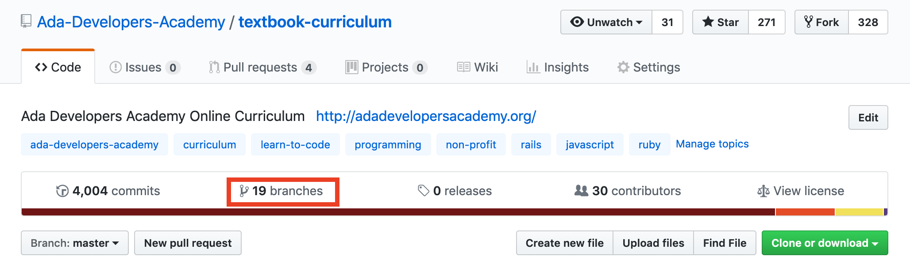
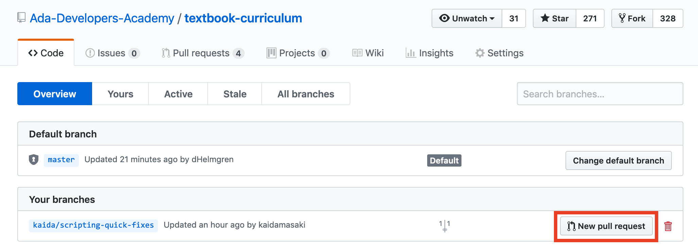
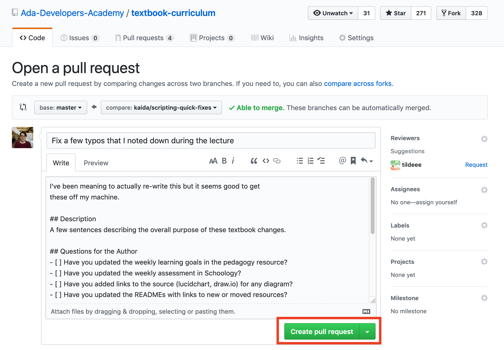
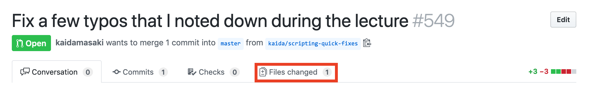
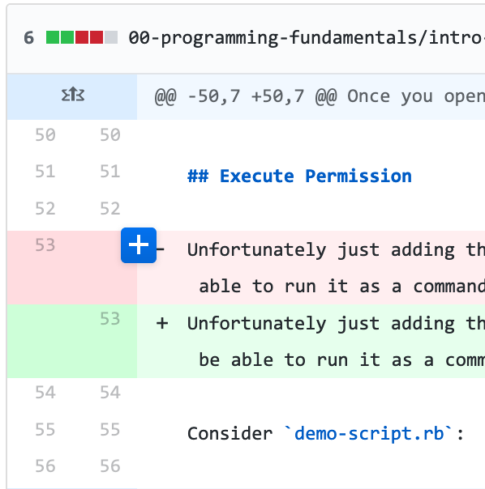
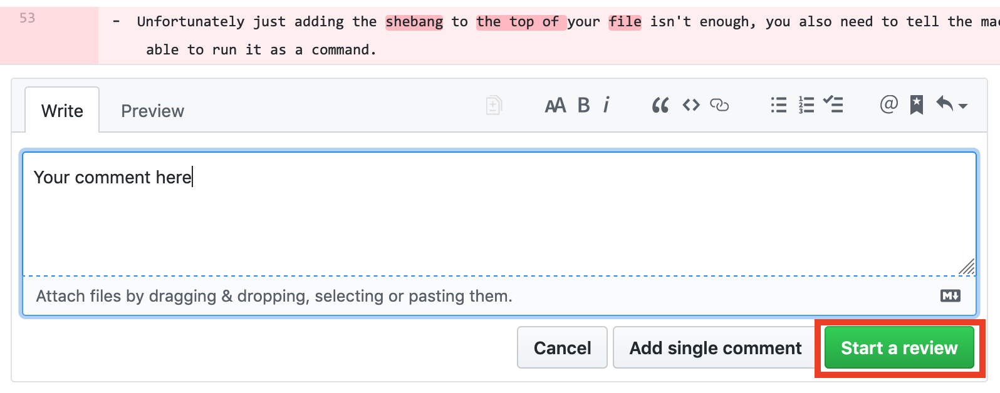
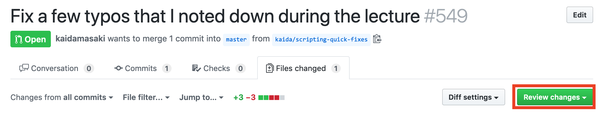
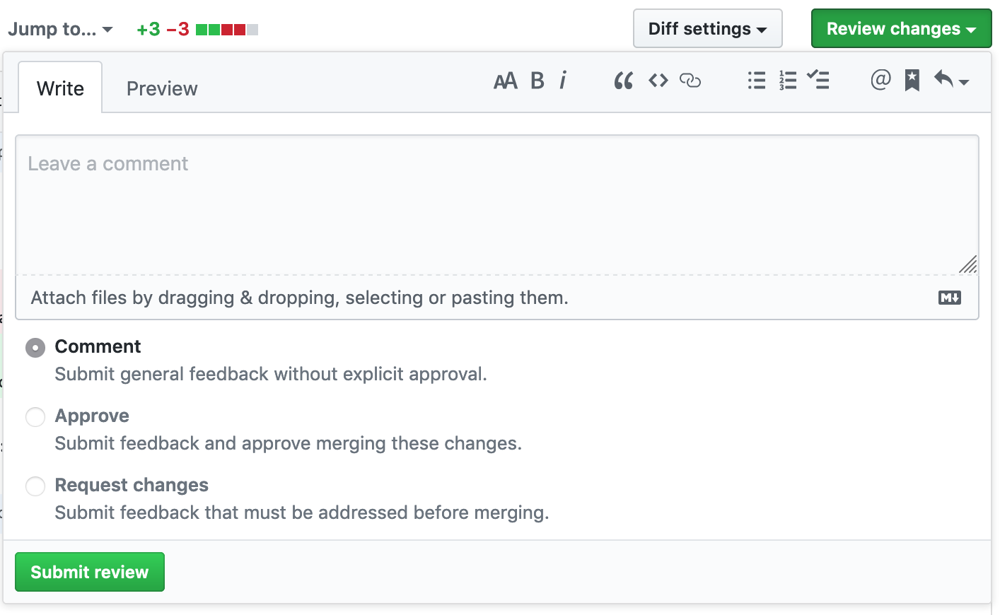
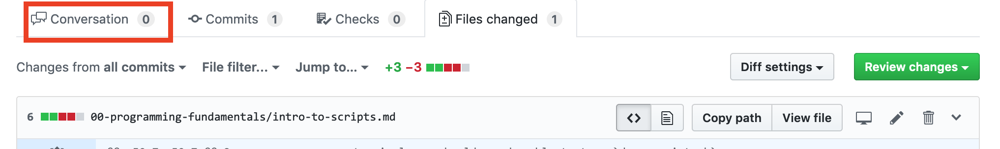
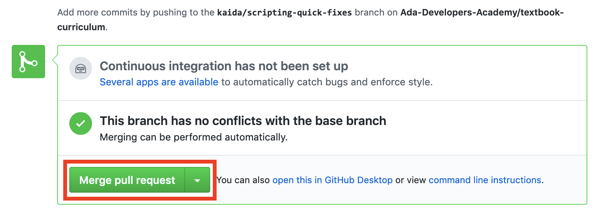

# Managing Git Branches
## Learning Goals
- Explore how Git tracks _branches_
- Learn common uses of the `checkout` command for managing _branches_
- Examine the difference between _merge_ and _rebase_
- Discuss when to _branch_, when to _merge_, and when to _rebase_
- Learn about Pull Requests for branches.

## Branches
Much of this discussion is going to happen on the whiteboard with sticky notes and drawing. However, here's a list of handy Git commands for working with branches:

### File Commands
- `git checkout [path/to/file]`: reverts any unstaged changes to the specified file(s) to their last committed state.
- `git checkout .`: reverts all unstaged changes to tracked files in the current direstory to their last committed state.
- `git stash -k`: set aside unstaged changes into a stash.
- `git stash`: set aside _all_ changes into a stash.
- `git stash pop`: apply the most recently (unapplied) stash.

(Changes that haven't been `add`ed are unstaged.)

### Branch Maintenance Commands
- `git checkout [branch_name]`: switches Git to an _existing_ branch.
- `git branch [branch_name]`: creates a new branch _but does not switch to it_.
- `git checkout -b [branch_name]`: creates a new branch and switches Git to this _new_ branch.
- `git branch -a`: shows a list of all local and remote branches.
- `git branch -d [branch_name]`: delete the specified local branch.

### Branch Sharing Commands

#### Update a Remote Branch (from your local branch)

- `git push -u [remote] [branch_name]`: pushes an _untracked_ local branch to the specified remote and instructs Git to keep the two associated. You only use `-u` the very first time you push a new branch upstream.
- `git push [remote] [branch_name]`: pushes commits on the _current branch_ to the _tracked branch_ of a remote.

#### Update a Local Branch

```sh
$ git merge [branch_name]
```

Merges changes _from_ the named branch _into your *current*_ branch.

This works by finding the last common parent in the histories of the two branches and then adds the commits from the named branch to your current branch in order.

##### From a Remote Branch

```sh
$ git pull [remote]
```

This works like `git merge` except it `fetch`es the remote branch first before merging.  (If you have done a `push -u` from this branch earlier you may not need to specify the remote.)

### Rebase Commands

#### When (not) to Rebase
`git rebase` is a destructive command.  Because of the way it rewinds your current branch your original commits are destroyed.  

This means that you should _**never**_ rebase a branch that you have already pushed remotely.  This will cause a guaranteed merge conflict due to the divergent histories.

You should generally avoid `rebase` because it rearranges the timeline and time travel is _dangerous_.  Specifically, if you rewind your commits and replay them then your history is inaccurate.  If you rebase regularly this will eventually confuse `git` that relies on consistent histories to perform its automatic conflict resolution.

If you have a very small well understood change and want to appear like you branched directly off the current version of the branch (instead of what actually happened) then it can make sense to rebase instead of merging.

`git rebase [branch_name]`: performs a _rebase_ of the current branch. Rebase is a four step process:
  - Rebase identifies the point of divergence between the current branch and the specified branch
  - Rebase rewinds the current branch to the point of divergence
  - Rebase then applies new commits from the specified branch to the current branch
  - Finally, rebase applies the commits unique to the current branch _as new commits to the top of the current branch_.


### Working with Branches

Unless you are making a very small change (like fixing a typo) you probably want to branch every time you start new work.

1. Create a new named branch, depending on the group you are working with you might want to stick your name in the branch.  If you're named Ada you might do something like: `git checkout -b ada/add-controller-tests` to create a new branch and move to it.
2. Do some work.
3. Push your code to Github: `git push -u origin ada/add-controller-tests`.
4. Create a [Pull Request](#pull-requests).

Generally you will want to keep your branches short lived.  This is so that the repository doesn't change too much under you while you are working.  Even with a short lived branch you should make sure to merge changes in from `master` regularly.

To merge changes from master (using our example branch above):
```sh
# Commit or stash your changes.
$ git checkout master
$ git pull
$ git checkout ada/add-controller-tests
$ git merge master
# Fix any merge conflicts.
# Apply any stashed changes.
```

**Note**: Depending on your configuration you may need to `git pull origin master` instead of just `git pull`.

This won't always be possible in practice but it's a good guiding principle and will make your life easier if you can stick to it as much as possible.

### Pull Requests

You've dealt with Pull Requests between forks before, however they are also extremely helpful when using branches as well!

#### Creating a Pull Request
To create a pull request first push your branch to Github: `git push -u origin [branch_name]`.

Then open your repository on Github and click on the "X branches" link near the top.



From the branches page locate the branch you are interested in the "Your Branches" section and click "New pull request".



Once you're on the "Open a pull request" page you have one final step.  Fill in your title and description and then click "Create pull request".  In the sidebar you can add your teammates as reviewers if you'd like so that they receive an email telling them to review the PR.



#### Reviewing a Pull Request

To start we need to go into the "Files changed" section of the pull request.



To add a comment hover over the margin for the line you would like to comment on and click on the blue plus sign.



This will open a box that lets you leave a comment and then begin a code review.  Choose "Start a review" and not "Add a single comment".



To finish reviewing a Pull Request click on the green "Review changes" button in the upper right corner.



This will open a box giving you space to write a comment and three options:

- Comment: use this when you don't have an opinion on whether or not the PR should be merged.
- Approve: use this when you think the PR should be merged.
- Request changes: use this when you think the PR needs more work before merging.



Click "Submit review" to finish.

#### Merging a Pull Request

Once a PR has been reviewed click back into the "Conversation" view.



Scroll down to the bottom until you get to the "Merge pull request" box.  Click on "Merge pull request" to merge the PR and then click "Confirm merge".



Your PR might say that you aren't ready to merge because there are conflicts with the base branch.  In this case you probably need to merge `master` (see [Working with Branches](#working-with-branches).

## Resources
- [Git SCM Documentation](https://git-scm.com/book/ch3-2.html)
- [Atlassian Tutorial](https://www.atlassian.com/git/tutorials/using-branches)
