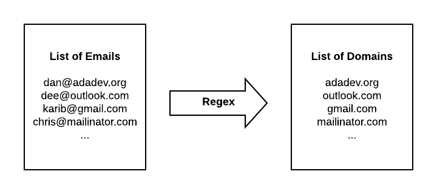
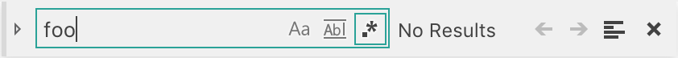

# More Regular Expressions

## Learning Goals
Be able to answer the following questions:  
- How can I use regular expressions to speed up my development workflow?
- Specific topics beyond Introduction to Regular Expressions include:
  - Repetitions
  - Capture Groups
  - Search and Replace

Preceding Lesson: [Introduction to Regular Expressions](./intro-to-regex.md)

## Repetitions

The `*` and `+` characters allow a token to be repeated, but often, such as for a zip code, you will want to limit a token to a specific number of repetitions.  For that you can use the curly braces (`{}`).  A number placed in the curly braces will indicate how many times the preceding token can be repeated.  So for example `/[abc]{3}/` will allow the letters `a`, `b` or `c` to be repeated three times, so `"aaa"` would match, as would `"abc"` and `"cab"`.

A range of repetitions can also be repeated by using two parameters in the curly braces.  For example `/[abc]{3,5}/` would allow the characters to repeat between 3 and 5 times.

An example using repetitions in our phone number example would include:  `/\(\d{3}\) \d{3}\-\d{4}/`

If you want to match a token a variable number of times you can place a comma inside the `{ }`. So `/a{2,3}/` would match 2 to 3 `"a"`'s.

## Capture Groups

A _capture group_ is a group of characters that we want to treat as a unit. Any quantifiers apply to the whole group, instead of individual characters.

We construct capture groups using parentheses.  For example `/(ada *)+/` would match one or more `"ada"` strings separated by 0 or more spaces.  So `"ada ada"`, `"ada"`, and `"ada ada   ada"` would all match. However, you need to have the full `ada` in order to match, so `adada` does _not_ match.

Another example: `/a(ab)*a/` would match the strings:  `"aaba"`, `"aa"`, `"aababa"` because it requires an `"a"` followed by zero or more `"ab"` blocks and ending with an `"a"`.


### Practice

Write a regular expression for these patterns:

1. An IP address like 127.0.0.1, or 206.190.36.45, Only worry about the numbers being a max of 3 digits.
1. "Ada", "Ada Academy" or "Ada Developers Academy", but not "Ada Developers" by itself. Should be case-insensitive (so both "Ada" and "ada" are OK).
    - Note that capture groups can be nested

[Check your answer here](solutions/regex.md#Capture%20Groups)

## Search and Replace

### In Ruby

So far we've only used regex to check whether a string matches a pattern. While this is certainly useful, regex can also be used to transform strings. To do so, we will _capture_ part of the string using a capture group, and then use the captured data to create a new string.

Let's use our email regex from a previous example to illustrate. We might imagine an application where we need to know all the different domains (like `adadev.org` in `dan@adadev.org`) where users have addresses.


<!-- https://www.lucidchart.com/documents/edit/c08de5b5-36a9-47bd-a702-326196e81c5e/0?driveId=1Wzk-dUvh8MxvkyQKRQeEiGLa8TG5mSCJ -->

First we write a regex that will match an email and _capture_ the data we want:

```ruby
email_regex = /.+@(.+\..+)/
match_result = "dan@adadev.org".match(email_regex)
```

We have two ways to get access to the capture groups. The first is to index into the value returned by `.match`:

```ruby
puts match_result[1]
# => adadev.org
```

Note that capture groups start at index 1. For historical reasons index 0 stores the part of the string that matched the pattern.

Your other option is to use the special variables named `$1`, `$2`, etc. We'll see this technique used when we talk about using regex with VS Code below.

Now that we've got access to the captured data, we can make use of it. Here is a slightly more complex version of the same program:

```ruby
emails = ['dan@adadev.org', 'dee@adadev.org', 'karib@gmail.com']
email_regex = /.*@(.*\..*)/

# Create a new hash where missing values are initialized to 0
domain_counts = Hash.new(0)

emails.each do |email|
  match_result = email.match(email_regex)
  next unless match_result # skip strings that don't match
  domain = match_result[1]
  domain_counts[domain] += 1
end

domain_counts.each do |domain, count|
  puts "#{domain}: #{count}"
end
```

#### Practice
Imagine that you have a long list of phone numbers typed by users, like the following:

```ruby
phone_numbers = [
  "(206) 555-1234",
  "425-555-9999",
  "406.555.1818",
  "+1 206 555 8888",
  "4255558872",
]
```

These phone numbers are formatted very differently: some have the `+1` country code, some have parentheses around the area code, some have dots instead of dashes, etc. Our job is to write some Ruby code to normalize these numbers, so that they all look like `(206) 555-1234`.

**Questions:**
- What regex will you need to match all these numbers?
- What characters will you need to capture? How many groups do you need?
- How will you use the captured data to fill in the final string?

[Check your answer here](solutions/regex.md#Phone%20Numbers)

### Search and Replace in VS Code

One of the most common ways to use regex search and replace is through your text editor. Here are a few examples of when this might be useful:
- You need to change a variable name throughout your code base, without changing a similarly named method
- Your mentor left you a comment on your code review that, according to the company's style guide, you need to change all your single-quoted strings to use double quotes
- You have a big list of data that you copy-pasted from the internet, and you need to transform it into something usable in Ruby

VS Code allows you to use regexes and capture groups when you search and replace. Let's see how to use it. Imagine that we have a file full of differently formatted phone numbers:

```
# phone_numbers.txt
(206) 555-1234
425-555-9999
406.555.1818
+1 206 555 8888
4255558872
```

1. Open a new file in VS Code and paste in the above list of numbers
1. Press `cmd+f` to open VS Code's search tool
1. In the upper right corner of the search bar, click the `.*` button to enable regex search
    
1. In the find bar, copy-paste the regex we used in the previous example: `^.*(\d{3}).*(\d{3}).*(\d{4})$`
    - You should not include the `/` characters at the beginning and end
1. In the replace bar, we have access to the capture groups using `$n`, where `n` is the group number (starting at 1). We can use `($1) $2-$3` to format the phone numbers the way we want.
1. Click the `Replace All` button. Now all the phone numbers are beautifully formatted!

#### Practice

Remember back to the original RideShare project from the first week of class. We provided a [CSV file full of ride information](https://raw.githubusercontent.com/AdaGold/ride-share/master/rides.csv), and you had to manually build up a data structure of nested arrays and hashes to manage that data.

Manually copying data is a tedious, error-prone process. It would be much better if we could use our tools to do this transformation automatically. Fortunately VS Code's regex search-and-replace tool is perfectly suited to this task.

We will build a regex search-and-replace pattern to transform CSV data like this

```csv
DR0004,3rd Feb 2016,5,RD0022,5
```

into a Ruby hashes like this

```ruby
{
  driver_id: "DR0004",
  date: "3rd Feb 2016",
  cost: 5,
  rider_id: "RD0022",
  rating: 5,
},
```

1. Create a new empty file called `ride_share_regex.rb`
1. Paste in the CSV data from the file linked above
1. Open up VS Code's search-and-replace tool, and turn on regex mode
1. In the search bar, build a regex to match the lines from the CSV file.
    - What pieces of data will you need to capture?
1. In the replace bar, build a template and fill it in with the capture groups from your regex.
    - Remember that VS Code stores captured data in variables named `$1`, `$2`, etc.
    - You can use `\n` for a newline
    - Which parts can be hard-coded in the template, and which come from the original CSV data?
1. Click `Replace All` (or hit `cmd+enter`)
1. Does the result look right? If not, study the output and figure out where you made a mistake. Make your edits to the regex and template string, then click back to the editor pane and use `cmd+z` to undo the transformation. Retry with your new regex. Repeat as needed.
1. Once you've correctly transformed the data, add in a little Ruby boilerplate at the beginning and end to group the hashes into an array.
    ```ruby
    rideshare_data = [
      {
        driver_id: "DR0004",
        date: "3rd Feb 2016",
        cost: 5,
        rider_id: "RD0022",
        rating: 5,
      },
      # ... more hashes ...
    ]
    ```

[Check your answer here](solutions/regex.md#CSV%20to%20Hash)

## Conclusion

Regular expressions are a powerful tool that works in almost all languages. The same syntax with minimal changes can work in JavaScript, Ruby, Python, Java, C++, shell scripts... you get the idea.

Because Regex is almost universal there are a **lot** of tools available to compose them and a variety of pre-made Regular Expressions. Some tools are listed below.

It is also common to find pre-made regular expressions online, for example on Stack Overflow. Having a strong understanding of regex fundamentals will allow you to combine these and tweak them to your needs.

### Regex Tools

There a number of tools you can use to compose regular expressions.

-  [Regexpal](http://regexpal.com.s3-website-us-east-1.amazonaws.com/?_ga=2.249565263.813004562.1495485737-848749570.1493938714) - A useful tool for composing Regular Expressions
- [Rubular](http://rubular.com/) - similar to Regexpal, a site you can use to compose a regular expression with a handy reference table on the page.
- [Regexper](https://regexper.com/) - a fantastic tool to generate a visual diagram of a regular expression.


## List of Regex Special Characters

| Character | Name  |  Description |
| --- | --- | --- |
|   \	|   Backslash	|   The backslash gives special meaning to the character following it. For example, the combination "\n" stands for the newline, one of the control characters. 	|
|   ^	|   Caret	|   The caret is the start of line anchor or the negate symbol.  Example: "^a" matches "a" at the start of a line.  Example: "[^0-9]" matches any non digit.	|
|   $	|   Dollar	|   $ the dollar is the end of line anchor.	|
|   \A	|   Beginning of String	|   \A indicates the beginning of the String, not the beginning of a line.	|
|   \Z	|   End of String	|   \Z matches the end of the String, not line.	|
|   {}	|   Curly Braces	|   { } the open and close curly bracket are used as range quantifiers.	|
|   []	|   Square Brackets	|    Open and close square bracket define a character class to match a single token inside the brackets.	|
|   ()	|   Parentheses 	|   The open and close parenthesis are used for grouping characters	|
|   .	|   Dot	|   the dot matches any character except the newline.	|
|   *	|   Star	|   The star is the match-zero-or-more quantifier.	|
|   +	|   Plus	|   The plus is the match-one-or-more quantifier.	|
|   ?	|   Question Mark	|   The question mark	 is the match-zero-or-one quantifier.	|
|   &#124;	|   Pipe	|   The vertical pipe separates a series of alternatives.	|
|  < > 	|   Anchors	|   The smaller and greater signs are anchors that specify a left or right word boundary.	|
|  - 	|   Minus	|   the minus indicates a range in a character class (when it is not at the first position after the "[" opening bracket or the last position before the "]" closing bracket. For example "[A-Z]" matches any uppercase character.	|
| & | Ampersand | The and is the "substitute complete match" symbol. |

## Resources
-  [Regex in Wikipedia](https://en.wikipedia.org/wiki/Regular_expression)
-  [Regular Expressions in rubylearning.com](http://rubylearning.com/satishtalim/ruby_regular_expressions.html)
-  [Freecodecamp Course on Regex (uses JavaScript)](https://learn.freecodecamp.org/javascript-algorithms-and-data-structures/regular-expressions/using-the-test-method)
