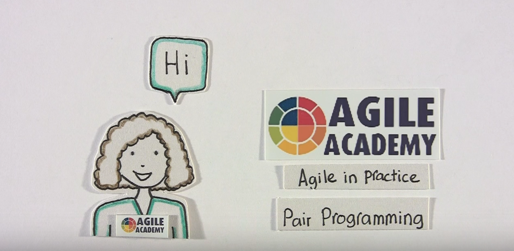

# Pair Programming

## What is Pair Programming?
Pair programming is a method of programming in which two people work together at one keyboard. One person, "the driver", types at the keyboard. The other person, "the observer" (or "navigator") reviews each line of code as it is typed, checking for errors and thinking about the overall design.

Some benefits you can expect: better code (simpler design, fewer bugs, more maintainable), higher morale (more fun!), shared knowledge throughout your team (both specific knowledge of your codebase and general programming knowledge), better time management, higher productivity.

Both programmers work on one computer throughout this process.

**Driver:**  
Controls the mouse/keyboard  
Deals with the details

**Navigator:**  
Thinks higher level  
Watches for typos, logical errors

## Guidelines
- Make sure to regularly rotate roles!
- _Anyone_ can change _anything_
- Be patient, respectful, and open
- Resolve disagreements civilly

## Why Pair Programming?
#### Code
- Fewer bugs (15-20%)
- Better code quality
- Better design

#### Programmers
- Increases knowledge sharing
- Reduces bad programming habits
- Improves focus
- Improves communication skills

#### Team
- Increases knowledge sharing
- Increases “bus factor”

## Steps for Successful Pairing

1. Start with a reasonably well-defined task before you sit down
2. Agree on one tiny goal at a time
3. Rely on your partner, support your partner
4. Talk a lot!
5. Sync up frequently
6. Take a moment to celebrate as you complete tasks and overcome problems
7. Switch roles often - at least every half hour

Note: Borrowed from [Wiki How](http://www.wikihow.com/Pair-Program)  
