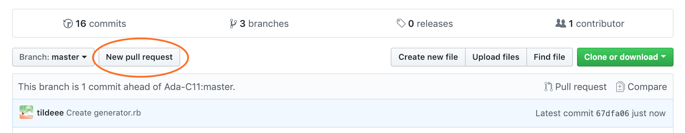

# Submitting Your Projects via GitHub

We utilize GitHub for all of our curriculum and project submissions.

Over time, we will learn how to `git` and GitHub to display changes in code. Today, we will learn how to use GitHub's web interface to track code additions, and to create a pull request, particularly to help submit our projects to Ada.

Until we learn how to use `git`, feel free to bookmark and reference this page.

## Learning Goals

- Understand that, at Ada, in order to submit projects, each person will need to fully open an appropriate Pull Request
- A Pull Request will require each person to fork the repo from an organization to their personal account, to make code changes, and then to open the PR
- Understand that each PR should be appropriately named, and should have answers to the comprehension questions

## Vocabulary

**Repository**: The term that GitHub uses for a collection of files that are all part of the same project. Every repository on GitHub is owned by an individual (e.g. [Hamled/dotnvim](https://github.com/Hamled/dotnvim)) or an organization (e.g. [github/hub](https://github.com/github/hub)). Also known as repo.

**Fork**: A copy of a repository onto an account, originally from another account. We will be asking you to make a fork of a repo onto your own personal GitHub account. For example [AdaGold/Word-Guess](https://github.com/AdaGold/Word-Guess) is an original repository named `Word-Guess` originally by the account `AdaGold`, and [Hamled/Word-Guess](https://github.com/Hamled/Word-Guess) is Hamled's _fork_ of that repository.

**Pull Request**: For our immediate purpose, this is the mechanism in which your instructors will check for your submission. In practice, in the general programming universe, this is how programmers submit their code for their teammates to review, and then include in the overall project.

## Steps to Submitting a Project at Ada

Once you are ready to submit your project, please work through these steps. Please take note that submitting a project takes around 15 minutes, so don't wait until the last minute!

There are ways to edit/modify the files that we'll learn in the future. At this moment, assume that the submission process should begin after your project is generally complete.

The overall process is such:

1. Fork the project repo from the Cohort project onto your personal account, so you have your own copy of the repo
1. On your fork of the repo, create a file, add code to the file, and then commit those changes so they are saved
1. Begin opening a Pull Request from your repo against the Cohort project repo
1. Fill out the title and answer the comprehension questions
1. Check your work!
1. Submit

For the example pictures below, the user's name is `tildeee`, and the cohort organization account on Github is `Ada-C11`.

### Fork the repo correctly

First, you'll want to fork the repo from the Ada-CX organization.

1. To do this, first you'll want to visit the Github.com page of this original repo. Typically, this will be the original project link you received when you started the project. **`AdaGold` _should definitely not_ be in the URL or header of GitHub**

1. Once you're on the right page, find the "Fork" button towards the top right corner

1. This should automatically take you to a page that is your fork: a copy of the repo, but under your account. Verify that you are on the correct page by ensuring that `Ada-CX` nor `AdaGold` are not the repo title, and in fact, your username is! (Check the page title and the browser URL)

If you weren't transported to your copy of the repo, you can find a list of your repos through Github.com and finding your account page.

### In your repo, add your code

The next step is to add a new file, and the code to put in that new file, to represent your project. All of this work should be done on your own personal fork.

1. Create a new file on your personal fork by finding the button that says "Create new file"

1. This should open up a page in which you put in the details of this new file. Give this file a name with a file extension

1. From your text editor, select all of your code (`cmd+a`), copy it, and then paste it into the large textbox. This represents the contents of the file that you are submitting.

1. At the bottom of the page, you should see details about how to "commit the new file." Use all of the default form values here, and press that fancy "Commit new file" green button!

### Open and Create a Pull Request

Almost there -- to actually finish project submission, you'll need to open and create a pull request.

1. Finishing the commit should bring you back to your own fork's page, but if not, make sure you're back there. Then, find the button that says "New pull request" and click it

1. This should open up a new page. PRs are ways in GitHub that we can compare code changes between repos easily. You need to change these settings so that the PR compares the right two things: You'll need to configure it so that it says your username on the right under "head fork," and your cohort org name on the left under "base fork." **Without these settings configured correctly, your project will not submit!** Github tries to be helpful by predicting what you will compare, but it's not very accurate sometimes.

1. This page actually has a lot of interesting detail, like all of the code additions you made, so if you scroll down, you should be able to see green lines of code that indicate the code additions you made.

1. Finish opening the pull Request by clicking the green "Create Pull Request" button

1. The next page should give you details about the PR that you need to fill out. As part of project submission, you will need to fill out the following things:
    1. The title of this PR should be "`<YOUR CLASSROOM NAME> - <YOUR NAME>`", such as "Ports - Dee"
    1. There should be a bunch of text already filled in as the detail for the PR! This is our way of giving each person project comprehension questions to answer. It is in the format of a table created in `markdown` formatting. Please spend a few minutes filling out an answer for each question, about 1-2 sentences for each answer.

1. Use the "Preview" tab above the text box to see see what the table of answers will look like

1. **FINALLY** -- finish creating the Pull Request by pressing the green button!

## Conclusion

Submitting a project takes around 15 minutes, particularly to answer comprehension questions. Also, there are a lot of things to verify, and submitting a PR with the wrong configuration will lead to your project not submitting correctly. Leave yourself some time to submit each project.
