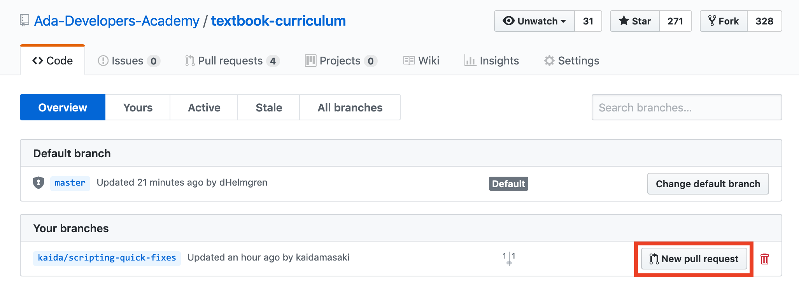
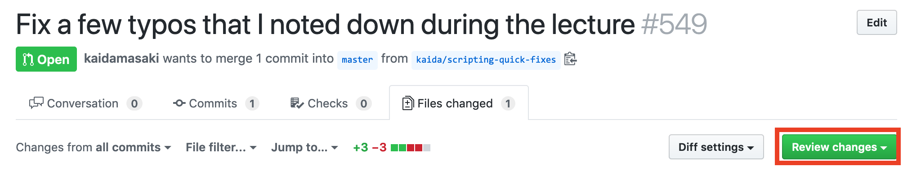
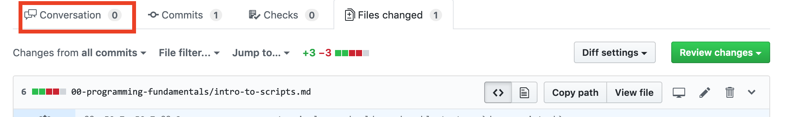

# Using Pull Requests for Branches

## Learning Goals
- Learn how to create a Pull Request from a branch.
- Learn how to review a pull request.
- Learn how to merge a pull request.

## Creating a Pull Request

You've dealt with Pull Requests between forks before, however they are also extremely helpful when using branches as well!

To create a pull request first push your branch to Github: `git push -u origin [branch_name]`.

Then open your repository on Github and click on the "X branches" link near the top.

From the branches page locate the branch you are interested in the "Your Branches" section and click "New pull request".

Once you're on the "Open a pull request" page you have one final step.  Fill in your title and description and then click "Create pull request".  In the sidebar you can add your teammates as reviewers if you'd like so that they receive an email telling them to review the PR.

## Reviewing a Pull Request

To start we need to go into the "Files changed" section of the pull request.

To add a comment hover over the margin for the line you would like to comment on and click on the blue plus sign.

This will open a box that lets you leave a comment and then begin a code review.  Choose "Start a review" and not "Add a single comment".

To finish reviewing a Pull Request click on the green "Review changes" button in the upper right corner.

This will open a box giving you space to write a comment and three options:

- Comment: use this when you don't have an opinion on whether or not the PR should be merged.
- Approve: use this when you think the PR should be merged.
- Request changes: use this when you think the PR needs more work before merging.

Click "Submit review" to finish.

## Merging a Pull Request

Once a PR has been reviewed click back into the "Conversation" view.

Scroll down to the bottom until you get to the "Merge pull request" box.  Click on "Merge pull request" to merge the PR and then click "Confirm merge".

Your PR might say that you aren't ready to merge because there are conflicts with the base branch.  In this case you probably need to merge `master` (see [Working with Branches](#working-with-branches)).

## Resources

- [Github: Creating a Pull Request](https://help.github.com/en/articles/creating-a-pull-request)
- [Github: Merging a Pull Request](https://help.github.com/en/articles/merging-a-pull-request)
