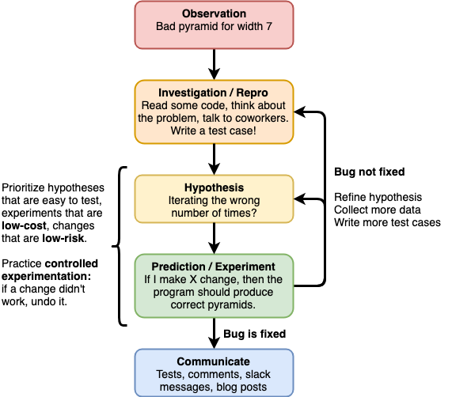

# Scientific Debugging

## Learning Goals

By the end of this lesson, students should be able to...

- List the steps of the scientific method
- Apply the scientific method to the debugging process
- Define the term _repro_
- Evaluate experiments in terms of _cost_ and _risk_
- Use _controlled experiments_ to methodically investigate bugs

## Introduction: How do you Debug?

Many programmers, especially early in their careers, take an ad-hoc approach to debugging. This works fine for simple bugs, but is likely to fall apart as programs become more and more complex. The goal of this lesson is to define a process to make debugging efficient, repeatable and scalable.

**Think/pair/share** (5/5/10 minutes): Spend some time reflecting on your debugging process. When you discover a bug in your code, how do you proceed? What steps do you follow to fix it?

As a concrete example, imagine a bug you see when something gets printed to the console twice when you expected it to be printed once. How do you figure out what's wrong?

## Example Problem: Pyramid

As a running example we will use the following problem (a classic interview question):

Write a program that, given a number `N`, prints a pyramid of octothorps (`#`) where the bottom layer of the pyramid has width `N`, and each layer above that has two fewer. The pyramids should be centered.

Example runs of a correct implementation of the program:

```
$ ruby pyramid.rb 6
  ##
 ####
######
$ ruby pyramid.rb 7
   #
  ###
 #####
#######
```

We might devise the following solution to this problem:

```ruby
# pyramid.rb
def build_pyramid(width)
  pyramid = ""
  height = width / 2

  height.times do |h|
    # Add the spaces for this line
    spaces = height - h - 1
    spaces.times do
      pyramid += " "
    end

    # Add in the pyramid blocks
    (width - 2 * spaces).times do
      pyramid += "#"
    end

    # Finish the line
    pyramid += "\n"
  end

  return pyramid
end

def main
  height = ARGV[0].to_i
  pyramid = build_pyramid(height)
  puts pyramid
end

main if __FILE__ == $PROGRAM_NAME
```

As it turns out, this implementation has a bug! Run the program a few times, and see if you can find it. Then read through the program and make sure you understand more-or-less how it works.

If you think you've found the source of the bug, don't fix it yet - the point of this lesson is to demonstrate the full debugging process.

## Using the Scientific Method to Debug



<!-- https://www.draw.io/#G19_rauxdM4HH3kXGK4_vM2FO-5CG7JnYV -->

[Wikipedia](https://simple.wikipedia.org/wiki/Scientific_method) has this definition for the scientific method:

> Scientific method refers to ways to investigate phenomena, get new knowledge, correct errors and mistakes, and test theories.

Sounds like a perfect tool to use in debugging!

Two things to remember as we go forward:

- The scientific method is an iterative process, which means that as new information is revealed it's common to go back to a previous step
- The scientific method is fluid and has many interpretations, but its goal is always a methodical, evidence-based pursuit of understanding

### 1. Observation

Debugging (and science in general) is almost always rooted in observation. We see something we don't expect, and wonder why it happened and how we can fix it.

It can be valuable to refine this further:
- What specifically went wrong?
- What did you expect to happen instead?

#### Pyramid

For our pyramid example, our observation might be "when I give it the number 7, it builds the pyramid wrong". We might refine this by saying "for a width of 7, I would expect to see 4 rows, but the top row appears to be missing."

### 2. Investigation and Repro

Now that you know something is wrong, you need to collect more information, both about the bug and about its context. In addition to reading code, asking your teammates for advice or searching through your team's bug database, a key component of this research is developing a _repro_.

A _repro_, or set of reproduction steps, is a way to make the bug happen again. Sometimes repros are straightforward, but occasionally they require substantial setup to get your program back to the buggy state. The key to any repro is consistency - you want a set of steps that reliably make the bug occur.

<details>
<summary>
<b>Question:</b> Why is it important to develop a reliable repro?
</summary>

A reliable repro is important for two reasons.

First, coming up with the repro forces you to think about what exactly is going on in your program, which can be a big help in finding the bug.

Second, if you have a reliable repro, you have a way to prove that the bug is fixed.

</details>

#### Pyramid

For our pyramid example the repro is straightforward:

> Run the program with input `7`.

We might do some additional experimentation and determine that even numbers produce the correct output, but odd numbers always skip the first row.

#### Automating the Repro

Often it's useful to automate the repro by writing a test. This both ensures you're following exactly the same steps every time, and gives you an easy way to confirm that you don't re-write the same bug in the future.

Encoding the repro as a test forces you to isolate the problem is a specific part of your code, which means you may not be able to do so right away. This is OK - remember, the scientific method is iterative.

**Exercise:** Write a test that mimics the repro steps for the bug in our pyramid program.
- How will your test differ from the manual repro?
- Do these differences matter?

You can use this boilerplate for your test file:

```ruby
# pyramid_spec.rb
require "minitest"
require "minitest/autorun"
require "minitest/reporters"

Minitest::Reporters.use! Minitest::Reporters::SpecReporter.new

require_relative "pyramid"
```

<details>

<summary>Our Implementation</summary>

```ruby
describe "build_pyramid" do
  it "builds a 4-layer pyramid when given a height of 7" do
    pyramid = build_pyramid(7)
    expected_pyramid = "   #\n" +
                       "  ###\n" +
                       " #####\n" +
                       "#######\n"
    expect(pyramid).must_equal(expected_pyramid)
  end
end
```

</details>

---

If you're working through this in the classroom, this would be a great spot to take a break!

---

### 3. Hypothesis

Now that you can consistently reproduce the bug, the next step is to come up with a hypothesis (an educated guess) about what caused the bug. The hypothesis doesn't have to be correct, but it should be reasonable given what you know so far.

Often when investigating a new bug you'll come up with a whole list of hypotheses, any one of which could be the true cause of the problem. At this point you should choose one to move forward with. You might choose the one that is most likely to be correct, or the one that is easiest to test.

#### Pyramid

For our pyramid code, we might make the following hypothesis:

> The loop on line 7 is running too few times.

This may or may not be correct, but seems reasonable given that we know the wrong number of lines is produced.

### 4. Prediction and Experiment

Once you have a hypothesis about where the problem lies, your next step is to try and prove it wrong. The way to do so is to make a prediction about your code that depends on that hypothesis, then test it to see if it's correct.

The difference between hypothesis and prediction is a subtle one. A hypothesis is a statement about what you believe about your program: "I think that the bug is caused by X". A prediction is an if-then statement: "given X, _if_ I do Y _then_ I should see Z".

If the bug is small, it may be that the easiest way to test the hypothesis is to fix the bug and re-run the repro. In that case the prediction is, "assuming this is really the cause of the bug, _if_ I change the code in this way, _then_ the problem should go away".

For larger bugs there may be substantial time and effort involved in a potential fix, or you may not even know what the fix would look like yet. In this case it's worthwhile to collect more information before beginning to work on a solution. This is when you break out your debugging tools: print statements and the interactive debugger.

It's common to cycle quickly between steps 3 and 4, particularly if you don't quite understand a problem yet. Come up with a hypothesis, use it to make a prediction you can test, disprove it, and repeat.

It's also common to run experiments on code or repros that you know are correct - this can be a good way to learn more about how your program works, and to help you come up with additional hypotheses about what might be going wrong.

#### Cost and Risk

We can think about different experiments in terms of _cost_ and _risk_.

- Cost describes how much time and effort it will take to run the experiment
- Risk describes how likely you are to create a new bug while fixing this one

<details>
<summary>
<b>Question:</b> What makes an experiment or fix low-cost or high-cost? Low-risk or high-risk?
</summary>

Factors that affect cost:

- Difficult repros increase cost
- Complex changes increase costs
- Familiarity with tools (e.g. debuggers) reduces cost

Factors that affect risk:

- Complex changes increase risk
- Strong, reliable tests reduce risk
- Experiments that don't change the code (e.g. using a debugger) are always low-risk

</details>

In general, you should prefer experiments that are low-cost / low-risk, and prioritize hypotheses that have low-cost / low-risk experiments.

#### Pyramid

For our pyramid code, we might make the following prediction and experiment:

> Assuming the loop on line 7 is running too few times, if I insert a print statement before line 8 and run the program with input `7`, I should see it appear only 3 times.

<details>

<summary>
<b>Question:</b> Is this experiment low-cost or high-cost? Low-risk or high-risk?
</summary>

This experiment is low-cost, because we have a consistent repro and all we're doing is adding one print statement. It's low-risk because a print statement is unlikely to break something.

</details>

At this point we're pretty sure we've found the problem, so now we engineer a fix. We can describe the change as another prediction:

> If I change the loop on line 7 to read `(height + 1).times do |h|`, then the program should produce correct pyramids.

<details>

<summary>
<b>Question:</b> Is this experiment low-cost or high-cost? Low-risk or high-risk?
</summary>

This experiment is low-cost, because the bug has a reliable repro and the code is quick to write. It's medium-risk, because there's now a risk of us breaking the program for other inputs that currently work. We can mitigate some of this risk by adding more test cases, for example for a pyramid of width 6.

</details>

When we run the experiment, we find that our fix doesn't quite work:

```
$ ruby pyramid.rb 7
  ###
 #####
#######
#########
```

We might observe that, while the program produces the right number of rows, it's not putting the right number of octothorps in each row. Even though the fix isn't correct, this was still a valuable experiment because we've learned a little more about the code, and we have one fewer thing to try.

#### Controlled Experimentation

An important part of the scientific method is the idea of a _controlled experiment_. This means that you only run one experiment at a time, and each experiment involves at most one change to the code. When an experiment is finished, you should undo the change you made.

Why does this matter? It's all about controlling risk. Imagine that you made three changes to your code, and now the bug is fixed. You're pretty sure only one of them is needed, but you're not sure which. Consider your options:

- Undo the changes one by one until you find the one that fixed the fixed the bug
- Check in all 3 "fixes" and hope for the best

The first option is as much work as testing the changes one by one would have been, just in the reverse order. The second option is tempting, but risky. 2 of those 3 changes are changing something other than the bug, which means there's a chance that they let a new bug slip in.

**You should make one change at a time, and if it doesn't solve the problem change it back**. It is OK to make multiple observations in one experiment, printing out multiple values or stopping at several breakpoints with the debugger, but each experiment should be isolated.

Source control can be a great tool to make controlled experiments easier to run. Commit immediately before beginning to debug and you can make all sorts of changes, then quickly jump back to your code's original state.

#### Pyramid

We revert our code to its original buggy state and go back to the drawing board. We make more predictions and conduct more low-cost experiments. Maybe we try out some other hypotheses. Maybe we write some additional test cases, both to explore the problem and reduce the risk associated with a fix.

Each time we make a change to the code, if it doesn't fix the problem, we change it back.

We think really hard, run though examples on our whiteboard or with the debugger, and eventually come up with another prediction:

> If I change line 5 to read `height = (width + 1) / 2`, then the program should produce correct pyramids for both even and odd widths.

We make the change and run the repro - it works! We run our full test suite, and see no failures. To the best of our knowledge this bug is now fixed. Good work!

### 5. Communicate

Now that the bug is fixed, it is your job to let others know about the work you've done. The type of communication depends on the nature of the bug.

For a small bug encountered during development, this might be as simple as reflecting on what you've learned, or leaving a comment in the code to explain a tricky line of code.

If the bug is a little bigger or has been around for a while, you might need to update your team's bug database or post a message in Slack. Is there something you could say to prevent others from making a similar mistake in the future?

For a really big bug, you might want to let your customers know, or write up what you've learned into a blog post.

In addition, if you haven't yet written a test case for this bug, now is the time to do so. You will never know more about this problem than you do right now.

## Summary

Debugging is tricky, but we can use the scientific method to inform a process that will work for complex programs and subtle bugs.

Scientific debugging follows these steps:

1. Observation
    - What specifically is the problem?
    - What behavior did you expect?
1. Investigation
    - Develop a _repro_, or way to consistently make the bug occur
    - Automate the repro with a test if possible
1. Hypothesis
    - Make an educated guess about where the problem lies
    - Focus on one hypothesis at a time
1. Prediction / Experiment
    - Attempt to prove or disprove the hypothesis
    - Use the hypothesis to make a prediction, then run an experiment to verify or falsify the prediction
    - Think about _cost_ and _risk_ when deciding what experiments to run
    - Practice _controlled experimentation_ to reduce risk
    - Use the results of experiments to refine your hypothesis
1. Communicate
    - Write a comment, test, email or blog post

## Additional Resources

On the scientific method in general:

- [The Scientific Method](https://www.khanacademy.org/science/high-school-biology/hs-biology-foundations/hs-biology-and-the-scientific-method/a/the-science-of-biology)
- [Controlled Experiments](https://www.khanacademy.org/science/high-school-biology/hs-biology-foundations/hs-biology-and-the-scientific-method/a/experiments-and-observations)

On debugging with the scientific method:

- [Video: Debugging with the Scientific Method](https://www.youtube.com/watch?v=FihU5JxmnBg) (50 minutes)
- [Debugging software using the scientific method](https://medium.com/@guilhermereiscampos/debugging-software-using-the-scientific-method-6d00d22092bf)