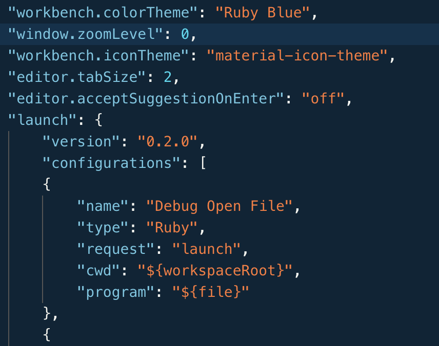

# Setting up the VSCode Debugger

## Learning Goals
- Be able to explain the purpose of an Integrated Development Environment
- Understand how to set up an individual .rb file for debugging in VS

## Text Editors vs. IDEs
Whenever you go to write code, you have options about the tools that you use to employ. These can range from the most basic text editors like [Vim](https://www.vim.org/) and [Emacs](https://www.gnu.org/software/emacs/) to development tools fully integrated with specific languages like [PyCharm](https://www.jetbrains.com/pycharm/) or [WebStorm](https://www.jetbrains.com/webstorm/), or something in between like [Atom](https://atom.io/), or our very own VS Code.

For every two developers, there are three opinions about the best environment for making code. So how do we pick? It all depends on how much help (some would say interference) a programmer wants moment to moment.

On the most basic level, a Text Editor will do just that: let you edit the words and symbols on a page unfettered by suggestion text or drop downs. An Integrated Development Environment (IDE for short) on the other hand has opinions about how you should be doing your work: they may try and give you the name of the function you were about to type, help manage a source control tool, or (as we will do) help you debug your code.

__Note: If anyone ever tells you that "real developers only use [their personal favorite tool]", laugh in their face and walk away from that conversation.__

## Get Relevant Gems and Extensions
If you have not already run the following:

```bash
$ gem install ruby-debug-ide
$ gem install debase
```

Please run them now.

## Install Ruby plugin to VSCode

By clicking on [this link](https://marketplace.visualstudio.com/items?itemName=rebornix.Ruby) you can install the Ruby plugin to VS Code if you haven't done that already.

## Configuring the Debugger

VS Code, being language agnostic, doesn't have an internally implemented script that knows how to launch, run and hook into every single kind of program. Instead, it talks to other scripts and tools like the gems we just downloaded, and has generic functionality which those external tools can hook into. When we set up projects in VS Code, we create a series of configurations that VS Code stores in a file called `launch.json` in a folder called `.vscode`. However, if we set our project up this way, we would need to add that `.vscode` folder to every project we ever make. Nobody would do it. Instead, we will set up a global set of configurations in our VS Code settings.

Open the debugger by using `⇧⌘D`, and look near the top left of the viewport to find a green triangle button that likely reads "No Configurations". When we are done, this list will be filled in with the names of our launch options.

Using `⌘,` or  the drop down menu as seen below, open the settings menu.


When you have opened the settings, the bar at the top will have an icon that looks like a page with an arrow on top as seen below. Clicking on it will open your `settings.json` for VS Code.


The code below represents a way in which we can launch our debugger on a ruby file that we have in focus, i.e. the last ruby file that you clicked on. Copy the text and paste it into your `settings.json` so that the launch keyword is at the same 'level' as the rest of your settings.

```json
"launch":{
  "version": "0.2.0",
  "configurations": [
    {
      "name": "Debug Open Ruby File",
      "type": "Ruby",
      "request": "launch",
      "cwd": "${workspaceRoot}",
      "program": "${file}"
    }
  ]
}
```

When you are finished, it should look approximately like this:



You may need to add a comma to the end of the line before the section you just added if it isn't already there. (Notice the comma after "off" in the above screenshot.)

As you work in new languages and with new tools, you will add more debugging configs to this file. As you can see, the image above is truncated, as the instructors already have a variety of debugging configurations. 

Once you have done so (and saved the `settings.json`) you will be able to select "Debug Local File" from the drop down. Additionally, when you go to add configurations in the future, it may show up as an option after selecting to debug in Ruby. 
