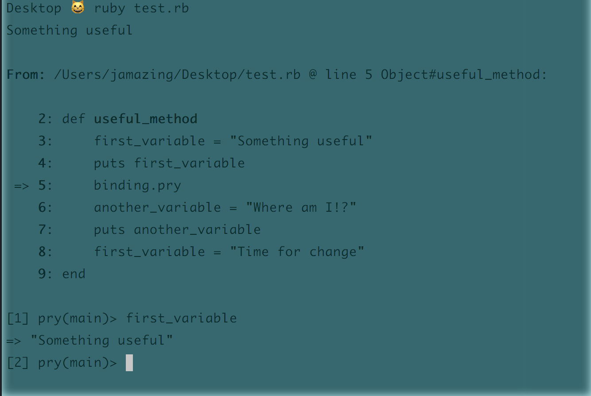

# Bug Off!
## Debugging with Pry


Remember way back when we were showing off all those fancy new gems we were just discovering!? Well you've been using them ALL, right? At least Pry? Even if you have, you may not be fully utilizing the gem.

Pry comes packed with an extensive amount of functionality to help us with tracking down those pesky bugs in our code.


### What is Pry
There are two main uses for PRY, to use in place of IRB and to inspect code in a file.

Pry is another Ruby REPL, much like IRB, with some added functionality. That means it works like a sandbox where you can type in and experiment with snippets of code, directly in terminal.

With code that we've already written in a file, we can use a Pry command to pause our code and more closely inspect. We can use Pry instead of using a bunch of 'puts' commands in a program.


### How to get started

1. Install by running `` gem install pry `` in terminal.
1. At the top of a file you want to debug, `` require 'pry' ``.
1. In your code, write ``binding.pry`` anywhere you want to pause the code that's being run. Doing so will allow you to evaluate what code is doing up to that point, like checking what what a variable equals while being changed in a loop.


### Test it out

Because programs are read from top to bottom, any code that is after a binding.pry command will not be read. Run the code in the exercise below, as you would normally. To exit, type 'exit' and push enter.

``` Ruby
require 'pry'
def useful_method
    first_variable = "Something useful"
    puts first_variable
    binding.pry
    another_variable = "Where am I!?"
    puts another_variable
    first_variable = "Time for change"
end
```
Your terminal should open in interactive environment that looks something like this:



### Debug Code
The following code is not coming out as expected. I am expecting 55 to return when I pass 50, but am getting 5. Oh bugger! Let's use pry to dig into what is causing the problem!

``` Ruby
def add_5_years(age)
  5.times do
    age + 1
  end
end

puts add_5_years(50)
```

### What else can Pry do!?
I'm so glad you asked!

Pry also has the following handy commands that let you see what objects are currently available in your program to focus on and interact directly with.

- ``ls``,  shows you the local variables defined in the current context, and any public methods or instance variables defined on the current object.
- ``cd``, command is used to move into a new object (or scope) inside a Pry session. When inside the new scope it becomes the self for the session and all commands and methods will operate on this new self.


### Try it out!
Open your scrabble or Bank Account project and inspect functionality of your code using PRY! Practice using the ls and cd commands.


## Additional Resources
- Dig into [Pry's documentation](http://pryrepl.org/) (with screencasts) to learn even more
- Here's a handy list of more [Pry commands](https://github.com/pry/pry/wiki/State-navigation#Ls)!
