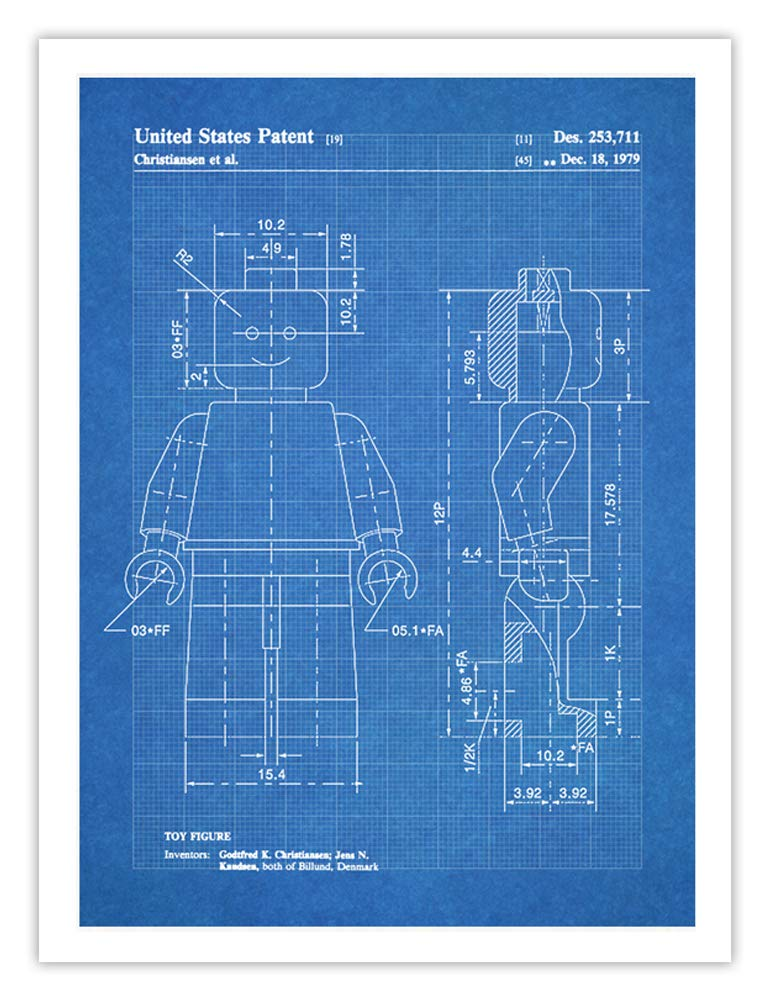
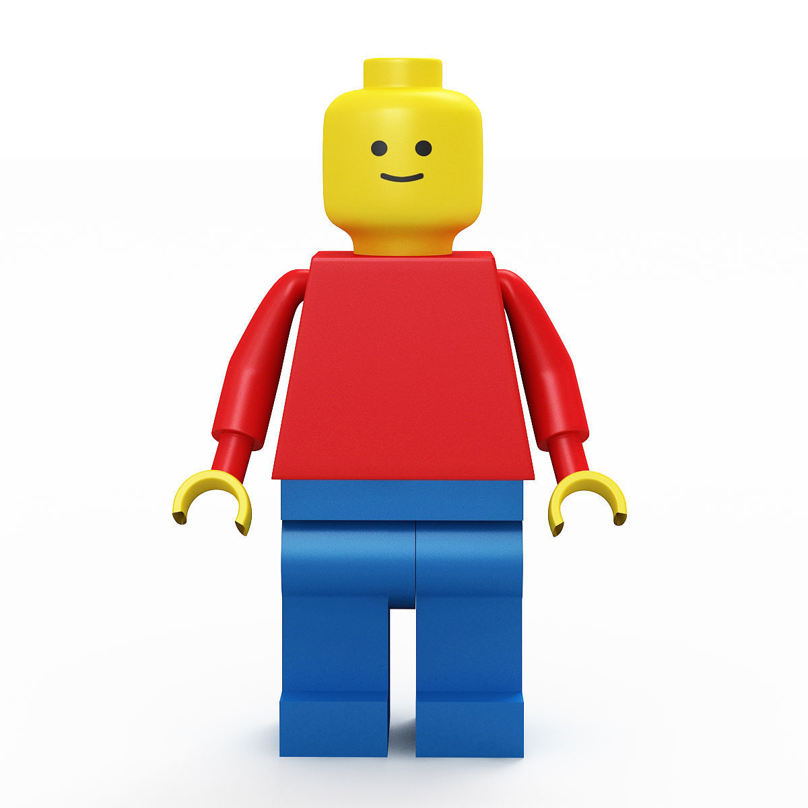

# Object-Oriented Design in Programming: Overview

## Learning Goals

By the end of this lesson, students should be able to...
- Describe the role that _classes_ fill in Ruby
- Differentiate between _classes_ and _instances_
- Identify the _state_ and _behavior_ of an _object_

## The Story So Far

So far, our code has usually been written like this:

1. We receive a problem statement
1. We make usually one `.rb` file
1. We write our code as a sequence of instructions to execute in this one file, working with numbers, strings, booleans, arrays, hashes, and symbols
1. Sometimes we use git to track our changes over time
1. Sometimes we install gems and load them into our Ruby files to use them
1. Sometimes we use tests in different files to check the correctness of our code

While we've gotten some interesting and useful tools (such as TDD and git), we haven't necessarily gotten strategies to re-think or re-organize our code.

Think back to our ride-share project. Imagine that we had a much larger dataset to work with, with more rides, drivers, passengers, and details. Imagine that we had to calculate more complex equations, with more complex relationships between concepts.

Our one file `worksheet.rb` would be so long, difficult to navigate, difficult to read, and difficult to understand. And working with the data would be more annoying to parse through and deal with!

## Introduce: Classes and Objects

Ruby, as a programming language, decided that the data types Numbers, Strings, Booleans, Arrays, Hashes, and Symbols, were interesting, useful, and common enough, that Ruby defined them. Numbers, Strings, Booleans, Arrays, Hashes, and Symbols, all have something unique that they represent. They also all have some unique behavior that is meaningful to them. For example, Numbers know how to be subtracted from each other. Strings can't be subtracted from each other, but strings know how to be concatenated together. Booleans can't be concatenated, but they can be flipped!

Just in this way that these types have their unique state and behavior, **Ruby allows us to define our own representations of ideas within a program using object-oriented programming.**

When we have the ability to define our own representations of ideas, we will define a **class**, which will let us create the template for this idea. Here, we will define the idea's (or class's) **state and behavior.**

After we've defined the idea by defining a **class**, we will use this template/blueprint to create manifestations, or **instances** of this class. These instances are also known as **objects.**

The programming language features and design patterns that enable these patterns is called **object-oriented programming.**

#### Examples

For the third and fourth example, let's create an idea that isn't pre-defined by Ruby.

Idea to represent | Class | Instances of the class
--- | --- | ---
A class that describes the idea of a sequence of text | String | `"Hello World! I am an instance of a String!"`
A class that describes an ordered list | Array | `["red", "orange", "yellow"]`
A class that describes a driver working at a ride-share app, who has a ride history and a vehicle | Driver | A driver with a driver ID of `DR0004`
A class that describes a music album sold at a music store, and all its data | Album | Dirty Computer (2018)

#### Vocab

Term | Definition | Analogy
--- | --- | ---
[Class](https://en.wikipedia.org/wiki/Class_(computer_programming)) | Code that defines a _template_ for creating similar objects, namely by defining generic state and behavior | A blueprint; A cookie cutter that defines a very specific shape
[Object](https://en.wikipedia.org/wiki/Object_(computer_science)) | An instance of a class; a literal manifestation of a class; data that was created by class instantiation | A house made from a blueprint for a house; a cookie made from a cookie cutter
[Object-Oriented Programming](https://en.wikipedia.org/wiki/Object-oriented_programming) | A programming paradigm that says data can be described as "objects," or things that have their own state and behavior

### State and Behavior

When we start defining our own classes, we will define their generic **state** and their generic **behavior.**

**State** describes any data or attributes that should be kept over its lifetime.

**Behavior** describes any actions that objects of this class should be able to do.

#### Examples

Class | Instances | Something Kept in State | Behavior it Can Do
--- | --- | --- | ---
String | `"Hello World! I am an instance of a String!"` | These specific characters, in this specific order | become CAPITALIZED if it needs to
Array | `["red", "orange", "yellow"]` | These specific items, in this specific order | change the order of its items randomly, by shuffling
Driver | A driver with ID `DR0004`, 3 rides, who has earned $35, has an average rating of 4.67 | Its ID, number of rides, total amount of money earned, and total average rating | Calculate its own average rating, tell you the number of rides it has
Album | Dirty Computer (2018), which has 14 tracks in a certain order, was released April 2018, has a total album length of 48:42 | Tracks (number and order), release date, total album length | Can give you the audio data for any specific track it has

## OOP Means Defining Blueprints, And Using Instances

Because Ruby allows for OOP, we will start approaching software problems by considering the objects in play.

We should take care to differentiate how we use classes (blueprints) and instances of classes (objects).

Using the blueprint analogy, our process will be this:

1. Consider the problem, and come up with options about different _things_, _ideas_, _nouns_ etc that are relevant
1. Create a blueprint, or class in a blank Ruby file. This blueprint should describe the generic pieces of state and behavior of this idea

Then, to _use_ the blueprint, we will follow these steps:

1. In a different Ruby file, first we need to load the class file using `require_relative`
1. Then we need to use Ruby syntax to say "let's make a new one of these, and here are all of the specifics to put into the blueprint." If we were working with the `Driver` class, this is where we would say a driver's id is `DR0004`. If we were working with the `Album` class, this is where we would say that an album's title is `"Dirty Computer"`.

Consider: Imagine a software problem for a library tracking system. The library has so much data, and it wants to re-organize how it keeps track of audiobooks. If we wanted to make a class `Audiobook`, what generic state and behavior should it have? What could an _instance_ of Audiobook be?

## In Ruby, OOP Means Classes and Relationships

Just as strings, arrays, hashes, booleans, numbers, etc., may or may not have relationships with each other (for example, an array of arrays, a hash with strings in it), classes and objects may have relationships with each other.

We should look forward to learning more deeply how to define relationships between classes.

### We've Seen Classes

We may have seen classes before!

Let's look at a few examples:

If you've ever worked with time in Ruby, you'll have learned that Ruby describes time with the `Time` class. By making instances of the `Time` class, you can have an object that represents a specific Time, and can do cool time behaviors, like find out if that time was on a Wednesday.

If you've ever used `Array.new` to make an empty array, or `Hash.new` to make an empty hash, you've utilized the formal class syntax in Ruby to create a new instance of those classes!

We'll get more into the syntax about classes shortly!

## What to Look Forward to

We should be focusing on developing the following three skills in our futures:

1. Learning and practicing the syntax for **defining classes** and their state, behavior, and relationships
2. Learning and practicing the syntax for using classes to **create and use instances of classes**
3. Learning and practicing designing classes, in a way that is relevant to our problem at hand, without being overly complex

Objects and classes can represent things that are like physical objects (like Albums, Drivers, or Users), or more abstract (like Time, or True)

When modeling a real-world object like a book or a person, it's important to remember that you don't need to track everything about it, only what's important to your program. You certainly could include information about the color of the book's cover or how tall it is in your catalogue, but you should only do so if that information is useful to you.

Different kinds of objects have different state and behaviors, and the same real-world object in two different programs might have totally different representations. Think about how different a model of a person would be in a medical application versus in a gradebook. What information is relevant is totally different for the two programs.

## Summary

- An _object_ is a piece of a program that ties together _state_ (variables) and _behavior_ (methods)
- A _class_ is used to define a type of object
  - Any program may have zero, one or many _instances_ of a class
  - We've seen many of Ruby's built-in classes already, like `String`, `Array` and `Time`
- Reasoning about what _state_ and _behavior_ your classes should have is one of the fundamental skills of designing software

## Vocab

Term              | Definition | Examples&nbsp;&nbsp;&nbsp;&nbsp;&nbsp;&nbsp;&nbsp;&nbsp;&nbsp;&nbsp;&nbsp;&nbsp;&nbsp;&nbsp;&nbsp;&nbsp;&nbsp;&nbsp;&nbsp;&nbsp;&nbsp;&nbsp;&nbsp;&nbsp;&nbsp;&nbsp;&nbsp;&nbsp;&nbsp;&nbsp;&nbsp;&nbsp;&nbsp;&nbsp;&nbsp;&nbsp;&nbsp;&nbsp;&nbsp;&nbsp;&nbsp;&nbsp;
---               | ---        | ---
Object            | A representation of an idea within a program. Ties together _state_ (variables) and _behavior_ (methods). | A number, an array, any instance of a class
Class             | A type of object. A class is _abstract_ in that it defines what those objects will look like, but doesn't itself have state. | `Array`, `Time`
Instance          | One particular object. Follows the format defined by its class, but has state that makes it specific. | `[1, 2, 3]`, `Time.new(2017, 'jul', 29)`
State             | Data or attributes an object will keep track of | The elements of an array, the days and years stored in a `Time` object
Behavior          | Methods that rely upon or modify state | `Array`s can be sorted with a `sort` method, `Time` instances can check if it is on a Friday with a `friday?` method
