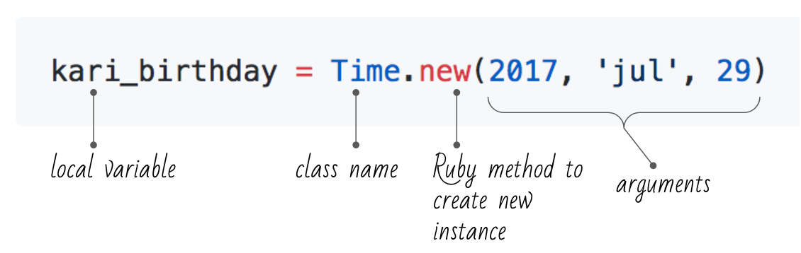

# Object Orientation: Classes, and Instances
## Learning Goals
By the end of this lesson, students should be able to...
- Describe the role that _classes_ fill in Ruby
- Define, instantiate and use a Ruby _class_
- Store object state using _instance variables_
- Define object behavior using _instance methods_
- DRY up repeated code using _helper methods_

## Objects Overview

An `object` is the representation of an idea within a program. Let's look at a common type of object we've used already: `Time`.




A class can be identified by it's __capitalized first letter__. In the above snippet `Time` is a class. When you call `.new` on a class, you get an _instance_ of that class. In any program, there may be zero, one or many instances of any given class.

Now let's examine another class we're familiar with: `String`

```ruby
my_animal = "elephant"
your_animal = "giraffe"
empty_string = ""
```

Turns out every string we've ever used is an instance of the class `String`. Because strings are so common, Ruby lets us use _string literals_ like `""` or `"elephant"` to create a new one. If feeling verbose, you could also call the `.new` method on the `String` class to create a new string object:

```ruby
my_animal = String.new("elephant")
```

The same is true for arrays and hashes. `[]` is short for `Array.new`, and `{}` for `Hash.new`. `""`, `[]`, and `{}` are syntactic sugar; using _literals_ to _initialize_ a new _instance_ of an _object type_. Most classes do **NOT** have this kind of convenience.

In general, using the syntactic sugar is the right way to go. `"elephant"` is much easier to read than `String.new("elephant")`, and there's rarely a reason to use longer version.

### State and Behavior

Objects are used to tie together _state_ and _behavior_.
- **State:** data or attributes the object will keep track of
    - _the letters "a", "b" and "c" in a string `"abc"`_
- **Behavior:** methods that rely upon or modify the state
    - _the String `upcase` method_

```ruby
# state
my_animal = "elephant"
your_animal = "giraffe"

# behavior - same method but results vary based on state
my_animal.upcase # "ELEPHANT
your_animal.upcase # GIRAFFE
```

In Ruby, state will be represented using _attributes_, also known as _instance variables_, and behavior will be defined using _methods_.

### What Are Objects Used For?

It can be intimidating to look at `String`, `Hash` or `Array` when learning about objects for the first time. These are fundamental programming concepts that get used in almost every program, how can we ever hope to build or reason about something as complex as that?

Although any abstract idea can be represented as an object, it's sometimes easy to think of a physical object to get the idea. Let's imagine a program designed to keep track of a library catalogue, which might have a class called `Book`.

**Question:** what _state_ and _behavior_ might a `Book` class need?

Note that all this state and behavior is for a particular instance of a `Book`. Think about the abstract concept of a book, what is its title or author? That doesn't make any sense. Only when we create an instance do these properties come into focus.

When modeling a real-world object like a book or a person, it's important to remember that you don't need to track everything about it, only what's important to your program. You certainly could include information about the color of the book's cover or how tall it is in your catalogue, but you should only do so if that information is useful to you.

Different kinds of objects have different state and behaviors, and the same real-world object in two different programs might have totally different representations. Think about how different a model of a person would be in a medical application versus in a gradebook. What information is relevant is totally different for the two programs.

## Classes in Ruby

As with methods, there are two steps to working with classes in Ruby:
1. **Define** the class using the `class` keyword
    - Happens once
    - Similar to defining a method with `def`
1. **Instantiate** (create an instance of) the class using `.new`
    - May happen many times
    - Similar to invoking a method

With all the classes we've worked with so far (`String`, `Array` and `Hash`) we've only had to do the second step, because the class was already defined for us. The first step definitely did happen though - somewhere in the bowels of you computer there is a file called `string.rb` containing all the code required to make a `String` work.

Our running example today will be a class to represent a chair. The simplest possible class in Ruby doesn't have any state or behavior, just the name `Chair` (note the capital `C`). Even so, we can instantiate it with `Chair.new`.

```ruby
# Define the class
class Chair
end

# Create an instance of the class
kari_chair = Chair.new
# ...what now?
```

We've got a chair, but it's not very interesting yet. To make our classes more useful, we'll need to add some methods and attributes.

### Adding Behavior Through Methods

If we define methods inside of our class definition, they will be available for instances of our class. Because these methods require an instance of the class to run, they're sometimes called _instance methods_.

```ruby
class Chair
  def name
    return "Terrible Chair"
  end  

  def weight_in_lbs
    return 29
  end

  def style
    return "Swivel"
  end

  def color
    return "Black"
  end

  def max_height
    return 32.625
  end
end
```

I'm going to load this script into `irb` using the `-r` flag

```bash
$ irb -r ./chair.rb
```

```ruby
Chair # => Chair - This is the class, it's just the idea of a chair
Chair.color # => Error!
Chair.new # => #<Chair:0x007fb7da550ca0> - this is an instance of a chair, it has a color
Chair.new.color # => "Black"
```

This is a good start, our chairs now have something to do. But our chairs are still all the same. There's nothing to differentiate one chair from another.

```ruby
first_chair = Chair.new
second_chair = Chair.new

first_chair.name     # => Terrible Chair
second_chair.name    # => Terrible Chair
```

### Adding State Through Instance Variables

Ruby allows us to attach variables to an instance of a class. Such variables are appropriately named _instance variables_. To create or use an instance variable, prefix the variable's name with the `@` symbol. Instance variables can be read and written in any instance method.

By default, instance variables are not accessible outside the instance they're attached to. By convention, to make them readable we define a method with the same name as the variable, which returns the current value of that variable. This method is called a _reader_, _getter_ or _accessor_, depending on what language you're in (Ruby uses _reader_).

Similarly, Ruby allows us to define a method that will allow the variable to be set with the `=` sign. This method is variously called a _writer_, _setter_ or _mutator_ (Ruby uses _writer_).

Let's rewrite our `Chair` to take advantage of instance variables.

```ruby
class Chair
  # reader for style
  def style
    return @style
  end

  # writer for style
  def style=(new_style)
    @style = new_style
  end

  def color
    return @color
  end

  def color=(new_color)
    @color = new_color
  end
end
```

Now we can have different chairs with different attributes.

```ruby
kari_chair = Chair.new
charles_chair = Chair.new

kari_chair.style = "swivel"
kari_chair.color = "black"

charles_chair.style = "comfy"
charles_chair.color = "green"

puts kari_chair.style     # => swivel
puts charles_chair.style  # => comfy
```

Methods that access instance variables don't have to be simple getters or setters - they can have complex logic like any other method. For example, we might have `@seat_height` and `@max_height` instance variables and an `adjust_seat` method:

```ruby
def adjust_seat(direction, amount)
  if direction == :up
    @seat_height += amount
    # Don't go higher than the max height

    if @seat_height > @max_height
      @seat_height = @max_height
    end

  elsif direction == :down
    @seat_height -= amount

    # Don't go lower than zero
    if @seat_height < 0
      @seat_height = 0
    end

  else
    puts "That direction doesn't make sense"
  end
end
```

### The Constructor

Objects in Ruby can have a special method called `initialize`. This method, often called a _constructor_, is called automatically from within the `new` method. So we will use it to "construct" our object. Since `initialize` is a method we create, we can define _parameters_ for it and pass _arguments_ to the `new` method. `new` is kind enough to pass along its _arguments_ to `initialize`.

```ruby
class Chair
  # Constructor! This will be called automatically when you invoke Chair.new
  def initialize(style, color)
    @style = style
    @color = color
  end

  def style
    return @style
  end

  def style=(new_style)
    @style = new_style
  end

  def color
    return @color
  end

  def color=(new_color)
    @color = new_color
  end
end
```

Now when we create a new `Chair`, we can give it some initial settings.

```ruby
kari_chair = Chair.new('swivel', 'black')
puts kari_chair.style     # => swivel
```

Much more concise! This pattern of passing in a bunch of values for instance variables is a very common one, but the constructor is just another method, so you can write any code you need in it. You can even call other methods!

Another advantage of setting instance variables in the constructor is that we know those variables will always have a value. By making it impossible to have a `Chair` without an associated `style` and `color`, we can save ourselves all sorts of frustration later on.

### Use Helper Methods to Avoid Repetition

The code above allows us to read/get and write/set the color and style properties in the `Chair` class. This is done so frequently that Ruby added some syntactic sugar to help us out. Enter two _helper methods_, `attr_reader` and `attr_writer`:

```ruby
class Chair
  # Generate reader methods for style and color
  attr_reader :style, :color

  # Only generate a writer method for color
  attr_writer :color

  def initialize(style, color)
    @style = style
    @color = color
  end
end
```

A _helper method_ (sometimes called a _macro_ or _generator_) is a small piece of code that generates a big piece of code. These two lines tell Ruby to automatically add reader and writer methods for those variables to your class. Adding `attr_reader :color` to our class is _exactly_ the same as creating the `def color` method in the previous example. Similarly, `attr_writer :color` replaces the `def color=(new_color)` method.

The instance variables to be exposed are specified using a comma-seperated list of symbols. To demonstrate the syntax, in the above example we have created both reader and writer methods for `@color`, but only a reader method for `@style`.

These pieces of code are called helper **methods** for a reason. Under the hood they're actually built-in Ruby methods that are run when the class is defined. `attr_reader` or `attr_writer` is the name of the method, and the instance variables to expose (like `:style`) are the arguments. Weird!

If you don't need to be able to control the read/get and write/set functionality independently, `attr_accessor` provides the functionality of `attr_reader` and `attr_writer`!

```ruby
class Chair
  # Color had both an attr_reader and an attr_writer, so we replace it with attr_accessor
  attr_accessor :color

  # Style had only an attr_reader, so we leave it as-is
  attr_reader :style

  def initialize(style, color)
    @style = style
    @color = color
  end
end
```

Helper methods like `attr_accessor` are very useful, because they allow us to add common functionality without typing out a bunch of boilerplate code. This makes our programs more readable and reduces the possibility of making a mistake. For these reasons, **we recommend that you always use the `attr_reader` / `attr_writer` / `attr_accessor` helper methods**, and never write getter and setter methods manually.

We'll see many more helper methods as we start talking about Rails in a few weeks.

## Classes Vocabulary

Term              | Definition | Example&nbsp;&nbsp;&nbsp;&nbsp;&nbsp;&nbsp;&nbsp;&nbsp;&nbsp;&nbsp;&nbsp;&nbsp;&nbsp;&nbsp;&nbsp;&nbsp;&nbsp;&nbsp;&nbsp;&nbsp;&nbsp;&nbsp;&nbsp;&nbsp;&nbsp;&nbsp;&nbsp;&nbsp;&nbsp;&nbsp;&nbsp;&nbsp;&nbsp;&nbsp;&nbsp;&nbsp;&nbsp;&nbsp;&nbsp;&nbsp;&nbsp;&nbsp;
---               | ---        | ---
Object            | A programming concept that ties together _state_ (variables) and _behavior_ (methods). |
Class             | Definition of what an object looks like, using Ruby's `class` keyword. The first letter is always capitalized. | `class Chair`
Instance          | One particular object. Built using a class's `new` method. | `kari_chair = Chair.new`
Instance Variable | A variable attached to a particular instance of a class. Also known as _attributes_. Always begins with an `@`. Not visible outside that class. | `@color`
Instance Method   | A method attached to a particular instance of a class. Often relies on or modifies instance variables. Can be invoked from outside that class using `.` notation. | `def adjust_seat(dir, amount)`
Constructor       | A special instance method that is called automatically when a new instance of a class is created. Takes care of any initial setup. Any arguments passed to `new` will be passed to the constructor. | `def initialize(style, color)`
Reader Method     | Instance method that returns the value of an instance variable. Also known as a _getter_ or _accessor_. | `def color`<br>&nbsp;&nbsp;&nbsp;&nbsp;`return @color`<br>`end`
Writer Method     | Instance method that sets the value of an instance variable. Also known as a _setter_ or _mutator_. | `def color=(new_color)`<br>&nbsp;&nbsp;&nbsp;&nbsp;`@color=new_color`<br>`end`
Helper Method     | A small piece of code that generates a big piece of code. In Ruby, they're used to automatically add functionality to a class, like reader or writer methods. | `attr_accessor :color`

## Additional Resources

- [Creating your own attr_accessor in Ruby](https://mikeyhogarth.wordpress.com/2011/12/01/creating-your-own-attr_accessor-in-ruby/)
