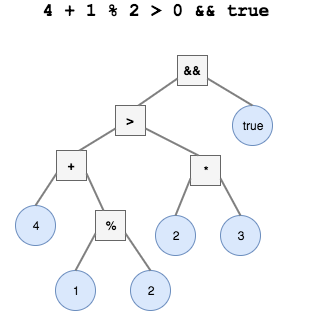

# Compound and Complex Conditionals
## Learning Goals
- Explore the _Truth Table_ & the _Precedence List_
- Practice expressing and evaluating complex conditions
- Learn strategies to manage complex conditions with `elsif` and `case`.
- Learn two new kinds of iteration using _conditional loops_: `while` and `until`

## Compound Conditions
Comparisons are often combined. Combinations can take one of two forms, __&& (and)__ and __|| (or)__. When you combine with _and_, __both__ comparisons must be `true` for the entire combination to be `true`. By combining with `or`, when __either__ of the comparisons are `true`, the entire combination is `true`:

### Truth Table
```ruby
true && true   # => true and true is true
true && false  # => true and false is false
false && true  # => false and true is false
false && false # => false and false is false

true || true   # => true or true is true
true || false  # => true or false is true
false || true  # => false or true is true
false || false # => false or false is false
```

## Evaluating Compound Conditions: Understanding _Precedence_
Compound comparisons often involve a chain of expressions to be evaluated. Ruby follows strict rules when deciding the order in which expressions are evaluated. These rules can be expressed in terms of their _precedence_. __Operations with a higher _precedence_ are evaluated before operations with lower _precedence_.__ To change the order in which operations are evaluated, add parenthesis `()` around the operations you want evaluated first.

Here is an abbreviated _Precedence List_ from __highest__ to __lowest__ _precedence_:

1. `!`, `unary +`
1. `**`
1. `unary -`
1. `*`, `/`, `%`
1. `+`, `-`
1. `>`, `>=`, `<`, `<=`
1. `<=>`, `==`, `===`
1. `&&`
1. `||`

__Note:__ _unary +_ and _unary -_ here means assigning a numeric value (_Integer_ or _Float_) as either positive or negative, e.g. `-5`, `-12.2`, `+30` and `+2.0`.

When evaluating a complex compound conditional expression, it is nice to visualize the resulting expression. One way to do this is by using a [parse tree](https://en.wikibooks.org/wiki/Introduction_to_Programming_Languages/Precedence_and_Associativity). A parse tree will show the way the result of higher precedence operators are passed to later operations, until you have a result.

Here is an example parse tree for the expression `4 + 1 % 2 > 2 * 3 && true`



### Using Compound Conditions

```ruby
puts "What is your first name?"
first_name = gets.chomp
puts "What is your last name?"
last_name = gets.chomp

# without compound conditions
if first_name.length > 8
  if last_name.length > 10
    puts "Your name is considerable!"
  end
end

# This is the same as the above, with compound conditions
if first_name.length > 8 && last_name.length > 10
  puts "Your name is considerable!"
end
```

```ruby
if command == "add"
  puts "We're adding numbers."
end

if command == "+"
  puts "We're adding numbers."
end

# This is the same as the above
# same amount of work, half as much code
if command == "add" || command == "+"
  puts "We're adding numbers."
end
```

### Complex conditionals
The `if/else/end` code we've written above is the standard and simplest form of a conditional. It is possible to extend this form with one or more `elsif` lines. Let's look at something kinda scary first:

```ruby
if command == "add" || command == "+"
  puts "We're adding numbers"
else
  if command == "subtract" || command == "-"
    puts "We're subtracting numbers"
  else
    if command == "multiply" || command == "*"
      puts "We're multiplying numbers"
    end
  end
end

# This is equivalent to the above
if command == "add" || command == "+"
  puts "We're adding numbers"
elsif command == "subtract" || command == "-"
  puts "We're subtracting numbers"
elsif command == "multiply" || command == "*"
  puts "We're multiplying numbers"
end
```

This can be very useful, when you have more than one `elsif` line, because the indentation, or *nesting*, can quickly become very deep, and more difficult to understand.


### Simplifying really complex conditionals
When you have several `elsif` lines within a single `if`, there's a way to write each conditional with much less repetition. First, a really long, really complex conditional:

```ruby
if command == "add" || command == "+"
  puts "We're adding numbers"
elsif command == "subtract" || command == "-"
  puts "We're subtracting numbers"
elsif command == "multiply" || command == "*"
  puts "We're multiplying numbers"
elsif command == "divide" || command == "/"
  puts "We're dividing numbers"
elsif command == "exponify" || command == "**"
  puts "We're exponentiating numbers"
elsif command == "sqrt"
  puts "We're finding the square root of a number"
else
  puts "What do you want from me?!"
end
```

The above code works, but it's kinda messy. We can trim it by using the `case/when` syntax:
```ruby
case command
  when "add", "+"
    puts "We're adding numbers"
  when "subtract", "-"
    puts "We're subtracting numbers"
  when "multiply", "*"
    puts "We're multiplying numbers"
  when "divide", "/"
    puts "We're dividing numbers"
  when "exponify", "**"
    puts "We're exponentiating numbers"
  when "sqrt"
    puts "We're finding the square root of a number"
  else
    puts "What do you want from me?!"
end
```

## Conditional Loops
### Wait a `while`
Execute the iterator `while` the condition is true.

```ruby
i = 0

while i < 4
  puts i
  i += 1
end
```

The above code will output the values of i until i is no longer less than 4, resulting in the following output:
```
0
1
2
3
```

```ruby
command = gets.chomp

while command != "add" && command != "+"
  puts "Please tell me to add (+)!"
  command = gets.chomp
end

puts "OMG It's about time!"
```

### Make it clearer by using `Until`
Execute the iterator `until` the condition is true.

```ruby
i = 0

until i == 4
  puts i
  i += 1
end
```

The above code will output the values of i until i is equal to 4, resulting in the following (equivalent to the above) output:

```ruby
0
1
2
3
```

```ruby
command = gets.chomp

until command == "add" || command == "+" || command == "subtract" || command == "-"
  puts "Please tell me to add (+) or subtract (-)!"
  command = gets.chomp
end

puts "Yay we did it!"
```

### Make it clearer by using `include?`
The _Array method_ `include?` can be used to simplify a complex conditional. It returns `true` if the provided _parameter_ is equal to any of the parameters in the _Array_, otherwise, it returns `false`:

```ruby
command = gets.chomp

until ["add", "+", "subtract", "-"].include?(command)
  puts "Please tell me to add (+) or subtract (-)!"
  command = gets.chomp
end

puts "Yay we did it!"
```
