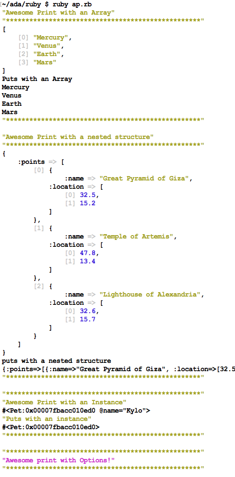

# An Introduction to Ruby Gems

## Learning Goals
By the end of this lesson you should:
- Be able to add a gem to your computer.
- `require` a gem and use it in your projects
- Have a basic grasp of how to use:
  - Awesome Print
  - Colorize
  - Pry
  - Faker

## Introduction
Gems are what other languages call a library. They are packaged code that can be shared and distributed. Most gems are distributed using [RubyGems.org](https://rubygems.org/). A Gem will contain one or more
Ruby Classes, just like the ones you've been creating.

The pages linked above are the rubygems sites for the gems, and you can sometimes find useful documentation here, but more often the updated documentation is on their github pages.

That said we do **NOT** expect all of these gems to be immediately useful.  The learning goal for this lesson is to be able to install, require and use Gems found on RubyGems and Github.  Further it is important to learn to research Gem documentation on Github and use it in your applications.  

## Installing Gems
Installing gems is super easy! We do it right from the Terminal. To install the gem `colorize`, do `$ gem install colorize`. You can see all the gems currently installed using `$ gem list`.

## Requiring Gems
Since gems are external Ruby libraries, they are not included in core Ruby. To use the code provided by the gem, we `require` it in our code base. This can be done at the top of any Ruby script, file, or in `irb`:


## Colorize
Next let's take a quick look at the colorize gem.

- [Colorize](https://rubygems.org/gems/colorize)

Look first at the Gem's page on rubygems.org and then examine the project's [Github repository](https://github.com/fazibear/colorize).

Lets answer a few questions:
1.   What does the gem do?
1.   How do you install the Gem and use it in your application?
1.   How would it be useful?

```bash
gem install colorize
```

Look at the [usage section](https://github.com/fazibear/colorize) of the github page.

```ruby
require "colorize"

puts "This is blue".colorize(:blue)
puts "This is light blue".colorize(:light_blue)
puts "This is also blue".colorize(:color => :blue)
puts "This is light blue with red background".colorize(:color => :light_blue, :background => :red)
puts "This is light blue with red background".colorize(:light_blue ).colorize( :background => :red)
puts "This is blue text on red".blue.on_red
puts "This is red on blue".colorize(:red).on_blue
puts "This is red on blue and underline".colorize(:red).on_blue.underline
puts "This is blue text on red".blue.on_red.blink
puts "This is uncolorized".blue.on_red.uncolorize
```

Neat!  Adding `.colorize` to a string in a `puts` statement styles the output.

## Gems Jigsaw

Next we will break into teams to investigate various gems.  Each time will create a **5 minute** presentation on their assigned gem(s).  In this activity, we will be learning and then teaching each other, in the format of two rounds: the research round and the teaching round.

In the research round, you will meet with your first assigned group to learn about an assigned topic.

- [Awesome Print](https://rubygems.org/gems/awesome_print/versions/1.8.0)
- [Pry](https://rubygems.org/gems/pry/versions/0.11.3)
- [Faker](https://rubygems.org/gems/faker/versions/1.8.7)
- [Chronic](https://github.com/mojombo/chronic)
- [Money](http://rubymoney.github.io/money/)
- [Terminal Table](https://github.com/tj/terminal-table)

In the teaching round, your research round group will disseminate and you will go into your a second assigned group. It is your responsibility to teach this group about that topic.

### What to Research
You will be learning and teaching each other a variety of Ruby Gems.

You will be practicing and teaching each other how to read through the Ruby documentation & Github pages to find these answers.

### Where to Start
You will want to start with the sample code below, and github pages for your given gem. To find the right web page, you may want to directly use a search engine, or you can look through the RubyGems docs for a link to the Gem. You will want to answer the questions:

-   What does this Gem do on a high level?
-   How do you use it?  Provide an example
-   What kind of syntax does it require?
-   Provide an example of a situation where it would be useful.

### Awesome Print

Awesome Print is... truly awesome!  It highlights syntax and gives you formatting options on console output.

```ruby
require "awesome_print"
```

**Example: Using the `awesome_print` gem.**
Generally the github page for a gem is the best place to go to get started. Let's check out the [awesome_print gems' page](https://github.com/awesome-print/awesome_print). Under _usage_ we see some common examples of how to use this gem.

In general `awesome_print` is a a great tool for printing debugging messages to the console because of it's syntax highlighting and how it provides information beyound `puts`.

```ruby
require 'awesome_print'

# Awesome_print has Waaay too many features to demonstrate in one example.
# We will stick to the basics.

# Comparing ap to puts

sample_array = ["Mercury", "Venus", "Earth", "Mars"]
ap "Awesome Print with an Array"
ap sample_array
puts "Puts with an Array"
puts sample_array


nested_structure = {
  points: [
    {
      name: "Great Pyramid of Giza",
      location: [32.5, 15.2]
    },
    {
      name: "Temple of Artemis",
      location: [47.8, 13.4]
    },
    {
      name: "Lighthouse of Alexandria",
      location: [32.6, 15.7]
    }
  ]
}

ap "Awesome Print with a nested structure"
ap nested_structure
puts "puts with a nested structure"
puts nested_structure

ap "Awesome print with an object"
class City
  def initialize(name)
    @name = name
  end
end

my_city = City.new("Seattle")
ap "Awesome Print with an Instance"
ap my_city
ap "Puts with an instance"
puts my_city

ap "Awesome print with Options!", color: {string: :purpleish}
```


**Exercise** Try to add an option to an `ap` statement.  Check the [github page](https://github.com/awesome-print/awesome_print)  for instructions


### Pry

Pry is an amazing gem which serves a couple of purposes.

1.  It can replace irb to serve as a REPL.  This is advantageous because it formats code nicely.
2. It can be used in debugging to halt your program and let you interact with it in a REPL.

To install `pry`
```bash
gem install pry
```

You can use `pry` to halt your program and open up a REPL to explore your running program with the command `binding.pry`

For example:

```ruby
# test_pry.rb
require "pry"

num = 0
while num < 10
  num += 1
  binding.pry
end

```

Running the program above with `ruby test_pry.rb` will result in this:
```
ruby test_pry.rb

From: /Users/chris/ada/ruby/test_pry.rb @ line 6 :

    1: require "pry"
    2:
    3: num = 0
    4: while num < 10
    5:   num += 1
 => 6:   binding.pry
    7: end

[1] pry(main)>
```

Pry has halted the program mid-execution and put you into an environment where you can interact with the program live.  You can then enter irb-like commands like: `num` to get the current value of the variable in the program, or call methods etc.

You can enter `exit` to exit the current binding and the program will halt again the next time it encounters  `binding.pry`, which in this case is the next iteration of the loop.  When you finish you can exit the entire program with `exit-program`.  We will go further into `pry` at a later date and you are welcome to [research](http://pryrepl.org/) the gem.

#### Replacing irb

You can have Pry replace irb by editing your bash profile with `atom ~/.profile` and adding the following line to the end of the file.

```bash
alias irb='pry'
```

Now the next time you open the terminal typing `irb` will instead invoke `pry`!

### Faker
Quite often as you are building a program you will need demo/fake data.  This could be names, addresses, numbers, etc.  For this we often turn toward `faker`.  This gem is designed to generate a variety of sample information.  To learn more, check out it's [github page](https://github.com/stympy/faker).

You can install `faker`
```bash
gem install faker
```

### Money

Money is a Ruby Gem for dealing with money and currency conversion.  A good place to learn more is it's [github page](https://github.com/RubyMoney/money)

To install the gem
```bash
$  gem install money
```

To use the Gem you need to require the gem and create money objects specifying the currency type.

```ruby
require 'money'

# Needed if you don't have a locale set up on your computer
I18n.enforce_available_locales = false

five_hundred_bucks = Money.new(500, 'USD')
five_hundred_euro = Money.new(500, 'EUR')

puts "I have #{five_hundred_bucks.format} and #{five_hundred_euro.format}"

Money.add_rate("USD", "CAD", 1.32)

puts "Five hundred bucks is #{five_hundred_bucks.exchange_to('CAD')} Canadian"
```

### Terminal Table

Terminal table helps you align text in a terminal application by setting up a grid.  Grids are very helpful in design.

To install Terminal Table:

```bash
$  gem install terminal-table
```

Terminal Table works by setting up an array of arrays.  Each element in the outer array defines a row.

```ruby
require 'terminal-table'

rows = []
rows << ['1st row left-side', '1st row middle', '1st row right-side']
rows << ['2nd row left-side', '2nd row middle', '2nd row right-side']
rows << ['2nd row left-side', '2nd row middle', '2nd row right-side']
table = Terminal::Table.new :rows => rows


puts table

# output:
#  +-------------------+----------------+--------------------+
#  | 1st row left-side | 1st row middle | 1st row right-side |
#  | 2nd row left-side | 2nd row middle | 2nd row right-side |
#  | 2nd row left-side | 2nd row middle | 2nd row right-side |
#  +-------------------+----------------+--------------------+
```

It has a number of options including table headers, alignment, different styles and widths for columns
## Using Gems in your projects

You are welcome to use gems in your projects.  However no gem will be required, unless specified in the project.

## Other Great Gems!

- [lolcat](https://github.com/busyloop/lolcat) & [table_flipper](https://github.com/iridakos/table_flipper)
- [Geocoder](http://www.rubygeocoder.com/)
- [Gist](https://github.com/defunkt/gist)
- [Rails](https://github.com/rails/rails)
