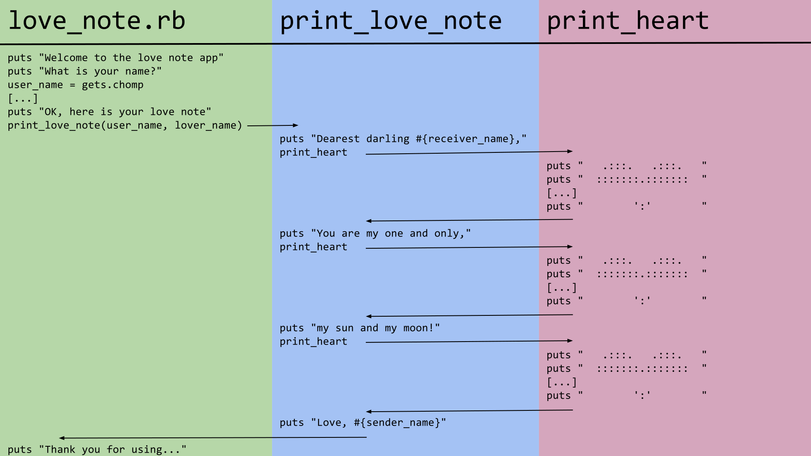

# Methods Exercise: Friendship Note

To demonstrate how methods are useful, let's write a program that prints out a short note to the console.

## Setup

Create a new directory called `friendship_note`, `cd` into it, create a file `friendship_note.rb` and open it with Atom:

```bash
mkdir friendship_note
cd friendship_note
touch friendship_note.rb
atom .
```

## The Heart

We'll start with the most essential part of any note: a heart.

```ruby
# friendship_note.rb
def print_heart
  puts "   .:::.   .:::.   "
  puts "  :::::::.:::::::  "
  puts "  :::::::::::::::  "
  puts "  ':::::::::::::'  "
  puts "    ':::::::::'    "
  puts "      ':::::'      "
  puts "        ':'        "
end
```

Before we go any further we should test this method to make sure it works. Save this method in a file called `friendship_note.rb`, then from the command line load it into `irb`:

```bash
$ irb -r ./friendship_note.rb
```

This will drop us into the familiar `irb` prompt, with the added benefit that everything defined in the file `./friendship_note.rb` is available for use. Note that the `./` indicates `irb` should look in the current directory for the file - if you leave it off, it will show an error.

Now from `irb` we can call our `print_heart` method:

```
2.4.0 :001 > print_heart
   .:::.   .:::.    
  :::::::.:::::::   
  :::::::::::::::   
  ':::::::::::::'   
    ':::::::::'     
      ':::::'       
        ':'         
 => nil
```

## The Note

Next we'll make use of this method... by writing another method! The new method, `print_note`, will take two parameters, `sender_name` and `receiver_name`, and it will make use of our `print_heart` method.

**Question:** What will the _signature_ of this method look like? What might it _return_?

Add the following code to `friendship_note.rb`, below our previous `print_heart` method:

```ruby
# friendship_note.rb
def print_note(sender_name, receiver_name)
  puts "Dear #{receiver_name},"
  print_heart

  puts "You are a good friend to me,"
  print_heart

  puts "And I hope you have a wonderful day!"
  print_heart

  puts "Sincerely, #{sender_name}"
end
```

We'll test it with `irb` again. Since our new method takes a _parameter_, we'll need to add an _argument_ when we _invoke_ the function. The arguments go in parentheses and are separated by a comma, like this: `print_note('Ada', 'Katherine')`. Here's the full sequence:

```
$ irb -r ./friendship_note.rb
2.4.0 :002 > print_note('Ada', 'Katherine')
Dear Katherine,
   .:::.   .:::.   
[... the rest of the note ...]
        ':'         
Sincerely, Ada
=> nil
```

Note that we get three hearts despite only having typed the heart's `puts` statements once in our code - this is part of the power of methods.

**Question:** Could you use a loop to accomplish the same thing?

## The App

Finally, we'll build a little bit of code to drive this application. Add this to the bottom of the file:

```ruby
puts "Welcome to the friendship note app"

puts "What is your name?"
user_name = gets.chomp

puts "Who is your friend?"
friend_name = gets.chomp

puts "OK, here is your note"
print_note(user_name, friend_name)

puts "Thank you for using the friendship note app"
```

When we run the code `print_note(user_name, friend_name)`, we _invoke_ the method we _defined_ above, passing in two _arguments_ to match the _parameters_ in the _method signature_.

[The final version of the file should look like this.](https://gist.github.com/droberts-ada/4dd96ed4122081bf0aa673352230f458) Now we can run the whole thing from the terminal (not `irb`) using `ruby friendship_note.rb`.

## Diagram

This diagram shows how the code in different methods is interleaved when the program is run. Some of the code has been omitted to save space, but otherwise it's the same program. Notice how different it looks than the code you wrote in Atom.

<!-- https://docs.google.com/presentation/d/1KQ7dyY4EMkGDYQNuYjrtoSofKiKaQttEx13R1vG_JyM/ -->

