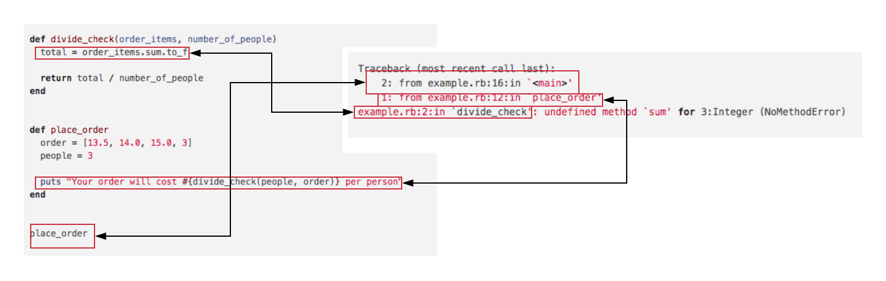

# Raising Exceptions

## Learning Goals
By the end of this lesson you should be able to:
-   Define what an exception is
-   Raise your own exceptions
-   Explain why exceptions are used

## What is an Exception?

When a program runs things can go wrong.  Your program could try to open a file that doesn't exist, connect to a resource online when the network is down, or try to divide a number by zero.  Ruby uses _exceptions_ to indicate that something has gone wrong.

You've seen exceptions before.  If you run the following in irb Ruby will _raise_ a `NameError` exception.

```ruby
>  puts some_variable_without_a_value
# Output:
# Traceback (most recent call last):
#        2: from /Users/cheezitman/.rvm/rubies/ruby-2.5.1/bin/irb:11:in `<main>'
#        1: from (irb):1
# NameError (undefined local variable or method `some_variable_without_a_value' for main:Object)
```

In this case `NameError` is an object that indicates what went wrong.  You may have also seen other errors in your projects.  So Exceptions are a way Ruby or people who write ruby methods to indicate a problem and let the user know that the program cannot proceed.

There is an entire family of Exceptions in Ruby each indicating a different type of problem.  Late you will learn to add your own types of exceptions.  For now we will work with predefined Exceptions.


When an exception is generated Ruby immediately leaves the current method and falls back to that method's caller and then that method's caller until the Exception is handled or it reaches the main program.

You may not appreciate it when your program crashes but as the exception unwinds through the calling methods it provides a _stack trace_ which is a list of the methods and line numbers encountered as the exception.

For example this program:

```ruby
def divide_check(order_items, number_of_people)
  total = order_items.sum.to_f

  return total / number_of_people
end


def place_order
  order = [13.5, 14.0, 15.0, 3]
  people = 3

  puts "Your order will cost #{divide_check(people, order)} per person"
end


place_order
```

Provides the following stack trace:

```bash
Traceback (most recent call last):
	2: from example.rb:16:in `<main>'
	1: from example.rb:12:in `place_order'
example.rb:2:in `divide_check': undefined method `sum' for 3:Integer (NoMethodError)
```

The Stack Trace above provides clues to where the problem was encountered allowing you to trace through the program and fix the bug.

**Question** What is the bug above?  Answer with your neighbor.
**Question** Does the stack trace indicate where the problem happened?

Notice that the Stack Trace indicates the line numbers and methods in which the Exception fell back through.



## Raising Your First Exception

One common type of Exception is ArgumentError. This exception is used to alert the user that the provided argument to a method is invalid for some reason. For example, it doesn't make sense to call divide_check with a number_of_people that is less that one. If that does happen, it probably means the programmer who wrote the code that calls that method made a mistake. We can raise an ArgumentError to help them understand what they did wrong.

```ruby
def divide_check(order_items, number_of_people)
  unless number_of_people > 0
    raise ArgumentError, 'You must provide a postive numeric argument to this method.'
  end

  total = order_items.sum

  return total / number_of_people
end
```

Now the stack trace looks like this:

```bash
Traceback (most recent call last):
	2: from example.rb:20:in `<main>'
	1: from example.rb:16:in `place_order'
example.rb:3:in `divide_check`: You must provide an array and a numeric argument to this method. (ArgumentError)
```

This stack trace is more specific about the problem and prevents the application from going further with invalid arguments.

## Why Raise ArgumentError Exceptions?

By checking the parameters of a method for valid values & types we prevent unexpected output.  We could add to our method by adding a check to make sure that `order_items` has a sum method.

```ruby
unless order_items.method_defined? :sum && number_of_people > 0
  raise ArgumentError, 'You must provide a collection and a positive numeric argument to this method.'
end
```

This prevents your methods from being called with an invalid number people when trying to divide the check.

### Why use ArgumentError?

Software development is normally a team sport.  In your career you will often write methods which will be used by other developers over the course of years.  In addition you may use a method you wrote **years** after you originally wrote it.  In such circumstances it can be easy to accidentally call a method with an invalid argument.  By providing checks to ensure proper arguments, your methods are defensive, preventing misuse.  This can prevent more subtle and harder to debug applications.  In turn this can make your methods easier to use.

## Summary

In this lesson we have seen that an exception is a indication of a problem in your application.  When an exception occurs the method or block is immediately exited and ruby continues to retrace through the the call stack until the program ends and produces a _stack trace_ which lists the methods and line numbers which can help the programmer debug the application. We have also seen how we can raise our own `ArgumentError` Exceptions and how it can help prevent our methods from being called with invalid arguments.

## More Resources
-   [RubyLearning.com on Exceptions](http://rubylearning.com/satishtalim/ruby_exceptions.html)
-   [A Beginner's Guide to Exceptions in Ruby](http://blog.honeybadger.io/a-beginner-s-guide-to-exceptions-in-ruby/)
