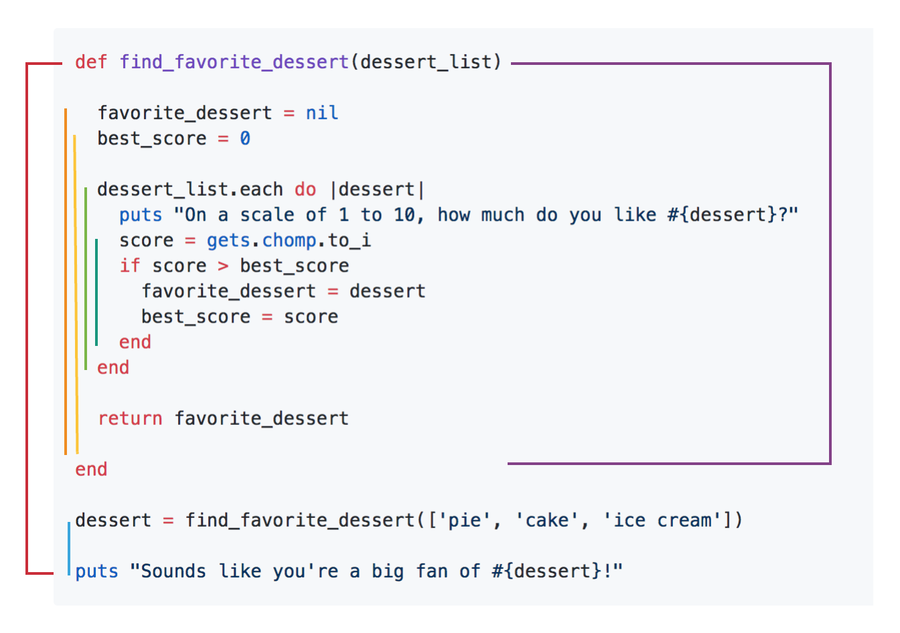

# Scope

## Learning Goals
- Learn how a variable's _scope_ is defined
- Practice identifying when a variable is out of scope
- Reinforce the need of `return` statements
- One strategy for debugging variable scope

## Recap

### Local Variables

We've created lots of _local variables_ already. They look like this:

```ruby
my_name = "Kari"
```

### Characteristics of a local variable

- Local variables start with a lowercase letter or an underscore, no digits
- Local variables are only available within the block in which they were declared
- Local variables will raise an error if they are read before they are created
- Local variables are used __often__
- Ruby style recommends variable names are in snake_case

## Scope

The _scope_ of a variable is the collection of methods, blocks, and objects that know about that variable. It's the comprehensive list of where that variable is available. We can talk about _scope_ for any variable, or thing that can be accessed.

Local variables are only available inside the block in which they were declared and any of that block's child blocks.

What about things like method and block parameters? Turns out these too are local variables, and they follow the same rules as a local variable defined inside their method/block.

### Example: Identifying where and why in or out of scope

Let's read through the following code together.

This is a method that takes in an array of strings. For each item in the array, it will ask the user to give a score. The score will be compared to a best score value. In the end, it prints some result of the `find_favorite_dessert` method.

```ruby
def find_favorite_dessert(dessert_list)

  favorite_dessert = nil
  best_score = 0

  dessert_list.each do |dessert|
    puts "On a scale of 1 to 10, how much do you like #{dessert}?"
    score = gets.chomp.to_i
    if score > best_score
      favorite_dessert = dessert
      best_score = score
    end
  end

  return favorite_dessert

end

dessert = find_favorite_dessert(['pie', 'cake', 'ice cream'])

puts "Sounds like you're a big fan of #{dessert}!"
```

#### Check for understanding

1. What is the method name?
1. When do we call the method?
1. What are the method parameters?
1. What is the method's return value? What is the data type of this return value?
1. How do we print the final output?

#### Determine the Scope

Now that we have a grasp on our example code, let's talk through the scope of each variable. Again, the _scope_ of a variable is the collection of methods, blocks, and objects that know about that variable.

When a piece of code tries to access a variable that is _out of scope_, the code will break. Most likely, the code will give you an error `undefined local variable or method`. Other likely things that may happen is that your code thinks you are working with a `nil` value, and cannot work with `nil`.



#### Exercise

Now look at this exercise version of the above code. There are comments that correspond to the exercise questions below:

```ruby
def find_favorite_dessert(dessert_list)

  favorite_dessert = nil
  # 1:
  puts "The value of favorite_dessert: #{favorite_dessert}"
  best_score = 0

  dessert_list.each do |dessert|
    puts "On a scale of 1 to 10, how much do you like #{dessert}?"
    score = gets.chomp.to_i
    if score > best_score
      favorite_dessert = dessert
      best_score = score
    end
  end

  # 2:
  puts "The value of score: #{score}"

  # 3:
  puts "The value of best_score: #{best_score}"

  # 4:
  puts "The value of favorite_dessert: #{favorite_dessert}"

  return favorite_dessert

end

# 5:
puts "The value of dessert: #{dessert}"

dessert = find_favorite_dessert(['pie', 'cake', 'ice cream'])

# 6:
puts "The value of dessert: #{dessert}"

puts "Sounds like you're a big fan of #{dessert}!"
```

1. Given the input `5`, `9`, `1`, what is the output for #1 or what happens when the code for #1 tries to execute?
2. Given the input `5`, `9`, `1`, what is the output for #2 or what happens when the code for #2 tries to execute?
3. ... for #3?
4. ... for #4?
5. ... for #5?
6. ... for #6?

**Hint:** Use a whiteboard, write out the code line by line, and mark and color-code the scope of each variable.

**Bonus:** Make a loop table for this method.

### Remembering how important `return` is

In the above exercise, what was the answer to #4?
In the above exercise, what was the answer to #5?

Earlier we asked the question "How do we print the final output?"

Sometimes we need to access information that is defined within a different scope, but it is challenging to do so because of how variable scope works.

Above, we defined `favorite_dessert`, which had the value of the best scoring dessert. We needed to access it in the final output outside of the method, where we printed what our favorite dessert is. How did we do it?

We used the `return`ed value from the `find_favorite_dessert` method. Remember, the value of the method call **is** the value of the `return` statement in a method.

`find_favorite_dessert`'s final line reads `return favorite_dessert`.

When we _call_ and _invoke_ `find_favorite_dessert`, we use the line:
```ruby
dessert = find_favorite_dessert(['pie', 'cake', 'ice cream'])
```

In this way, we say that the _value_ of `find_favorite_dessert(['pie', 'cake', 'ice cream'])` **is** the returned value of that method, which is the _value_ of `favorite_dessert` within the method.

This value is assigned to the variable `dessert`.

**If you need the value of a variable from inside one method, you need to `return` it from that method.**

### Debugging Scope

Sometimes when we're coding, we're unsure of what the value of each variable is at a given moment.

Throughout Ada, we'll learn about ways to lessen that confusion with debugging techniques. The first debugging technique we will learn is using `puts` statements, just as we saw above.

When you are reading through some code and you aren't sure what the value of a variable is at that moment, one thing you can do is `puts` the variable.

## Conclusion

The _scope_ of a variable is the collection of methods, blocks, and objects that know about that variable.

Local variables are only available inside the block in which they were declared and any of that block's child blocks.

When we think about needing the value of a variable outside of its scope, one thing we can think about is utilizing `return`.

When we are unsure about what the value of something is, maybe because of misunderstanding its scope, we can use some strategies like `puts` to debug it.
