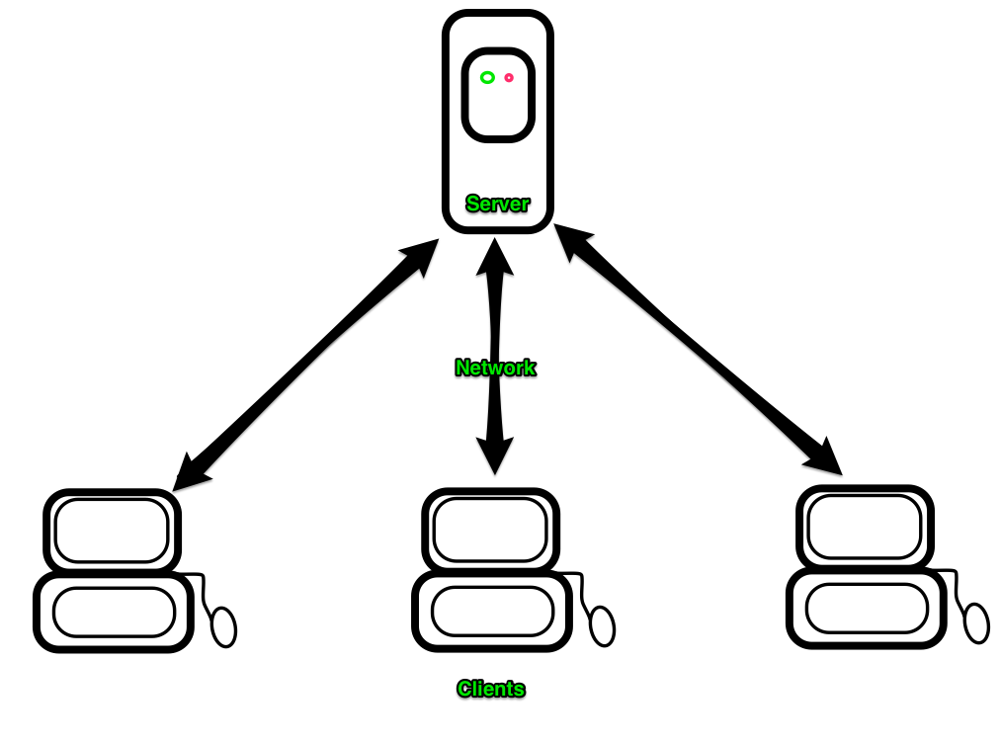
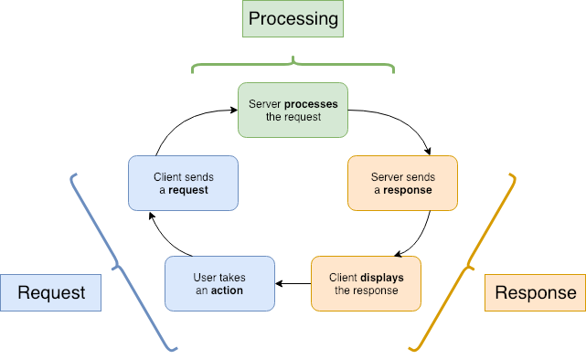

# Intro to the Web, HTTP and APIs

Pull from HTML/CSS week intro, Rails week intro, API week intro

Talk about installing a JSON viewer chrome plugin

https://chrome.google.com/webstore/detail/json-viewer/gbmdgpbipfallnflgajpaliibnhdgobh

## Learning Goals
- Examine the _HTTP_ protocol; what does it do? How does it do it?
- Talk about the most common server architecture on the internet: _Client/Server_
- Discuss the difference between _websites_ and _APIs_
- Explore an API using the browser
- Define the key pieces of the _request/response cycle_
  - Request: HTTP verb and path
  - Response: Status code

## So what is the Internet?
It's a computer network: a collection of computers and devices connected using communication devices (routers, cables, wifi, fiber, etc).

Computers communicate over a network by sending data over the connection.

There are many types of networks and architectures, but we're going to look primarily at the internet and client/server architecture.

### Client/Server

A **Server** is a computer that provides a service to clients.

A **Client** is a computer that requests services from a _server_ (your web browser, an ATM, your phone, a point-of-sale terminal).

Typically there is a single _server_ and many _clients_.



### How do _clients_ and _servers_ communicate? Protocols.

Hypertext Transfer Protocol (HTTP) functions as a __request-response__ protocol.

A client sends a __request__ and a server sends back an __response__. HTTP describes how that request and response are formatted. There are lots of different protocols that describe lots of different kinds of interactions. Common protocols utilized in networked or internet-based applications include HTTP and HTTPS (hypertext transfer protocol secured), IMAP, FTP, SSH, SMTP, LDAP, DHCP, NFS, and more.

All of these are, at the end of the day, text sent over the network. A suite of technologies take this text, carry it to the intended destination, and make sense of it. The _protocol_ is the definition of how the _client_ and _server_ understand the information they've received. Most _protocols_ serve a single purpose--displaying web pages (HTTP), sending an email (SMTP), transmitting a file (FTP), etc.

### Our role in all of this

In this course, we will write programs that function both as clients and as servers.

We will start out writing command-line Ruby programs that work as clients. These programs will consume JSON data from an external server.

Then we will spend a lot of time working with a collection of Gems called **Rails**, which will allow us to build our own servers. Our Rails apps will produce web pages in the form of HTML and CSS, which will be consumed by the browser (acting as a client).

Finally, when we get to our JavaScript unit we will go back to being the client, though in a more sophisticated way than before.

**For right now, you can think of the terms _client_ and _server_ as meaning the following:**
- **Client:** A ruby program we write
  - Sometimes we will also use Chrome as a client
- **Server:** Some program running on the internet

## Websites and APIs

There are two types of resources you can access on the web: websites and APIs.

A _website_ is the kind of resource you've interacted with most often. These are pages built with HTML, CSS and JavaScript, designed to be interpreted by a browser and consumed by a human. When you type `www.adadevelopersacademy.org` into the URL bar of your browser and hit enter, you are accessing a _website_.

An _API_ (Application Programming Interface) is a resource that is designed to be used by machines. Instead of HTML and CSS, which contain explicit instructions for how to draw a website on a screen, APIs send back raw data. This is easy for a computer to interpret and use, but it's not always great for humans. Common formats for this data include JSON and XML.

### API Example

To see an example of what an API looks like to a client, copy/paste this address into the URL bar of your browser:

```
https://dog.ceo/api/breeds/image/random
```

**Question:** What do you notice about the data the API sent back? How is this different than a normal website?

<details>
<summary>Answers</summary>

- This API sent back JSON data
- JSON data looks kind of like a Ruby hash (this is by design)
- The browser doesn't have any instructions on how to display this data, so just prints out a bunch of text
</details>

### Using the Browser as a Client

As we just saw, the browser can consume both websites and APIs. When exploring a new API, it's common to poke around using the browser before writing code.

However, since the API doesn't send any information about how to display the data, the browser just displays it in a raw form. This can be hard to read for us humans.

To help us out, we will install the [JSON Viewer chrome extension](https://chrome.google.com/webstore/detail/json-viewer/gbmdgpbipfallnflgajpaliibnhdgobh). This handy tool will format JSON in an easy-to-read way. Try it out now!

## The Request/Response Cycle

<!-- NB: if you update this text, please also update the similar text in ../08-rails/requests-and-responses.md -->

One of the most important ideas in web development is the _request-response cycle_:

1. **User** (a human) takes some action (run a command-line program) to begin the cycle
1. **Client** (our program) makes a _request_ to the server
1. **Server** (a computer on the internet) receives the request and processes it
1. **Server** sends a _response_ for the request to the client
1. **Client** receives the response and displays it to the user (printing text to the command line)
1. **User** takes another action, and the cycle begins anew

We can shorten this to 3 major steps:
1. Request
1. Processing
1. Response


<!-- https://www.draw.io/#G17ynKwAoksm5XSU5tqEsDiGuMz_UwZByl -->

We won't worry too much about the processing step yet - that will be the subject of our Rails unit. For now we will focus on the request and the response.

## Request

The first part of the request-response cycle is the request. A request is made by the browser to the Rails server. Here is an example of a real-life request:

```
GET /books HTTP/1.1
User-Agent: curl/7.30.0
Host: localhost:3000
Content-Length: 6
Accept: */*
```

This is the literal text that is sent over the internet by the browser. There are two components of the request that are important to us right now:
- `GET`, an HTTP verb
- `/books`, path

There's a bunch of other stuff in there too, but we won't be worrying about that for a while (if at all).

### Verbs and Paths

The _verb_ tells the server what sort of thing the client wants to do. There are a bunch of verbs, but the most common are:

Verb             | Meaning
---              | ---
`GET`            | Send me some data
`POST`           | Here is some data, please save it
`PATCH` or `PUT` | Make a change to existing data
`DELETE`         | Remove data

There's quite a few default _verbs_ in the HTTP spec, though we (Ruby/Rails devs) mostly just use `GET`, `POST`, `PUT` (and `PATCH`), and `DELETE`.

The _path_ tells the server what resource the client is interested in. In our example above this is the list of books at `/books`. Later we'll see it looking at individual books via the path `/books/3` (where 3 is the ID of the book in question).

A request may also contain a _payload_, like the data submitted through a form. We'll talk about this more later in the week.

## Response

Once the server has finished processing a request, it must send back a response. This lets the client know that the work is done, and gives them any information they requested.

Here is the response for the request we saw earlier:

```
HTTP/1.1 200 OK
Content-Type: text/html
Server: WEBrick/1.3.1 (Ruby/2.1.2/2014-05-08)
Date: Mon, 22 Sep 2014 19:19:57 GMT
Content-Length: 21
Connection: Keep-Alive

# then a bunch of HTML or JSON
```

There are two important things here. At the top we see the _status code_, in this case `200 OK`. A 200 response indicates that the server was able to process the request without any problems.

We also see "a bunch of HTML or JSON", more formally referred to as a _payload_. The payload is optional, and is usually only included in the response to a GET request.

Again, we can see there's a bunch of other HTTP stuff in there that we're ignoring for right now.

### Status Codes

Status codes are an important part of the HTTP protocol - they let the client know how things went. Every response must have a status code attached.

Each status code is a 3-digit number paired with an English word or phrase. The first digit of the number indicates what sort of status it is, and the last two tell the details. It's sort of like how the first two digits of a room number are the floor that room is on.

Here are some common status codes:

Code    | Text             | Meaning
---     | ---              | ---
**2XX** | **Success**      |
200     | OK               | Standard success response, typically has an HTML payload (common for `GET` requests)
201     | Created          | We made a new resource for you (common for `POST` requests)
204     | No Content       | We did what you asked and it went fine, but there's no HTML to give you (common for `DELETE` requests)
**3XX** | **Redirection**  |
302     | Found            | Go look at this other URL
**4XX** | **Client Error** |
400     | Bad Request      | The data you sent doesn't make sense
401     | Unauthorized     | You need to log in to do that
403     | Forbidden        | The person you're logged in as doesn't have permission to do that
404     | Not Found        | The resource you requested doesn't exist
**5XX** | **Server Error** |
500     | Internal Server Error | There's a bug in this Rails project. As engineers, we see this one a lot!

**If you're writing a client program, you should make sure to check the response code for every request you send!**

## Summary


## Additional Resources
