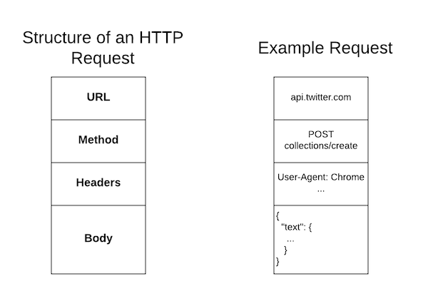
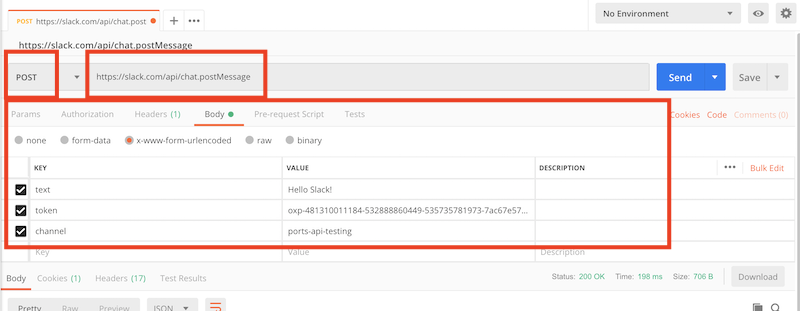
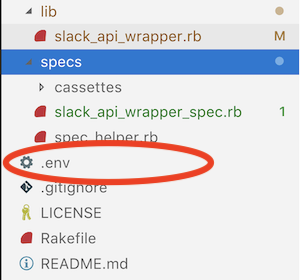

# Making Post Requests

In our past exercises we _consumed_ information from an API.  We looked up details about particular resources and used them in our Ruby applications.  However we do not yet have the ability to _create_ any information on the external API.  In this lesson we will introduce the concept of a `POST` request which can save information to the API.  We will do so using the [Slack API](https://api.slack.com/) to create our own command-line slack client.

## Learning Goals

By the end of this lesson you should be able to:

- Identify the differences between a `GET` and `POST` request.
- Use Postman and HTTParty to make a `POST` request to save data to an api.
- Write tests to verify the results of a `POST` request using the VCR gem.

## Overview of Post Requests

With `GET` requests you request information from the API.  The API then sends information back in the body of the response.  However with a `GET` request, you only need specify the method and URL of the request.  Any other information is embedded in the URL as _Query Parameters_.

With a `POST` request you are asking the API to accept some data and create a resource.  For example, a blogging API like the [Wordpress API](https://developer.wordpress.org/rest-api/reference/posts/#create-a-post) takes a date, author, title and content when it creates a new blog entry.  Because you are sending additional information with all `POST` requests, these requests have an additional _body_ section to contain the information being sent.

Below is a diagram of the structure of a `POST` request.


<!-- Lucid chart link:  https://www.lucidchart.com/invitations/accept/5a79e24c-fcd2-4754-8162-83fcf44f2030 -->

## Making `POST` Requests

We will learn to make `POST` requests using the [Slack API](https://api.slack.com/web).  To do so we will need our [legacy tokens page](https://api.slack.com/custom-integrations/legacy-tokens) which we have already obtained for our project.  **Note** There are [other](https://api.slack.com/docs/oauth), better, more secure methods of accessing an API, but the token method is the most simple way to introduce the concept and begin using APIs.

Next we need to see how Slack takes in messages to post into a channel.  Take a look at the [chat.postMessage](https://api.slack.com/methods/chat.postMessage) page in the Slack API documentation.

**Questions**:

- What is the URL for this Api endpoint?
- What arguments does the `chat.postMessage` endpoint accept?  Are any mandatory?
- What types of errors could the API return?


### From Postman

You can make a `POST` request from Postman in a similar fashion to `GET` requests.  Open [Postman](https://www.getpostman.com/downloads/).

1.  First set the HTTP Method and URL in Postman, the URL should be:  `https://slack.com/api/chat.postMessage` and the method should be `POST`.
1.  Next go to the `body` tab in postman, select `x-www-form-urlencoded` and enter the following arguments and values:
    * token
    * text
    * channel

Postman should look like this:



Now hit `send`

**Questions**

- What JSON is returned by Slack?  What status code is returned?
- Try submitting an invalid token, what happens?

You've now successfully posted to Slack from Postman!

#### Thinking About Testing

**With a partner** discuss what are the things to test when sending messages to slack.  Consider the elements of the body section as arguments to a method, how can they vary.

- What is the nominal case?
- Write out all the edge-cases you can think of.  What could go wrong when sending messages to Slack?
  - Try them out in Postman to see the results.

### Using HTTParty - Setting Up

In this lesson we will build a method for sending messages to Slack in a TDD fashion.  Start by forking and cloning the [Ada Gold slack-cli](https://github.com/AdaGold/slack-cli) repository.

### What Do We Have?

In this repository we have a `Rakefile` to run our tests with, a `run_chatstream.rb` file to run our finished application, and a `specs` folder with the following files:

- `spec_helper.rb`
- `slack_api_wrapper_spec.rb`

The `lib` directory also has a `slack_api_wrapper.rb` file with the following code inside:

```ruby
# slack_api_wrapper.rb
require 'httparty'

module SlackApi
  BASE_URL = 'https://slack.com/api/'

  # Code goes here

end
```

In this exercise we will build some tests for a `send_msg` method in the `SlackApi` class and then build out the functionality to satisfy the tests.

### Our First Test - Nominal Case

For our first test we will build a test case for sending a message to Slack successfully.  We will need to set up the testing first.  Add the following to `specs/spec_helper.rb`

```ruby
# spec_helper.rb
require 'dotenv'
Dotenv.load

require 'minitest/autorun'
require 'minitest/reporters'
require 'vcr'
require 'webmock/minitest'
require_relative '../lib/slack_api_wrapper'

Minitest::Reporters.use! Minitest::Reporters::SpecReporter.new

VCR.configure do |config|
  config.cassette_library_dir = 'specs/cassettes' # folder where casettes will be located
  config.hook_into :webmock # tie into this other tool called webmock
  config.default_cassette_options = {
    record: :new_episodes,    # record new data when we don't have it yet
    match_requests_on: [:method, :uri, :body] # The http method, URI and body of a request all need to match
  }
  # Don't leave our Slack token lying around in a cassette file.
  config.filter_sensitive_data("SLACK_TOKEN") do
    ENV["SLACK_TOKEN"]
  end
end
```

Later we will not need to explicitly load the `dotenv` gem when we are using Rails.  This code configures VCR just like we did when we tested `GET` requests.  We have added `config.filter_sensitive_data("SLACK_TOKEN")` so that anytime our VCR sees our slack token it will replace it with the words "SLACK_TOKEN".  **This will prevent the token from appearing in git**.

We can add our Slack token to a `.env` file in the project's root folder like this:

```
SLACK_TOKEN=<TOKEN_GOES_HERE>
```



Next we can write our first test using VCR.

```ruby
# slack_api_wrapper_spac.rb
require_relative 'spec_helper'

describe SlackApi do
  it "can send a valid message" do
    VCR.use_cassette("slack-posts") do
      response = SlackApi.send_msg("Hey I can post messages!", "YOUR-CHANNEL-NAME")
      expect(response).must_equal true
    end
  end
end
```

This test calls a method called `send_msg` and sends it a message and channel name.  When we run our tests we get one test error because the method does not yet exist.  Now we can write `send_msg` to get the test to pass.

With `HTTParty`, you can use the `post` method to send `POST` requests.  The `post` method takes two arguments.

1. The URL of the post request, like `https://slack.com/api/chat.postMessage`.
1. A hash with the following key-value pairs.
    - `headers` a hash of key-value pairs to put in the request header.  If headers is left off, `HTTParty` will assume a set of default headers.
    - `body` a hash of key-value pairs for the data sent to the API.

Like the `get` method, `post` returns an HTTP response from the API.

For example:

```ruby
response = HTTParty.post("https://petdibs.herokuapp.com/pets",
  headers: { 'Content-Type' => 'application/json' },
  body: {
    name: 'Kylo',
    human: 'Kari',
    species: 'Dog',
    age: 4
  }
)
```

When the API returns a response, just like a `GET` request, the body of the response of many APIs is JSON, which can be used like a Ruby hash.

```ruby
  puts response.body
  # { id: 57, name: 'Kylo', human: 'Kari', species: 'Dog', age: 4, Created-at: '2019-02-27'}
```

In `lib/slack_api_wrapper.rb` we will use this method to post data to Slack using the Slack URL and the API key we saved in our `.env` file.

```ruby
module SlackApi
  BASE_URL = 'https://slack.com/api/'
  API_KEY = ENV['SLACK_TOKEN']

  def self.send_msg(message, channel)

    response = HTTParty.post(
      "#{BASE_URL}/chat.postMessage",
      body:  {
        token: API_KEY,
        text: message,
        channel: channel
      },
      headers: { 'Content-Type' => 'application/x-www-form-urlencoded' }
    )

    return response.code == 200 && response.body["ok"]
  end
end
```

This method takes the message and channel and uses `ENV['SLACK_TOKEN`] to retrieve the API key and sends a message to slack.

Run the test, it should now be **green**.  If you run the test a few times, you should notice that only the initial run caused a message to be posted to slack.

### Edge Cases

What were the edge cases you and your partner came up with?  There are a few, such as:

- when the API URL is wrong or the network is down
- the API key is invalid
- when the text is `nil`

However in the interest of brevity we will only cover one edge case, when the channel does not exist.

What should we do when the channel does not exist?  We have a few options.

1. We could simply return false, but this does not provide much information to the user about what the problem is.
1. We could return a string describing the error, which could work, but a user of our method would need to know to check for the return value to know that the message did not work, and strings are truthy values, which could be misleading.
1. We could raise an error.  This is what we will do instead.  By raising an error we can describe the problem, and alert any user of our method of the problem, making it clear that the API call did not work while making it easier to debug with an error message and stack trace.

Add the following test to `specs/slack_api_wrapper_spec.rb`.

```ruby
  it "will raise an error when given an invalid channel" do
    VCR.use_cassette("slack-posts") do
      exception = expect {
        SlackApi.send_msg("This post should not work", "invalid-channel")
      }.must_raise StandardError

      expect(exception.message).must_equal 'channel_not_found'
    end
  end
```

Now when we run the tests, the new test fails.
Notice that Slack returns the error message `channel_not_found` when the channel does not exist, and we can use this in our `send_msg` method as we write code to pass the new test.

Update `send_msg` to the following:

```ruby
  def self.send_msg(message, channel)

    response = HTTParty.post(
      "#{BASE_URL}/chat.postMessage",
      body:  {
        token: API_KEY,
        text: message,
        channel: channel
      },
      headers: { 'Content-Type' => 'application/x-www-form-urlencoded' }
    )

    unless response.code == 200 && response.body["ok"]
      raise StandardError, response.body["error"]
    end

    return true
  end
```

### Going Further

Now update the existing code to use the optional arguments to `chat.postMessage`.  You can add keyword arguments for the optional parameters to your `send_msg` method.  To start change the avatar of your posting bot.

Next try running the `run_chatstream.rb` file in the project root directory.  What does it do?  How could you improve it?


## Summary

In this lesson you learned:

- to compare the `GET` requests with `POST` requests.
- to create a `POST` request using `HTTParty`
- to test code performing `POST` requests using the `VCR` gem.

## Resources

- [List of HTTP Header Fields](https://en.wikipedia.org/wiki/List_of_HTTP_header_fields)
