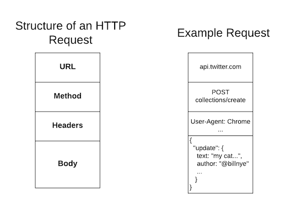
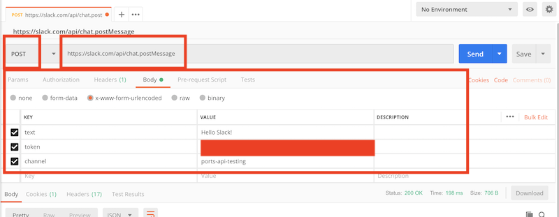

# Making Post Requests

In our past exercises we _consumed_ information from an API.  We looked up details about particular resources and used them in our Ruby applications.  However we do not have the ability to _create_ any information on the external API.  In this lesson we will introduce the concept of a `POST` request which can save information to the API.  We will do so using the [Slack API](https://api.slack.com/) to create our own command-line slack client.

## Learning Goals

By the end of this lesson you should be able to:

- Identify the differences between a `GET` and `POST` request.
- Use Postman and HTTParty to make a `POST` request to save data to an api.
- Write tests to verify the results of a `POST` request using the VCR gem.

## Overview of Post Requests

With `GET` requests you request information from the API.  It then sends information back in the body of the request.  However with a `GET` request, you only need specify the method and URL of the request.  No other information is sent to the API.  

With a `POST` request you are asking the API to accept some data and create a resource.  For example, when you create a post on Slack, the browser takes the text you typed and sends it to to a slack endpoint.  The Slack API then uses that information to create a new entry in a Slack channel.  Because you are sending additional information with the request, a `POST` request requires an additional _body_ section to contain the information being sent.

Below is a diagram of the structure of a `POST` request.



## Making `POST` Requests

We will learn to make `POST` requests using the [Slack API](https://api.slack.com/web).  To do so we will need a developer access token, a long alphanumeric string of characters.  **You will need to log into the slack website and apply for one on their [legacy tokens page](https://api.slack.com/custom-integrations/legacy-tokens).**  Register for a token and bookmark the legacy tokens page for now.  You will need it going forward.

Next we need to see how Slack takes in messages to post into a channel.  Take a look at the [chat.postMessage](https://api.slack.com/methods/chat.postMessage) page in the Slack API documentation.  

**Questions**:  

- What is the URL for this Api endpoint?
- What arguments does the `chat.postMessage` endpoint accept?  Are any mandatory?
- What types of errors could the API return?


TODO Move to Ruby section

We can't share access tokens or secrets on Github, for the same reason you shouldn't put your password on Github, anyone could see and use it!  So we will later put these codes in a `.env` file and tell git to ignore that file so it **never** appears on Github!

### From Postman

You can make a `POST` request from Postman in a similar fashion to `GET` requests.  Open [Postman](https://www.getpostman.com/downloads/).

1.  First set the HTTP Method and URL in Postman, the URL should be:  `https://slack.com/api/chat.postMessage` and the method should be `POST`.
1.  Next go to the `body` tab in postman, select `x-www-form-urlencoded` and enter the following arguments and values:
    * token
    * text
    * channel

Postman should look like this:



Now hit `send`

**Questions**

- What JSON is returned by Slack?  What status code is returned?
- Try submitting an invalid token, what happens?

You've now successfully posted to Slack from Postman!

#### Thinking About Testing

**With a partner** discuss what are the things to test when sending messages to slack.  

- What is the nominal case?
- Write out all the edge-cases you can think of.  What could go wrong when sending messages to Slack?
  - Try them out in Postman to see the results.

### Using Ruby - Setting Up

In this lesson we will build a method for sending messages to Slack in a TDD fashion.  Start by forking and cloning the [Ada Gold slack-cli](https://github.com/AdaGold/slack-cli) repository.  

### What Do We Have?

In this repository we have a Rakefile to run our tests with and a `specs` folder with the following files?

- `spec_helper.rb`
- `slack_api_wrapper_spec.rb`

The `lib` directory also has a `slack_api_wrapper.rb` file with the following code inside:

```ruby
# slack_api_wrapper.rb
require 'httparty'

class SlackApiWrapper
  BASE_URL = 'https://slack.com/api/'

  # Code goes here

end
```


## Summary

In this lesson you learned:

- to compare the `GET` requests with `POST` requests.
- to create a `POST` request using `HTTParty`
- to test code performing `POST` requests using the `VCR` gem.

## Resources

- [List of HTTP Header files](https://en.wikipedia.org/wiki/List_of_HTTP_header_fields)