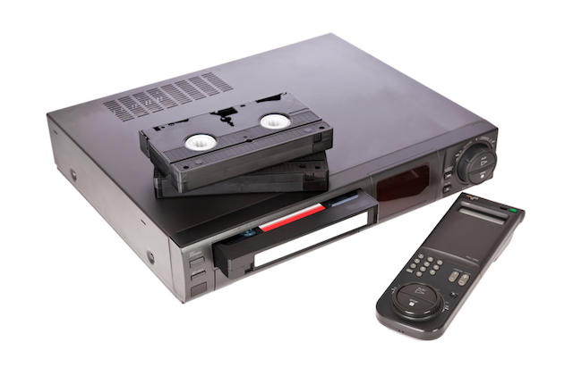
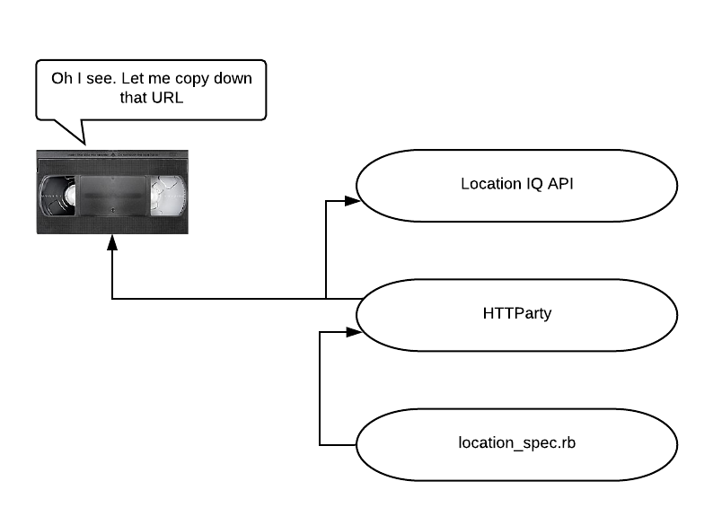
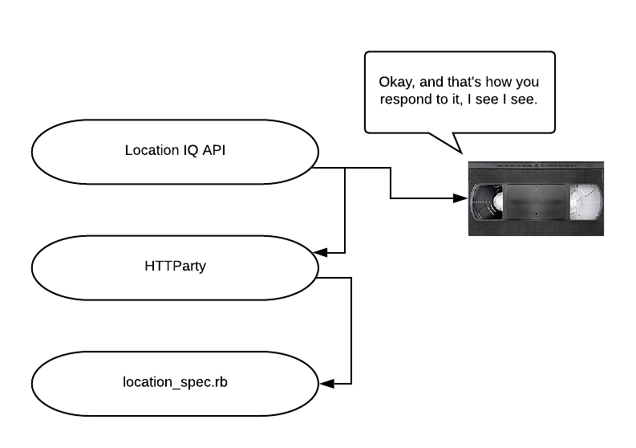
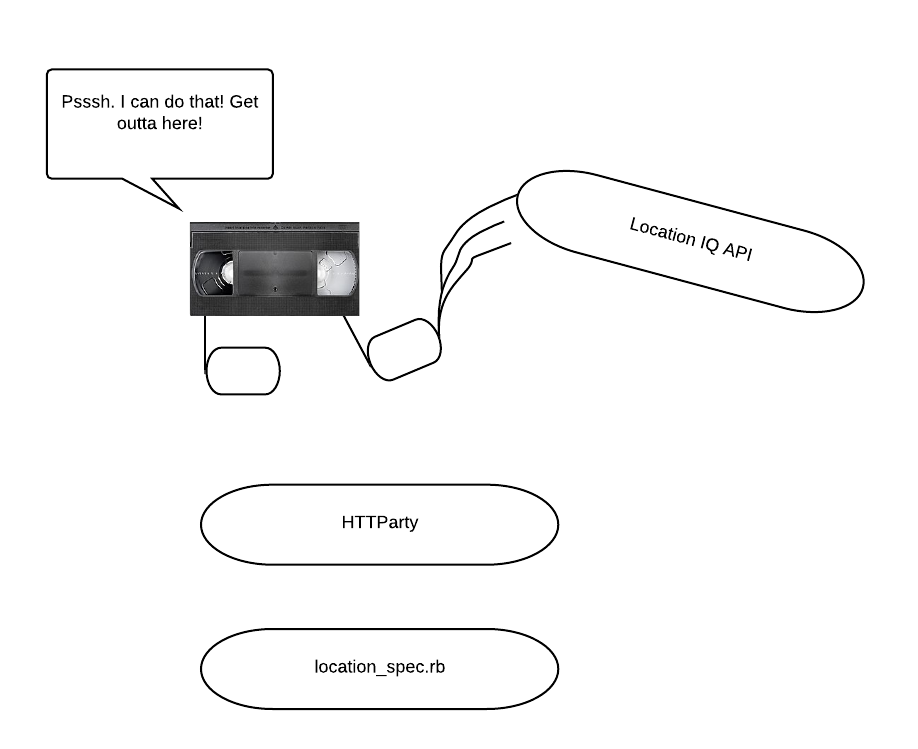
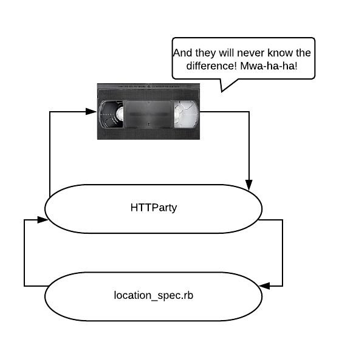

# Testing APIs

## Learning Goals
- Identify the areas of APIs that we want to test
- Utilize VCR to snapshot API calls
- Integrate tests

### How is testing APIs different?
We know why testing is important, we have seen the importance of the TDD cycle. When testing APIs it is important to note that we are now relying on external sources for our own code to work. There are a few things to consider when testing external sources:

1. If they're down, we're down
1. Every API call costs something (whether it be counting against your # of free calls or actually costing real $)

With these two considerations in mind, we want to reduce the dependency on an external API in testing, so we can focus on the important pieces of our code. In comes VCR!

### What is VCR?
VCR is a tool that allows your tests to _record_ HTTP interactions and replay them when necessary. By re-using these responses, VCR will improve stability and performance of your test suite.

Each interaction is recorded as a **cassette**. We can load cassettes in our tests, depending on which requests/responses we want to be testing.



### What is VCR doing?
VCR is essentially a recording device that interrupts the normal way they we send messages out to the internet. The first time a set of tests that use VCR run, the cassette takes note of the new request, based off of request method, URI, and body:



When the API responds, the cassette takes note of the contents of the response as well:



Whenever the same request (matching on request method, URI, and body) is sent out in the future, VCR gobbles up the message before it goes to the API, taking the API out of the equation:



At this point, the cassette can read in and play back messages and responses as if it were the API.



### Installation
1. **Gems**
    ```
    $ gem install minitest-vcr webmock dotenv
    ```
1. **Test Config**

All our example [testing setup](https://github.com/AdaGold/api-testing) can be found in AdaGold.

    In your `spec_helper.rb` file, add the following code:
```ruby
require "minitest/autorun"
require "minitest/reporters"
require "vcr"
require "webmock/minitest"
require "dotenv"
Dotenv.load

require_relative "../lib/location_search"

Minitest::Reporters.use! Minitest::Reporters::SpecReporter.new

VCR.configure do |config|
  config.cassette_library_dir = "specs/cassettes" # folder where casettes will be located
  config.hook_into :webmock # tie into this other tool called webmock
  config.default_cassette_options = {
    :record => :new_episodes,    # record new data when we don't have it yet
    :match_requests_on => [:method, :uri, :body], # The http method, URI and body of a request all need to match
  }
  # Don't leave our token lying around in a cassette file.
  config.filter_sensitive_data("<LOCATIONIQ_TOKEN>") do
    ENV["LOCATIONIQ_TOKEN"]
  end
end
```

    The last section, beginning with `config.filter_sensitive_data`, tells VCR not to put your token into the cassette file, instead replacing it with the string `"<LOCATIONIQ_TOKEN>"`. That way when the cassettes end up in your git repo, you won't be exposing your secrets to the world. You'll need a separate call to `config.filter_sensitive_data` for every piece of data you want to omit from your cassettes.

    Cassette files usually should be checked into git as they fill a similar role to spec files.

1. **Tests**

    Now you're ready to test your API!!

    We wrap the code where an API call would be made in the `VCR.use_cassette` block. This will ensure that the code inside the block will use the cassette if it has not already been generated.

```ruby
describe "get_location" do
  it "can find a location" do
    VCR.use_cassette("location_find") do
      location = "Seattle"
      response = get_location(location)

      expect(response["Seattle"]).wont_be_nil
      expect(response["Seattle"][:lon]).must_equal "-122.3300624"
      expect(response["Seattle"][:lat]).must_equal "47.6038321"
    end
  end   
   
  it "will raise an exception if the search fails" do
    VCR.use_cassette("location_find") do
      location = ""
      expect {
        response = get_location(location)
      }.must_raise SearchError
    end
  end
end
```

Application Code: 

```ruby
# lib/location_search
require "httparty"

#Starter Code:

BASE_URL = "https://us1.locationiq.com/v1/search.php"
KEY = ENV["LOCATIONIQ_TOKEN"]

class SearchError < StandardError; end

def get_location(search_term)
  query = {
    q: search_term,
    key: KEY,
    format: "json",
  }
  response = HTTParty.get(BASE_URL, query: query)

  unless response.code == 200
    raise SearchError, "Cannot find #{search_term}"
  end

  return {
           search_term => {
             lat: response.first["lat"],
             lon: response.first["lon"],
           },
         }
end
```

Once you run a test that uses VCR, you'll notice that there will be a file in the `specs/cassettes` folder with the name corresponding to the parameter provided in the `use_cassette` method.

If you expect the response data to change, _**you** must delete the cassette file._

Once the cassette file is created, how do we know that our tests are not still calling the API directly? One (very manual) way of doing this is by turning off your Wifi. If you ensure you have the VCR cassette files, then turn off your Wifi and run your tests again, your tests should still pass! Huzzah!

## Wrap Up

Our process for testing with VCR is as follows:

1. Configure VCR
    - Add the VCR setup to your `spec_helper.rb`
    - Ensure that any personal information or secrets are hidden using a filter

1. Wrap test code that causes API calls in `VCR.use_cassette("name") do..end`

1. Run tests as normal

1. Check to see that cassettes have been created

1. When a test needs to change, delete the existing cassette and proceed from step 2
