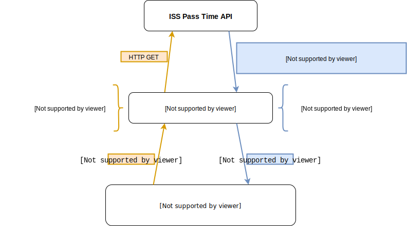

# Consuming an API with Ruby

When we first discussed APIs, we described them as a way to publish data so it's easy for machines to consume. But so far we have only used the browser to read API data. In this lesson, we will discover how to make requests against an API from within a Ruby program.

## Learning Goals:

By the end of this lesson, students should be able to...

- Consume an API in Ruby
- Identify the pieces of an HTTParty response
- Handle errors from an API
- Wrap API code in a class

## HTTParty

To consume an API from Ruby, we'll need to make use of a gem. There are a few that would do the trick, but in this class we'll be using one called [HTTParty](https://github.com/jnunemaker/httparty). HTTParty doesn't support some of the more complex things you can do with a network connection, but it's relatively simple to use and is more than powerful enough for our purposes.

**Question:** How would we install the HTTParty gem and include it in our program?

### Making Requests

The HTTParty gem gives us access to a module called `HTTParty`, which we can use to make requests. To do so we'll need a URL. This one will do:

```
https://dog.ceo/api/breeds/image/random
```

**Question:** Try this URL out in your browser. What do you get back?

Now let's do the same thing in Ruby. Open up pry and enter the following code:

```ruby
# pry
require 'httparty'

url = "https://dog.ceo/api/breeds/image/random"
response = HTTParty.get(url)
```

Pry is a great tool for investigating an API, because it allows us to poke at the data we get back without having to worry about writing a whole Ruby script.

When we say `HTTParty.get`, HTTParty will send a GET request to the url. The `get` method returns something, which we have stored in the variable `response`.

**Question:** What is `response`? What data does it contain? What is its class?

`response` looks and acts like a hash containing the data we got back from the server. It's important to note that all they keys in this hash are `"strings"`, not `:symbols`.

But `response` is really an instance of `HTTParty::Response`, which means it's got some extra methods we can call:

```ruby
# Use hash syntax to access the data returned
response["status"]  # => "success"
response["message"] # => "https://images.dog.ceo/breeds/leonberg/n02111129_892.jpg"

# Use dot notation to access other attributes
response.body    # => Raw response of the HTTP body
response.code    # => The numerical code of the response (200)
response.message # => The text message that corresponds to the code ("OK")
response.headers # => A hash of data about the request (date, server, content-type)
response.request # => An HTTParty::Request object containing info about what we sent to the server
```

Note that we could have called `response` anything we wanted, like `dog_data`. `response` seems like a good name for this variable, so we will stick with that.

## Query Parameters

`dog.ceo` is great, but it's not a very complex API. To explore more of the features of HTTParty, let's dive into something a little more interesting.

### ISS Pass Time API

There is a project called Open Notify, which publishes an API to compute the next time the International Space Station will be visible from a given location on Earth.

**Activity:** Spend a few minutes reading through [the documentation for the ISS pass time API](http://open-notify.org/Open-Notify-API/ISS-Pass-Times/).
- Can you make the API work from your browser?
- What is different about the URL for this API?

### Query Parameter Syntax

The following URL will show ISS passes for Seattle. Put it in your browser now.

```
http://api.open-notify.org/iss-pass.json?lat=47.6062&lon=122.3321
```

The pieces after the `?` in the URL are called _query parameters_. They act almost the same as method parameters in Ruby. Each query parameter takes the form:

```
name=value
```

Different query parameters are separated by ampersand (`&`) characters. A bunch of query parameters together make up a _query string_, which has the form:

```
?name1=value1&name2=value2
```

The query string for the ISS pass time API contains two query parameters, `lat` and `lon`, each of which takes a floating point number as its value.

You can figure out the names and the possible values of an API's query parameters by reading the API's documentation.

### Query Parameters in HTTParty

When using HTTParty, you have two options for sending query parameters with a request. The first is to do what we did in the browser and append them to the URL:

```ruby
# Don't do this
url = 'http://api.open-notify.org/iss-pass.json?lat=47.6062&lon=122.3321'
response = HTTParty.get(url)
```

While this works, it's not very pretty, especially for longer query strings. The other way is to use the optional `query` argument to `HTTParty.get`:

```ruby
# Ahh, much cleaner
url = 'http://api.open-notify.org/iss-pass.json'
query_parameters = {
  lat: 47.6062,
  lon: 122.3321
}
response = HTTParty.get(url, query: query_parameters)
```

**Activity:** Write a script that sends a request for ISS pass times for Seattle, then loops through the times in the response and prints them out to the command line.
- Note: to convert the timestamps to human-readable dates, use `Time.strptime(stamp, '%s')`

### Diagram

There's a lot going on here!

1. Our code talks to HTTParty by calling the `get` method
1. HTTParty turns Ruby data structures like strings and hashes into something the API can understand: a URL containing a query string
1. HTTParty sends an HTTP request to that URL and waits for a response
1. The API sends an HTTP response back
1. HTTParty receives the HTTP response and decodes it into Ruby data structures
    - The raw JSON string is decoded into a hash
1. HTTParty returns from the call to `get`
1. Our program goes about its merry way

It might help to draw a diagram:


<!-- https://www.draw.io/#G1Pk80ViT_UJg4FKuzrZ7uHaT3OL6Zmndu -->

## Error Handling

When working with an API, everything won't always go as smoothly as you might like. This might be due to a programming mistake, or because a user provided you with bad data.

To demonstrate, let's see what happens if we don't send a longitude when requesting ISS pass times. 

**Make a prediction:** What do you think will happen when we run the below code? How might the API or HTTParty behave?

```ruby
url = 'http://api.open-notify.org/iss-pass.json'
query_parameters = {
  lat: 47.6062
  # no longitude
}
response = HTTParty.get(url, query: query_parameters)
```

**Question:** What happened? Was your prediction correct?

### Investigating the Error Response

In a Ruby program, if we give a method bogus input it will probably throw an exception. APIs don't have this luxury. All they can send back is a status code and some JSON.

By investigating the response, we can see that the ISS API did both. It set a response code of 400 ("bad request"), and it sent back some JSON detailing why the request was problematic.

```ruby
# Look at data from the response headers with dot notation
puts response.code
# => 400
puts response.message
# => "BAD REQUEST"

# Look at data from the JSON with subscript notation
puts response["message"]
# => "failure"
puts response["reason"]
# => "Longitude must be specified"
```

Note the difference between the first `message` and the second `message` in the above code.

The first, `response.message`, is a method called on the `HTTParty::Response` object to get the human-readable version of the HTTP status code.

The second, `response["message"]`, is a piece of data sent in the response JSON, that happens to have the same name as one of the HTTParty methods.

This kind of naming collision is common when working with APIs, and it's important to be aware of what comes from where.

**Activity:** Modify the code you wrote before to check for an error response
- If you get an error, print out the HTTP status code and the reason from the JSON to the user
- Test your new code by messing with the query parameters

**Every API will report errors differently!** It is up to you to read the docs and use pry to find out how to detect and handle these errors.

Having solid error handling code is required work for every project at Ada that interacts with an API. Writing this code early in your project can save you a lot of headache and frustration when things go wrong.

## Wrapping the API

When we write a Ruby program that interacts with an API, it's common to end up with a bunch of code specific to that API, which doesn't have much to do with the rest of our program. We're already starting to see that with our ISS pass time program.

**Question:** How might we organize code that interacts with an API?

This is a problem we've run into before, in the context of reading data from CSV files. There we had a bunch of code that dealt with parsing the file and turning it into something our program could use, that was independent of the problem our program was solving.

When working with files, our strategy was to create a class to contain the details of reading the file. We will follow a similar strategy for working with APIs.

**Activity:** Read through [the final version of our ISS pass time program](source/api-wrapper-class.rb), and answer the following questions:
- How does the driver code interact with the wrapper class?
- How is the code to build and send the request different than what we had previously?
- What does the wrapper class do if it encounters an error?
- What does the call to `self.new` in `get_passes` do?
- What is returned from `get_passes`?

## Summary

- When consuming an API from Ruby, we use the HTTParty gem
- `HTTParty.get` will send a request to an API, and takes a URL and an optional hash of query parameters
- HTTParty calls return an `HTTParty::Response` object
  - This acts like a hash containing the response JSON
  - It also has some methods like `.code` to interact with the response's metadata
  - Pry is a great tool to investigate the structure of the response, and figure out how to get at the data you need
- Error handling is key for working with APIs
  - Every API will be different
  - Read the docs and play around in pry to get a sense for what error handling should look like
- It's often best practice to wrap code to interact with an API in a class

## Additional Resources

- [HTTParty documentation](https://github.com/jnunemaker/httparty)
- [Treehouse: It's Time to HTTParty](https://blog.teamtreehouse.com/its-time-to-httparty)

