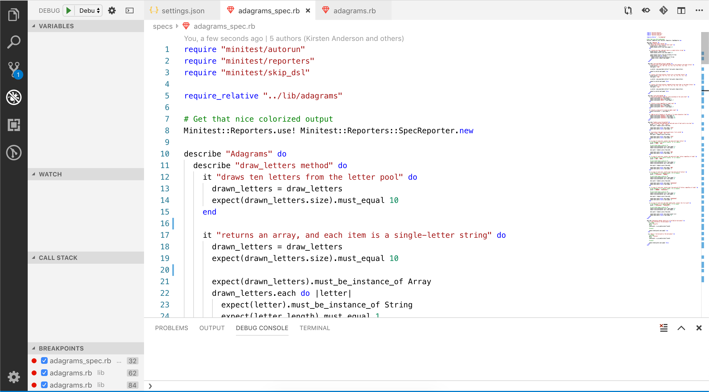
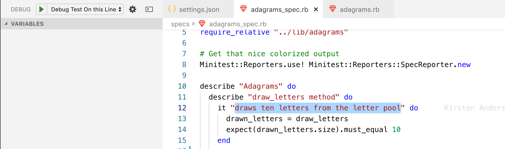

# Debugging Tests

## Learning Goals
- Understand how to add new debug configurations to VS Code
- See how testing tests is different than testing code
- Be able to run and debug a single test in a spec file

You've gained confidence debugging using VS Code. You know all about looking for weird data in your variables, you have watched your execution pointer jump around to different parts of a file, perhaps you've even set a watch! But now you want more. More tools, more debugging, more POWER.

It's time to be able to debug a Minitest Spec file.

## Setup

Open up your Adagrams project and navigate over to one of the spec files. Open up [this link](source/sample_launch.json) and copy the whole of the file.

Recall back to when we [first set up debugging](debugging-with-vs-code.md), and open up the settings json. Navigate down to the `launch` field, pasting in the whole of what we copied into the field. Save it, and bring up the spec file again.

The structure of the Adagrams project is such that we are only really able to check what is going on by running the tests we wrote for it. In other words, it has no driver code that runs the functions we are writing. Our old debugging tricks therefore don't work; no code that calls the function means that Debugging the Open Ruby file will do nothing. We _could_ write driver code that calls the functions we want to test at the bottom of the Adagrams file, but this is blasphemy, and a really poor habit to get into. Instead, we will debug by running our test file.

Our starting scenario looks something like this:

Set a breakpoint in one of the tests, and then use the drop down to pick `Debug Ruby Test File` as your debugging option. Run the debugger now.

What happened?

We would expect to see all of the tests run, not necessarily in the order that they were written in `adagrams_spec.rb`. When the debugger reached the breakpoint, we would expect the program to break, giving us control of the flow of execution. If this did not work, try closing and opening VS Code and trying the debugger again.

This is our basic flow for testing our code in a scenario where we aren't writing any driver code; we let our tests do the driving for us, and can break and control the flow of code as normal. 

Try adding a break point inside of the `draw_letters` method in `adagrams.rb`. 

What happens?

Wowzer, the breakpoint inside the method gets hit each time it's called by the tests!

## Advanced and Secret Techniques

Okay, great, we can test all the tests at once. But that is _cumbersome_ and _boring_, not to mention if we want to test a single method that gets called all over the place it can get downright confusing. Go ahead and switch your debugging mode to `Debug Highlighted Test`.

Leave the breakpoint inside of the `draw_letters` method in `adagrams.rb` alone, but remove any other breakpoints in the files (this is made easier by using the breakpoints section of your debugging window).

Highlight the name of the first test in the file as shown below. Do not include the quotation marks around the name. Then, run the debugger.

Using this method, we should see only the highlighted test run! This will make it much faster to try things out and debug a specific test. 

### A Quick Word of Warning!

`Debug Highlighted Test` will run multiple tests with the same name because we are using a generic [regular expression](../00-programming-fundamentals/intro-to-regex.md) to match the test name. If you want to avoid this, just name all your tests uniquely.

## Wrap Up

And that's all there is to it! With this under your belt, you're going to be set all the way through Rails. 

Remember:

1. `Debug Ruby Test File` will debug the entirety open spec file.
1. `Debug Highlighted Test` will debug only the test whose name you've highlighted.
1. You can set breakpoints in the files that the tests are testing, and those breakpoints will be hit.