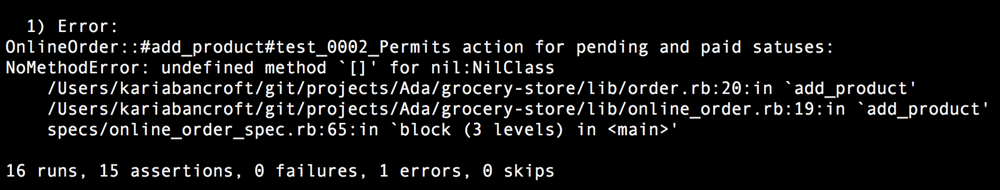
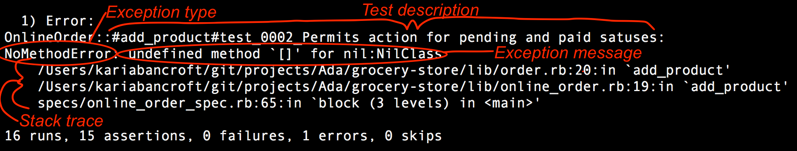
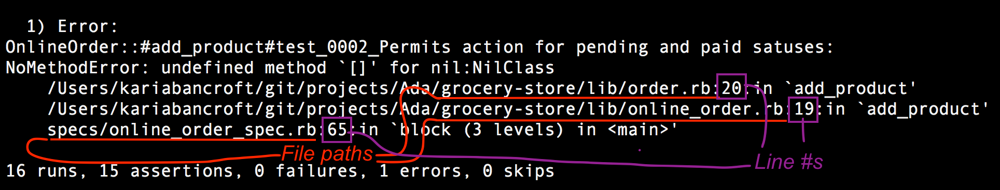
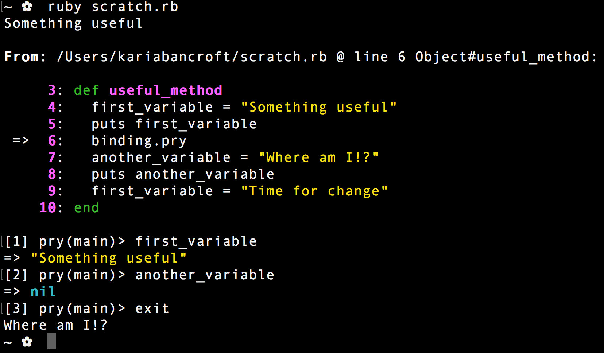

# Debugging

## Learning Goals
- Read and analyze a stack trace
- Understand how to use `pry` for debugging in Ruby code
- Better understand the scope of variables and instances in an application when testing

Debugging your code is a skill that you will use throughout your career. Over time you will get better at figuring out what the issues are with your code and addressing them more efficiently. The skills addressed in this lecture are intended to be a starting for your practice of debugging and we imagine you'll continue bulding these over the years.

### Reading Errors via Stack Traces

When an exception is raised, it immediately stops the current method, just like `return`. It will then bubble its way up through the program, method by method. If it makes it all the way to the top, Ruby will print out a summary of the exception and a description of what the program was doing when the exception happened, also known as a **stack trace**.

A stack trace contains a ton of useful information, including a list of methods and blocks that Ruby was inside when the exception was raised. Being able to quickly read a complex stack trace is a super useful skill, so let's examine one now.

First, take a look at the following stack trace that came from running some of the tests within the grocery store project.



**Activity**: Now, with your pair, spend a few minutes looking at this error in detail. We know you don't have access to the code, but try anyway to answer the following questions:
1. What file has the code that was _originally called_ to create the error?
2. What file has the code where the _error is located_? (Is this different than your answer to the question above?)
3. Without seeing the code but using the error details, what do you think the code in question could look like?

**Review**: While you don't have the code, an error message with a stack trace gives you a lot more information than you might be expecting!

First, let's look at each piece of the provided error.



Next, we'll take a look at all of the details of the stack trace itself.



With this information, now we can more confidently answer our questions above:
1. `online_order_spec.rb` - line 65 specifically
2.  `order.rb` - line 20 specifically within the `add_product` method
3. Trying to use the `[]` Array syntax to access an element on a variable that does not have an Array value

The questions that we've asked you to answer about this error message are not arbitrary. Whenever you get an error, you should be overjoyed! It provides you with this extremely useful information and should never be ignored.

### Using `pry`

You've already been introduced to pry in our discussion about gems, but now we're going to ensure you see how to use it in all of your projects all the time! 

`pry` has a tool you can use: `binding.pry`

With code that we've already written in a file, we can use a Pry command to pause our code and more closely inspect. We can use Pry instead of using a bunch of `puts` commands in a program.

### How to get started

1. You should already have the gem installed, but if you don't, you can run `gem install pry`.
1. Require the gem at the top of the file you'd like to debug: `require 'pry'`.
1. In your code, write `binding.pry` anywhere you want to pause the code that's being run. Doing so will allow you to evaluate what code is doing up to that point, like checking what what a variable equals while being changed in a loop.

### Test it out

Because programs are read from top to bottom, any code that is after a `binding.pry` command will not be read. Run the code in the exercise below, as you would normally. To exit, type 'exit'.

```ruby
require 'pry'

def useful_method
  first_variable = "Something useful"
  puts first_variable
  binding.pry
  another_variable = "Where am I!?"
  puts another_variable
  first_variable = "Time for change"
end

# call them method!
useful_method
```
Your terminal should open in interactive environment that looks something like this:



### Debug Code
The following code is not coming out as expected. I am expecting the method to return 55 when I pass 50, but am getting 5. Oh bugger! Let's use pry to dig into what is causing the problem!

``` Ruby
def add_5_years(age)
  5.times do
    age + 1
  end
end

puts add_5_years(50)
```

### What else can Pry do!?
I'm so glad you asked!

Pry also has the following handy commands that let you see what objects are currently available in your program to focus on and interact directly with.

- ``ls``,  shows you the local variables defined in the current context, and any public methods or instance variables defined on the current object.
- ``cd``, command is used to move into a new object (or scope) inside a Pry session. When inside the new scope it becomes the self for the session and all commands and methods will operate on this new self.


### Try it out!
Open your current project and inspect functionality of your code using PRY! Practice using the ls and cd commands.

## Key Takeaway
Debugging your code is a critical skill to establish in your programming career. Using error messages and `pry` in your test-driven development process will help you pinpoint the cause of errors more efficiently.

## Additional Resources
- [Debugging with Pry](https://learn.co/lessons/debugging-with-pry)
- Dig into [Pry's documentation](http://pryrepl.org/) (with screencasts) to learn even more
- Here's a handy list of more [Pry commands](https://github.com/pry/pry/wiki/State-navigation#Ls)!
