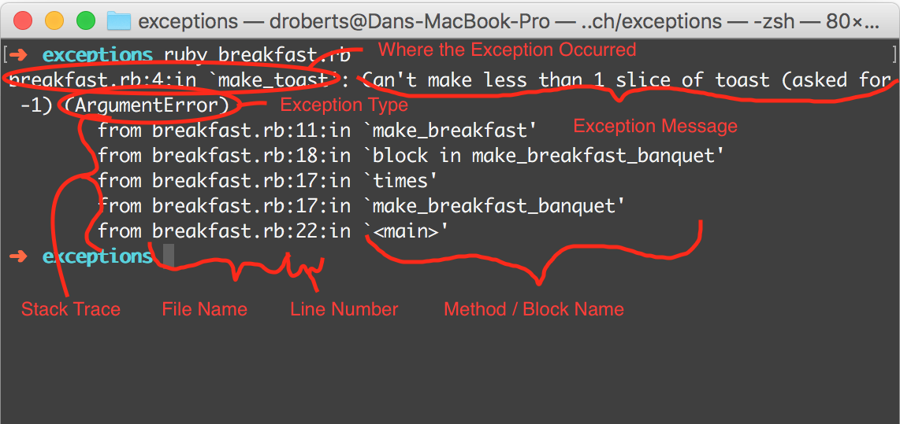

# Exception Handling In Ruby

## Learning Goals
At the end of this you should be able to:

- Explain how exception handling works
- Create rescue blocks to "catch" exceptions
- Define custom exceptions
- Evaluate when to use exceptions

## The Story So Far

With any program there are things that can go wrong. Maybe a file you are planning to read doesn't exist, your database server is unavailable, or you try to divide something by zero. In these cases, Ruby programs use _exceptions_ to indicate that something has gone wrong.

We've seen exceptions before. If you try and access an undefined variable, Ruby will raise a `NameError`, and we've even raise our own `ArgumentError` exceptions in our projects.

### Producing Exceptions

For a quick reminder of what an exception looks like, save the following code as `divide_by_zero.rb`

```ruby
# divide_by_zero.rb
quotient = 5 / 0
puts quotient # this code will never run
```

and run it from the command line

```
$ ruby divide_by_zero.rb
divide_by_zero.rb:2:in `/': divided by 0 (ZeroDivisionError)
  from divide_by_zero.rb:2:in `<main>'
```

If you need to produce an exception of your own you can use the `raise` keyword

```ruby
def make_toast(slices)
  if slices < 1
    raise ArgumentError.new("Can't make less than 1 slice of toast (asked for #{slices})")
  end
end
```

### Stack Traces

When an exception is raised, it immediately stops the current method, just like `return`. It will then bubble its way up through the program, method by method. If it makes it all the way to the top, Ruby will print out a summary of the exception and a description of what the program was doing when the exception happened, also known as a **stack trace**.

A stack trace contains a ton of useful information, including a list of methods and blocks that Ruby was inside when the exception was raised. Being able to quickly read a complex stack trace is a super useful skill, so let's examine one now.

```ruby
# breakfast.rb
def make_toast(slices)
  if slices < 1
    raise ArgumentError.new("Can't make less than 1 slice of toast (asked for #{slices})")
  end
  # ...probably do some other stuff...
end

def make_breakfast(type)
  if type == "eggs and toast"
    make_toast(-1)
    make_eggs
  end
end

def make_breakfast_banquet
  10.times do
    make_breakfast("eggs and toast")
  end
end

make_breakfast_banquet
```

```
$ ruby breakfast.rb
breakfast.rb:4:in `make_toast': Can't make less than 1 slice of toast (asked for -1) (ArgumentError)
    from breakfast.rb:11:in `make_breakfast'
    from breakfast.rb:18:in `block in make_breakfast_banquet'
    from breakfast.rb:17:in `times'
    from breakfast.rb:17:in `make_breakfast_banquet'
    from breakfast.rb:22:in `<main>'
```



## What Are Exceptions?

**Question:** We know that raising an `ArgumentError` requires a call to `ArgumentError.new`. What does this tell us about what `ArgumentError` is, and what sort of a thing we're raising?

`ArgumentError` is a class, and the thing that we're raising is an _instance_ of `ArgumentError`. There's a whole bunch of built-in Ruby magic around the `raise` keyword, but the exceptions themselves are just objects like any other, binding together data and behavior.

**Question:** What data might an exception keep track of? What behavior does it provide? How would you find out for sure?

All exceptions are children of the `Exception` class, inheriting its core functionality.

[](http://findnerd.com/list/view/Exception-Handling-in-Rails-using-begin-rescue/21677/)

The Ruby docs have a [full list of built in Ruby exceptions](https://ruby-doc.org/core-2.4.0/Exception.html).

## Handling Exceptions

So far, when a program has produced and exception, it has immediately terminated. However, there's often something more productive to be done. For example, if you ask the user for a file name and then get an exception because it doesn't exist, it's much more polite to let them know with `puts` than to dump a scary stack trace to the terminal.

Fortunately, Ruby gives us a way to stop an exception before it bubbles up to the user: a `begin/rescue` block. Let's see it in action:

```ruby
# sample_exception.rb
begin
  # Dividing by zero causes an error
  quotient = 5 / 0
  puts "Made it past the error"
rescue
  quotient = nil
  puts "Rescued the error and set quotient to nil"
end
```

The output would be:
```
$  ruby sample_exception.rb
Rescued the error and set quotient to nil
```

Note that without the rescue clause, the exception still bubbles up to the user.

```ruby
# sample_exception.rb
begin
  # Dividing by zero causes an error
  quotient = 5 / 0
  puts "Made it past the error"
end
```

The output would be:
```
$  ruby sample_exception.rb
sample_exception.rb:4:in `/': divided by 0 (ZeroDivisionError)
  from basic_exception_without_rescue.rb:4:in `<main>'
```

**Vocabulary note:** In many languages, `raise` and `rescue` are called `throw` and `catch`, and you will often hear people talking about "throwing" or "catching" an exception.

### Rescuing Specific Exceptions

Ruby provides many different types of exceptions, and a `rescue` block will capture any of them. However, this has some drawbacks:
- What if you need to handle different exceptions in different ways?
- What if you were expecting a `ZeroDivisionError`, but instead got a `NameError` from an undefined variable due to a programming error?

Fortunately, Ruby allows you to specify which type of exception you want to rescue. The syntax looks like this:

```ruby
begin
  # some code that will create an exception.

rescue ArgumentError
  # Code to recover from an ArgumentError

rescue ZeroDivisionError
  # Code to recover from a ZeroDivisionError

rescue
  # other exceptions handled here

end
```

If you specify a type of exception, Ruby will rescue that exception as well as any of its subclasses. That means that `rescue Exception` will rescue all exceptions, since all exceptions are subclasses of `Exception`.

Most recoverable errors inherit from `StandardError`, and without any arguments `rescue` will only rescue `StandardError` and its subclasses.

It is almost always worth your time to figure out exactly what type of exception you're expecting, and rescue only that. Otherwise you're setting yourself up to ignore the valuable information Ruby is giving you about why your program failed. A bare `rescue` with no exception type specified is a classic example of sloppy programming.

### Accessing a Rescued Exception

Exceptions are full of useful information about what went wrong, which is often useful inside a `rescue` clause. Ruby allows us to access the thrown exception using `=>`

```ruby
begin
  # do something risky
rescue ArgumentError => exception
  puts "Encountered an error: #{exception}"
end
```

Like method or block parameters, the rescued exception is a local variable and may be called anything you please.

### Example: `csv_printer.rb`

```ruby
# csv_printer.rb
require 'csv'

while true
  puts "What file would you like to print?"
  filename = gets.chomp

  begin
    CSV.read(filename).each do |line|
      puts line.join(",")
    end

  rescue SystemCallError => exception
    puts "Could not open file: #{exception.message}"
  end

  puts "Would you like to go again?"
  break if gets.chomp != "yes"
end
```

### In Minitest

If we expect a method to raise an exception and it doesn't, that's a bug! This means that we must test that our methods raise the exceptions we want, as well as testing nominal behavior. As we saw on in several projects, you can look for an exception in a given block of code in Minitest like this

```ruby
it "Raises an ArgumentError when given an invalid word" do
  proc {
    Scrabble::Scoring.score("1337")
  }.must_raise ArgumentError
end
```

## Creating Custom Exceptions

Sometimes you run into a situation where the built in Ruby exceptions don't quite describe what went wrong. For example, imagine you have a program for processing credit card transactions. Here are two types of thing that could go wrong:

- The credit card number is the wrong type - maybe we expected a `String` of digits, but got a `Boolean`. This implies a programming error, and should be fixed by the engineer.
- The credit card number is [invalid](https://en.wikipedia.org/wiki/Luhn_algorithm) - there are too many or too few digits, or it doesn't match some other check. This implies the user has given us bad data, and should be asked politely to try again.

The two problems need to be handled in different ways, and the easiest way to do this is with different types of exception. In the first case an `ArgumentError` seems like the correct choice, but Ruby doesn't provide an exception for an invalid card number. Lucky for us, Ruby allows you to define custom exceptions!

As we discussed above, exceptions are just classes that inherit from `Exception` or one of its subclasses, so making your own is as simple as defining a new class. You'll usually want to inherit from `StandardError`, so that your exception can be handled with `rescue`.

```ruby
class InvalidCardNumberError < StandardError
end

def process_transaction(card_number, amount)
  # card_is_valid? is defined elsewhere
  unless card_is_valid?(card_number)
    raise InvalidCardNumberError.new("Invalid credit card number #{card_number}")
  end
  # ... process the transaction ...
end
```

This gives us the same functionality as `StandardError`, but with a different name. You can rescue it by name with `rescue InvalidCardNumberError`. Nine times out of ten that's all you need.

## When to Use Exceptions

Exceptions aren't the only way to indicate that something has gone wrong. For example, a common pattern is to return `nil` if a searched element isn't found.

```ruby
class SolarSystem
  def lookup_by_name(name)
    planets.each do |planet|
      return planet if planet.name == name
    end
    return nil
  end
end
```

So when are exceptions appropriate? There are a lot of [differing opinions](https://www.sitepoint.com/ruby-error-handling-beyond-basics/), but the consensus seems to be that exception handling should be for *exceptional* circumstances.

Here are some examples of when and when not to raise an exception. Each of the following situations is paired with an example in the context of `GroceryStore`.

**Raise an Exception When:**
- A method is given invalid arguments
  - Negative price 
- Some prerequisite condition isn't true
  - An order without any products
- Some required resource can't be found or is invalid
  - `orders.csv` doesn't exist
  - `onlineorders.csv` doesn't contain order information
- There's a problem external to Ruby
  - User pressed `Ctrl-C`

Note that many of these are handled automatically by Ruby!

**Don't Raise an Exception When:**
- A search yields no results
  - No order with that ID
- The user quits via a normal method
  - Types `quit` at the prompt

In general, an exception indicates that either there was a programming error, or the user has done something wrong. In other words, some human intervention is required. If the program can handle a situation automatically, an exception is probably not the right choice.

## Vocabulary

| Term | Meaning |
|------|---------|
| Exception | An object describing something that went wrong with a program. If not handled, will cause the program to terminate. |
| Stack Trace | The stuff Ruby dumps to the screen when it hits an unhandled exception. Describes exactly what the program was doing when the exception occurred. |
| `raise` | Ruby keyword used to cause an exception to take effect. Often used as a verb. |
| `begin` | Ruby keyword used to mark the beginning of a block of code that might produce an exception. |
| `rescue` | Ruby keyword used to specify code to execute if an exception happens. Attached to a `begin` block. |
| `ensure` | Ruby keyword used to specify code that must execute, even if there's an unhandled exception. Attached to a `begin` block. Not covered in this lecture. |
| Throw | Synonym for raise |
| Catch | Synonym for rescue |
| Finally | Synonym for ensure |

## What Have We Accomplished?
- Reviewed raising exceptions
- Analyzed a stack trace produced by an exception
- Discussed the exception class hierarchy
- Used `rescue` to handle exceptions
- `rescue <ExceptionType>` to handle a specific type of exception
- `rescue <ExceptionType> => exception` to store the exception in a local variable
- Created our own custom exceptions
- Discussed when to use exceptions

## Additional Resources
- [RubyLearning on Exceptions](http://rubylearning.com/satishtalim/ruby_exceptions.html)
- [Ruby Error Handling Beyond the Basics](https://www.sitepoint.com/ruby-error-handling-beyond-basics/)
- [Railscast Exception Handling, old but still valid](http://railscasts.com/episodes/53-handling-exceptions?autoplay=true)
