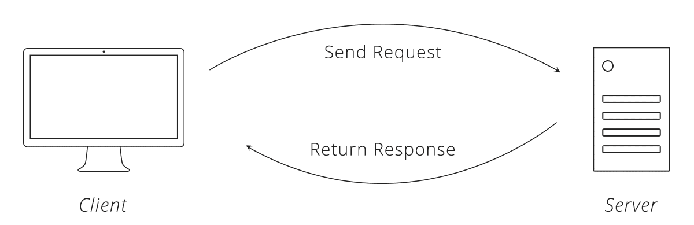

# Request-Response Cycles

Observe the following diagram:

For this exercise, fill out the following details for each situation:

1. Who is the client?
1. Who is the server?
1. What are the details about the request?
1. What are the details about the response?

Imagine this example, and aim for this level of detail:

> A CLI program asks the Twitter API for a list of tweets by the user @adaacademy

The answer is:

1. Client: the CLI program
1. Server: servers run by Twitter
1. Request: `GET` request, to the path that gets tweets, with params that specify tweets from the user @adaacademy
1. Response: data that represents those tweets that comes back in `JSON`

## Exercises

1. A CLI program that asks for a random image from the service dog.ceo

  

    Answer
  

  1. Client: the CLI program
  1. Server: servers run by dog.ceo
  1. Request: `GET` request, to the path that gets a random image
  1. Response: data that contains information about that image that comes back in `JSON`

 

2. A CLI program that has a valid API key and asks for the latitude and longitude of `Great Pyramid of Giza` from the service Location IQ

  

    Answer
  

  1. Client: the CLI program
  1. Server: servers run by Location IQ
  1. Request: `GET` request, to the path that gets latitude and longitude, containing an API key and the location `Great Pyramid of Giza`
  1. Response: data that contains information about that location that comes back in `JSON`

 

3. A CLI program that has a valid API key and searches for recipes that are Filipino dishes and vegetarian using the Edamam API

  

    Answer
  

  1. Client: the CLI program
  1. Server: servers run by Edamam API
  1. Request: `GET` request, to the path that gets recipes, containing an API key and the parameters for Filipino dishes and vegetarian
  1. Response: data that contains a list of all matching recipes that comes back in `JSON`

 

4. A CLI program that asks for [a list of repos of the authenticated user](https://developer.github.com/v3/repos/#list-your-repositories), but is not authenticated

  

    Answer
  

  1. Client: the CLI program
  1. Server: servers run by GitHub
  1. Request: `GET` request, to `https://api.github.com/user/repos`, but is not authorized
  1. Response: data that contains details about the error's message. The message says that the request requires authentication. This comes back in `JSON`

## Summary

The request-response cycle is an important diagram to practice, as our understanding of web development will rely on it.

It probably will help a lot to have a generic diagram (like the one at the top of this exercise) on hand, and to try to apply it specifically to each situation you're in!