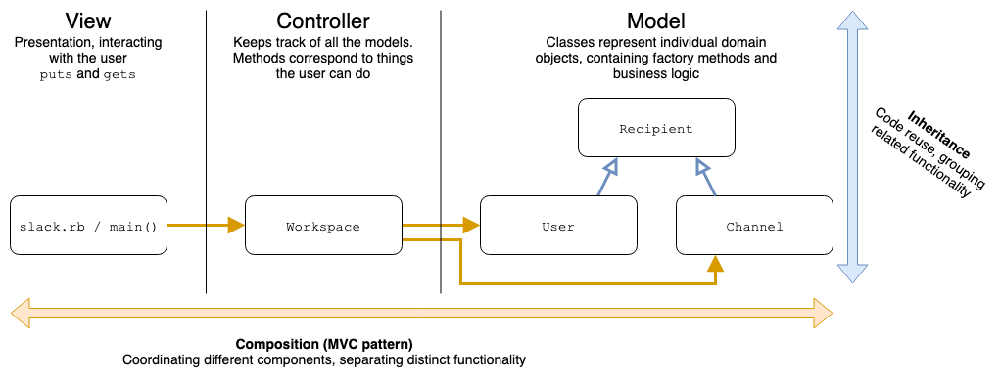

# The MVC Pattern

In this lesson we will introduce a design pattern called MVC (short for Model, View, Controller) through the lens of the Slack CLI project.

## Learning Goals

By the end of this lesson, students should be able to...

- Explain how the MVC pattern helps to organize programs
- Define the terms Model, View and Controller
- Identify program components as Models, Views or Controllers

## Design Patterns in the Slack CLI Project

**Activity:** Think about the composition relationships (has-a, has-many) in the Slack CLI project.
- What is each class responsible for?
- How do the classes connect to each other? Where does one class call the method of another class, and which class is doing the calling?
- Draw a picture of these connections, with boxes for the classes, and arrows for method calls. Include the `main` method from `slack.rb` as well.

What patterns do you notice?
- How do method calls flow through the app?
- Is there a direction to the flow, with one component at the start and another at the end?
- How does this compare to other projects we've built in this course?

## Model, View, Controller

We can separate the components of the Slack CLI project into three distinct categories

Category | Description | In Slack CLI
--- | --- | ---
Model | Each class represents an individual domain object. They contain factory methods and business logic. A program typically contains many instances of these classes. | `User`, `Channel`
Controller | One class to keep track of models and program state. Typically there's only one instance per program. Methods correspond to things the user can do. | `Workspace`
View | A method or class to handle interacting with the user. For a CLI program, typically this is a command loop full of `puts` and `gets`. | The `main` method in `slack.rb`

This categorization is not unique to the Slack CLI project.
- OO Ride Share's , and `TripDispatcher` is a Controller, and `Trip`, `Driver` and `Passenger` are all Models
- Most Hotel designs contain a Controller (something like `Hotel` or `BookingSystem`) and several Models (`Room`, `Reservation`, `Block`)

(In both Hotel and OO Ride Share we skipped the View component)

This pattern is called MVC, short for Model, View, Controller. It is extremely common in object-oriented programming, especially when building user interfaces.

In particular, Ruby on Rails (along with many other web frameworks) uses MVC to organize its code.

## What Does MVC Get Us?

MVC adds much-needed structure to our programs.

The key insight of MVC is that any program with a user interface needs to do three more-or-less distinct things:
- **Model:** Keep track of application data
- **View:** Present information to the user
- **Controller:** Respond to user actions

Acknowledging that these tasks are different allows us to separate them in our code, helping to keep it organized. We can  then focus on each separately, noticing and applying patterns as appropriate.

**Model**
- Structure
  - Each class represents a domain object
  - Often many smaller classes
  - Instance methods usually contain business logic
  - Class methods are usually factory methods (create instances of the class)
  - Classes often share functionality through inheritance relationships
  - Composition relationships are usually limited - even if you have _many_ of something, you typically don't have _all_ of them
- Testing
  - Tests are often straightforward, require less setup / teardown
- Dependencies
  - Does not depend on View or Controller components
  - Often implemented first

**View**

- Structure
  - Either a class or a `main` method, along with helper methods
  - Typically contains a command loop, lots of `puts` and `gets`
- Tests
  - Very difficult to test, often not cost-effective to do so
  - In Ruby and Ruby on Rails, we will not ask you to test View code
- Dependencies
  - In our code the view directly on the controller
  - Sometimes (e.g. Rails) this relationship is reversed
  - Often implemented last

**Controller**

- Structure
  - One class to keep track of models and program state
  - Typically only one instance per program
  - Instance methods correspond to user actions
  - Composition is usually comprehensive - the controller has a list of _all_ the models
- Tests
  - Tests are often more complex or require some set-up
  - Different test cases correspond directly to different behaviors the user might observe
  - Test code often looks similar to view code
- Dependencies
  - Depends directly on the Model
  - May depend on the View

## MVC, Composition and Inheritance

MVC is a specific organization for the _composition_ relationships in our program. This relationship is separate and distinct from the _inheritance_ relationship between `Recipient` and `User`/`Channel`. Each solves a different part of the design problem:
- The _composition_ relationship determines how the classes work together to accomplish each task, helping us keep the program organized
- The _inheritance_ relationship allows us to reuse functionality without duplicating code, helping us keep the program DRY

In essence, composition allows us to separate distinct functionality, while inheritance allows us to group similar functionality.

<!-- https://www.draw.io/#G1CnhRB6-Cj15KEDqwhkQmThbTWPDI-Gqz -->

## Summary

The MVC pattern is a key technique in building programs with user interfaces. The different components are
- **Model:** Keep track of application data
- **View:** Present information to the user
- **Controller:** Respond to user actions

Thinking about these different components and tasks separately keeps our code organized, and allows us to identify and take advantage of common patterns.

MVC is a way to think about _composition_ relationships to keep our code organized. This is orthogonal to _inheritance_ relationships, which enable code reuse.

## Additional Resources

- [Codecademy on MVC](https://www.codecademy.com/articles/mvc)
- [Short YouTube overview of MVC Architecture from Lynda.com](https://www.youtube.com/watch?v=3mQjtk2YDkM)