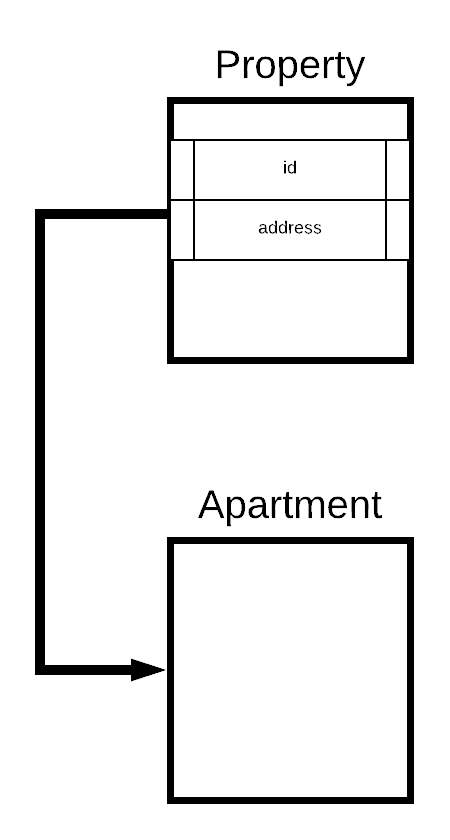
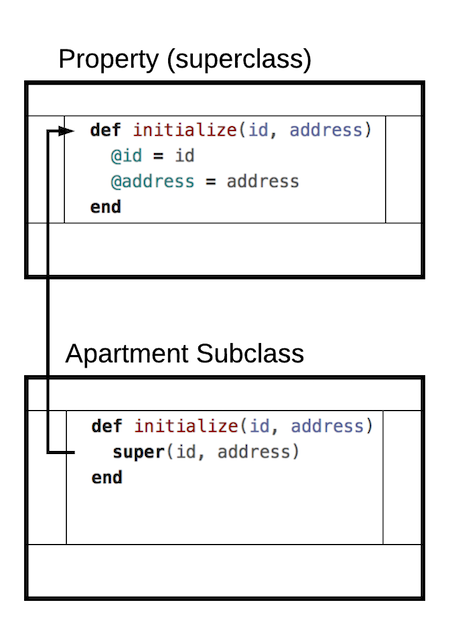
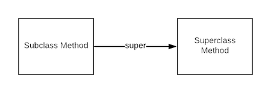

# Object Inheritance

## Learning Goals
- Describe objects in terms of _is-a_ relationships
- Use _inheritance_ to indicate a hierarchy of ownership or lineage between classes
- Explore overriding method definitions in _subclasses_
- Use `super` to invoke the behavior of a _base class_ in a _subclass_

## Object Inheritance: _is-a_
_Inheritance_ is used to model the behaviors of one class after another. We would want to do this when two objects have a clear relationship. Often the parent class, or _base class_, is more general while the child, or _subclass_, is more specific.

For example, we could have a `Property` class that describes the general behaviors of properties which could be used in a real estate listing site like Redfin or Zillow. This is a _base class_ or _superclass_. We could create `Apartment` and `Condo` classes that model more specific behaviors and additional information. An `Apartment` is very different than a `Condo` or a `House`, but they are all properties which can be listed. It could make sense then, to declare them _subclasses_ of `Property`.

A way to describe this is by using the _is-a_ phrase: an `Apartment` _is-a_ `Property`.  In Ruby, we use the `<` symbol to denote that the class on the left of the `<` symbol is inheriting behaviors from the class on the right side of the `<` symbol:

```ruby
class Property
  attr_reader :id, :street, :city, :state, :zip

  def initialize(id, street, city, state, zip)
    @id = id
    @street = street
    @city = city
    @state = state
    @zip = zip
  end

  def mailing_address
    return "#{street}\n#{city}, #{state} #{zip}"
  end
end

# Apartment is-a Property
# Apartment inherits from Property
class Apartment < Property
end
```

The code above creates an is-a relationship between `Apartment` and `Property`.  The relationship diagramed below gives any instance of `Apartment` properties like `id` and the `mailing_address` method.



## Inheriting Methods
So what do we get when we inherit? We get __methods__ and instance variables from the parent class. The  `Property` class has an instance method called `mailing_address` which returns the mailing address of the property. Since all properties have a `mailing_address` method, our _subclasses_ will _inherit_ this method. So now all `Apartment` instances have a `mailing_address` method.

```ruby
generic_property = Property.new(12345, '123 St Charles Place', 'New York', 'NY', 12080)
generic_property.mailing_address #=> "123 St Charles Place"
                                  #  "New York, NY 12080"

fun_place = Apartment.new(56789, '111 Boardwalk', 'New York', 'NY', 12070)
fun_place.mailing_address #=> "111 Boardwalk"
                          #   "New York, NY 12070"
```

This is known as _implicit inheritance_ because when we put functionality in the _base class_ (`Property`), then all _subclasses_ (`Apartment`) will automatically get those behaviors.

## Super & Initialize

We have seen how inheritance allows a subclass to "inherit" the methods, in this case `mailing_address`, from it's superclass.  We can also create an `initialize` method in the subclass and use it to give our subclass additional attributes.

An apartment mailing address are different that of a generic `Property` in that it must have a unit number.  So we can give `Apartment` objects a unit number attribute.

```ruby
class Property
  attr_reader :id, :street, :city, :state, :zip

  def initialize(id, street, city, state, zip)
    @id = id
    @street = street
    @city = city
    @state = state
    @zip = zip
  end

  def mailing_address
    return "#{street}\n#{city}, #{state} #{zip}"
  end
end

class Apartment < Property
  attr_reader :unit

  def initialize(id, street, unit, city, state, zip)
    super(id, street, city, state, zip)
    @unit = unit
  end
end
```

In the above example notice the `super` keyword in the 1st line of the `Apartment` class' `initialize` method.

In initialize, `super` calls the parent, or superclass' constructor.  So `Property`'s `initialize` method is called and `@id`, `@address` etc are set to the given parameter.

`super` **must** be the first line in a subclass' `initialize` method.  If `super` is called without an argument, it will use the parameters from the subclass' `initialize` method.



## Overriding Methods

What happens when our classes have different functionality for the same idea? We can _override_ methods from _base classes_ in their _subclasses_.  We want the mailing addresses of `Apartment` objects to include the unit number so we can override the `mailing_address` method.

```ruby
class Apartment < Property
  attr_reader :unit

  def initialize(id, street, unit, city, state, zip)
    super(id, street, city, state, zip)
    @unit = unit
  end

  def mailing_address
    return "Unit: #{unit}\n#{street}\n#{city}, #{state} #{zip}"
  end
end

generic_property = Property.new(12345, '123 St Charles Place', 'New York', 'NY', 12080)
generic_property.mailing_address #=> "12345: 123 St Charles Place"

fun_place = Apartment.new(56789, '111 Boardwalk', '212B', 'New York', 'NY', 12070)
fun_place.mailing_address #=> "Unit: 212B"
                  # "111 Boardwalk"
                  # "New York, NY 12070"
```

In this case, we override the functionality that the _base class_ (`Property`) provides with more specific functionality in the _subclass_ (`Apartment`).

### Using `super` to invoke behavior in _base classes_.

It's also possible to use the behavior defined in the _base class_ alongside specialized behavior in the _child class_. By using the keyword `super`, we can invoke the code in the _base class_ at any point in the _overriding_ method __and__ still be capable of using the overridden code.  In other words the overriding method can do the same action as the parent class **and** more.  This can help us DRY up our code significantly.

```ruby
class Apartment < Property
  ...
  def mailing_address
    return "Unit: #{unit}\n#{super}"
  end
end

generic_property = Property.new(12345, "123 St Charles Place", "New York", 'NY', 12080)
generic_property.mailing_address #=> "123 St Charles Place"
                         # "New York, NY 12080"

fun_place = Apartment.new(56789, '111 Boardwalk', '212B', 'New York', 'NY', 12070)
fun_place.mailing_address #=> "Unit: 212B"
                  # "111 Boardwalk"
                  # "New York, NY 12070"
```

In this case, we utilize the behavior that the _base class_ (`Property`) provides but augment it with behavior specific to the _subclass_ (`Apartment`).



**Exercise**  With your seatmates create an `Condo` class.  In addition to the same properties as `Apartment`, a Condo should also have `price` and `square_feet` properties and a `price_per_square_foot` method.

## Summary

Inheritance allows one class to gain or "inherit" the methods and attributes from another class.  This is a key concept in Object Oriented Programming.  Inheritance can be extremely powerful, but it is also easy to misuse.

Inheritance is good to use where one class is clearly an extension or variation of the parent class, so the class gaining methods and attributes **"is-a"** specialized version of the parent class.  Be very selective in your use of inheritance as composition is more often the most effective strategy.

## Resources
- [Understanding Inheritance in Ruby](http://culttt.com/2015/06/24/understanding-inheritance-in-ruby/)
- [Ruby the Hard Way inheritance vs composition](https://learnrubythehardway.org/book/ex44.html)
- [Youtube Video Intro to class inheritance](https://www.youtube.com/watch?v=hrCKyNFSaos)
