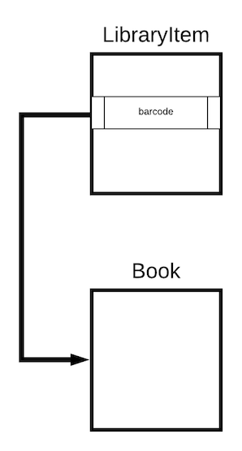
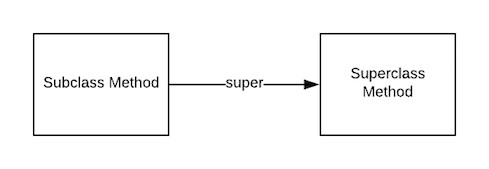
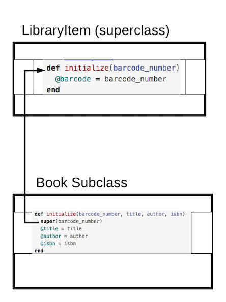

# Object Inheritance
## Learning Goals
- Describe objects in terms of _is-a_ relationships
- Use _inheritance_ to indicate a hierarchy of ownership or lineage between classes
- Explore overriding method definitions in _subclasses_
- Use `super` to invoke the behavior of a _base class_ in a _subclass

## Object Inheritance: _is-a_
_Inheritance_ is used to model the behaviors of one class after another. We would want to do this when two objects have a clear chain of ownership. Often the parent class, or _base class_, is more general while the child, or _subclass_, is more specific.

For example, we could have a `LibraryItem` class that describes the general behaviors of items in a library. This is a _base class_ or _superclass_. We could create `Book` and `Video` classes that model more specific behaviors. A `Book` is very different than a `Video`, but they are both items in the library. It would make sense then, to declare them _subclasses_ of `LibraryItem`.

A way to describe this is by using the _is-a_ phrase: a `Book` _is-a_ `LibraryItem`. `Video` _is-a_ `LibraryItem`. In Ruby, we use the `<` symbol to denote that the class on the left of the `<` symbol is inheriting behaviors from the class on the right side of the `<` symbol:

```ruby
class LibraryItem
  def barcode
    return "12345"
  end
end

# Book is-a LibraryItem
# Book inherits from LibraryItem
class Book < LibraryItem
end
```

The code above creates an is-a relationship between `LibraryItem` and `Book`.  The relationship diagramed below gives any instance of `Book` a `barcode` method.



## Inheriting Methods
So what do we get when we inherit? We get __methods__. The  `Book` class has an instance method called `barcode`. Since all items in the library have a barcode, our _subclasses_ will _inherit_ this method. So now our `Book` instances will have the `barcode` method.

```ruby
generic_item = LibraryItem.new
generic_item.barcode #=> "12345"

poodr = Book.new
poodr.barcode #=> "12345"
```

This is known as _implicit inheritance_ because when we put functionality in the _base class_ (`LibraryItem`), then all _subclasses_ (`Book`) will automatically get those behaviors.

## Overriding Methods
What happens when our classes have different functionality for the same idea? We can _override_ methods from _base classes_ in their _subclasses_.

```ruby
class Book < LibraryItem
  def barcode
    return "BOOK12345"
  end
end

generic_item = LibraryItem.new
generic_item.barcode #=> "12345"

poodr = Book.new
poodr.barcode # => "BOOK12345"
```

In this case, we override the functionality that the _base class_ (`LibraryItem`) provides with more specific functionality in the _subclass_ (`Book`).

### Using `super` to invoke behavior in _base classes_.

It's also possible to use the behavior defined in the _base class_ alongside specialized behavior in the _child class_. By using the keyword `super`, we can invoke the code in the _base class_ at any point in the _overriding_ method __and__ still be capable of using overriding code.  In other words the overriding method can do the same action as the parent class **and** more.

```ruby
class AudioBook < Book
  def barcode
    # super invokes the `barcode` method on the _base class_ (Book)
    return "AUDIO" + super
  end
end

generic_item = LibraryItem.new
generic_item.barcode # => "12345"

audiobook = AudioBook.new
audiobook.barcode # => "AUDIOBOOK12345"
```

In this case, we utilize the behavior that the _base class_ (`Book`) provides but augment it with behavior specific to the _subclass_ (`AudioBook`).



## Super & Initialize

We've seen how methods by themselves work with methods, what about instance variables?  Instance variables are inherited as well, for example:

```ruby
class LibraryItem
  def initialize(barcode_number)
    @barcode = barcode_number
  end

  def barcode
    return @barcode
  end
end

class Book < LibraryItem
  attr_reader :title, :author, :isbn

  def initialize(barcode_number, title, author, isbn)
    super(barcode_number)
    @title = title
    @author = author
    @isbn = isbn
  end
end
```

In the above example notice the `super` keyword in the 1st line of the `Book` class' `initialize` method.  

In initialize, `super` calls the parent, or superclass' constructor.  So `LibraryItem`'s `initialize` method is called and `@barcode` is set to the parameter.  

As a general rule, `super` will often be the first line in a subclass' `initialize` method.  If `super` is called without an argument, it will use the parameters from the subclass' `initialize` method.



## Summary

Inheritance allows one class to gain or "inherit" the methods and attributes from another class.  This is a key concept in Object Oriented Programming.  Inheritance can be extremely powerful, but it is also easy to misuse.  

Inheritance is good to use where one class is clearly an extension or variation of the parent class, so the class gaining methods and attributes **"is-a"** specialized version of the parent class.  Be very selective in your use of inheritance as composition is more often the most effective strategy.  

## Resources
- [Understanding Inheritance in Ruby](http://culttt.com/2015/06/24/understanding-inheritance-in-ruby/)
- [Ruby the Hard Way inheritance vs composition](https://learnrubythehardway.org/book/ex44.html)
- [Youtube Video Intro to class inheritance](https://www.youtube.com/watch?v=hrCKyNFSaos)
