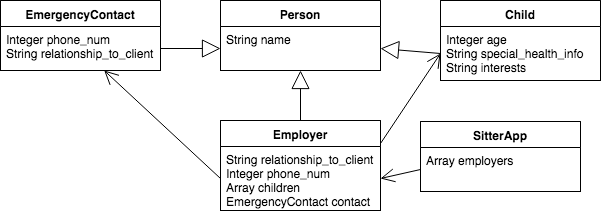
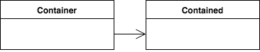
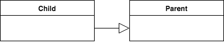
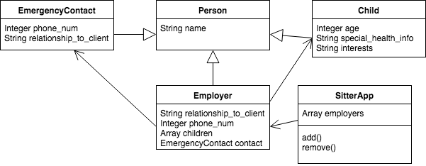

# Object-Oriented Design: Breaking Down the Problem

## Learning Goals
- Break down a problem into a UML diagram
- Identify two types of relationships in UML diagrams

### Getting Started

Breaking down a programming problem is hard! Oftentimes you get a problem and you don't even know where to start. In this discussion and exercise, we are going to spend some time talking about strategies to help you break down problems into a manageable design that can help you get started.

### Let's try it out!

Consider the following project description:

> A part-time babysitter wants you to help their implement some way of organizing and managing
their employers’ information where it would be easy to add and remove new employers. Each
employer is a person with a name, an address, a phone number and at least one child. Each
employer also provides a person, an emergency contact, with a name, phone number and
relationship to the client. Each child’s name, age, special health information and interests should
also be noted.

How can we use this description to help us figure out what our entities (or classes) should be? One way is to go through the description and make a note of all of the **nouns**.

> A part-time babysitter wants you to help their implement some way of organizing and managing
their employers’ information where it would be easy to add and remove new employers. Each
**employer** is a **person** with a **name**, an **address**, a **phone number** and at least one **child**. Each
**employer** also provides a **person**, an **emergency contact**, with a **name**, **phone number** and
**relationship to the client**. Each **child**’s **name**, **age**, **special health information** and **interests** should
also be noted.

Some of the highlighted items will be entities and some will be the attributes that describe that entity. This is part of the decision-making process that you'll need to decide. You could go as far as every noun in the problem being an entity, but most likely that will be overkill as a starting point. You should also notice which common entities are all people!

<!--
All diagrams located here https://www.draw.io/#G1ZwIIgnSG8xJq_NRLrTVsgu3nStGljIy0
-->

### Diagram details

This diagram is a [UML](https://en.wikipedia.org/wiki/Unified_Modeling_Language) representation of a system design. UML is used regularly in designing programming systems. Here we'll highlight the two relationships in the above diagram.

The line with the regular black arrow shows an association between a "container" and a class that is "contained".

The line the with solid arrowhead signifies an inheritance relationship.

### Adding Actions

The initial diagram we came up with contains the entities and attributes that we pulled out from the initial problem description. Next, we'll want to go back to our problem description to highlight the verbs that may be associated with the entities.

> A part-time babysitter wants you to help their implement some way of organizing and managing
their employers’ information where it would be easy to **add** and **remove** new employers. Each
employer is a person with a name, an address, a phone number and at least one child. Each
employer also provides a person, an emergency contact, with a name, phone number and
relationship to the client. Each child’s name, age, special health information and interests should
also be noted.

Then we can add these actions to our design diagrams.

It is important to remember that the diagram above and those like it are used for initial planning. When
you start actually trying to complete the project code-wise, you may discover that you actually need
more methods, classes and attributes

### Exercise
Now, let's try it out ourselves.

Pick on of the following project descriptions and determine the classes you need to write, what methods and
variables the classes will contain and how the classes relate to one another. Draw a diagram if
necessary.
1. A teacher wants you to help their write a program that will randomly assign each of her students
to an activity at the various activity tables available in her classroom. Each activity table knows
its activity, the materials needed for the activity, the students at the table and how many chairs
are left. The activity tables available are the math table, the art table, the reading table and the
computer table and their respective activities are doing math, drawing, reading and playing on
the computer.

2. A friend wants you to help create a portion of the logic behind a Pac-Man game. Remember that
a Pac-Man knows how to move, eat and die. A Pac-Man can eat dots, the flashing energizer dots
or a ghost that has turned blue. A dot only knows its location. There are four normal colors for a
ghost: red, pink, orange and cyan. A ghost knows how to move, be eaten, kill Pac-man, turn blue
and return to the center of the screen after being eaten. (Do not think about the graphical
details or extra portions of the game not mentioned in the description).

## Key Takeaway
Designing our systems up front can help us consider entities, attributes and actions that we need our system to be able to handle. Creating a UML diagram is a great visual representation of initial system design to communicate with your team or give you a design to revisit as the system is implemented.

## Additional Resources
- Material originally pulled from [this resource](http://coweb.cc.gatech.edu/cs1316/uploads/629/Spring_2008_Breaking_the_Problem_Down_Problem_Solving_in_OO_Computer_Science.1.pdf)
