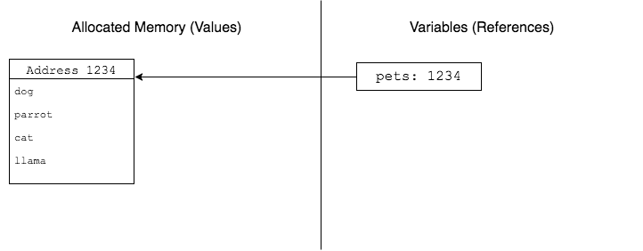
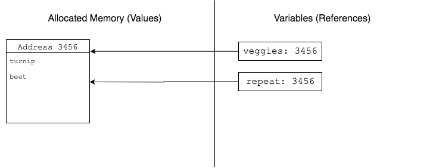
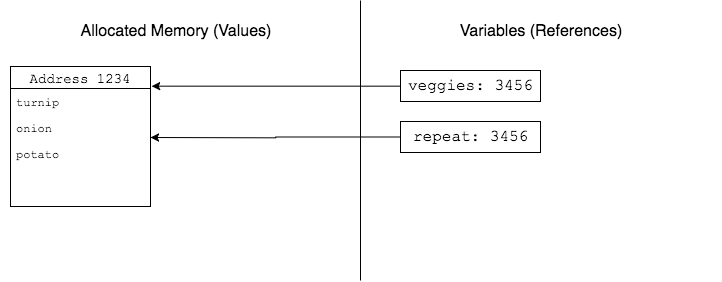
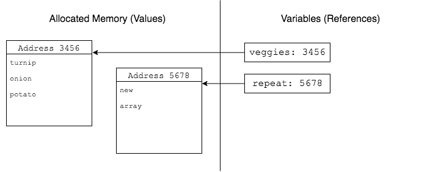

# References and Values

## Learning Goals
At the end of this lesson, students should be able to...

- Discuss how objects are stored in Ruby
- Differentiate between _references_ and _values_
- Compare _modifying an object_ with _reassigning a variable_

## Motivation

We're going to start today with some Ruby code that does something a little unexpected. It's a method that takes an array of strings as an argument, and truncates (chops off the end of) all the strings with more than three characters. Or at least that's the idea.

```ruby
def short_strings(input)
  result = []
  input.each do |word|
    # Slice characters 0 to 2
    result << word[0..2]
  end
  input = result
end

pets = ['dog', 'parrot', 'cat', 'llama']
short_strings(pets)
puts "#{pets}"

```

Running this code results in `["dog", "parrot", "cat", "llama"]`. The array in unchanged! Let's do some debugging:

```ruby
def short_strings(input)
  result = []
  input.each do |word|
    # Slice characters 0 to 2
    result << word[0..2]
  end
  input = result
  puts "Inside short_strings, input is"
  puts "#{input}"
end

pets = ['dog', 'parrot', 'cat', 'llama']
short_strings(pets)
puts "After calling short_strings"
puts "#{pets}"
```

The results:

```
Inside short_strings, input is
["dog", "par", "cat", "lla"]
After calling short_strings
["dog", "parrot", "cat", "llama"]
```

`short_strings` is indeed creating a list of shortened words and storing it under the name `input`, but our outer variable `pets` isn't being updated. The reason why has to do with references and values, and how data is stored in a computer.

As an aside: one way to fix our method is to return the new array, and when calling it say `pets = short_strings(pets)`. However, sometimes this isn't an option, or isn't what you want.

## References and Values

When we create an array in Ruby (or a string or a hash or any other complex data type), we're actually creating two things.

The first is the _value_ of the array, which involves asking the operating system for a bit of memory and then putting our data in it. You can think of this as the actual object. Each piece of memory we get from the OS has an _address_ representing its physical location in hardware, which is how we get back to it later.

The second is a _reference_ to the array, which ties together the address of that memory with a name for our program to use. The address part of a reference is sometimes called a _pointer_ (especially in low-level languages like C and C++), and we say that a variable _points to_ or _references_ an object.

This split between references and values comes up often, both in computing and in the wider world. Here are some examples:

Reference               | Value
---                     | ---
Street address          | Your house
URL                     | Web page or file
File path on hard drive | The contents of that file
A named variable        | The contents of that variable

Recalling our example above, saying

```ruby
pets = ['dog', 'parrot', 'cat', 'llama']
```

and imagining that the `pets` array has been stored at address `1234`, we would get the following memory layout:



Every variable in Ruby consists of these two parts, a reference and a value. Normally when you type the variable's name, Ruby automatically goes and gets the object. You'll almost never need to use the address yourself. If you do want to find out what object your variable references, you can use the `object_id` method:

```ruby
pets = ["dog", "parrot", "cat", "llama"]
puts "pets.object_id: #{pets.object_id}"

# Different objects have different IDs
veggies = ["turnip", "beet"]
puts "veggies.object_id: #{veggies.object_id}"
```

### The `=` Operator

The `=` operator changes what a variable points at.

If we assign one variable to another variable, they will both reference the same underlying object.

```ruby
# Two variables can point to the same object
repeat = veggies
puts "repeat.object_id: #{repeat.object_id}" # same as veggie.object_id
```



If we make changes to the object through one variable, we can see the changes via the other. The variables have different names, but the underlying object is the same.

```ruby
puts "#{veggies}"     # ["turnip", "beet"]
puts "#{repeat}"      # ["turnip", "beet"]

veggies[1] = "onion"
puts "#{veggies}"     # ["turnip", "onion"]
puts "#{repeat}"      # ["turnip", "onion"]

repeat.push("potato")
puts "#{veggies}"     # ["turnip", "onion", "potato"]
puts "#{repeat}"      # ["turnip", "onion", "potato"]
```



When we use the `=` operator, we are not changing the underlying object but instead _changing what our variable points to_. This does **not** affect any other variables.

```ruby
repeat = ["new", "array"]
puts "repeat.object_id: #{repeat.object_id}"
puts "value of repeat:"
puts "#{repeat}"    # ["new", "array"]
puts "value of veggies:"
puts "#{veggies}"   # ["turnip", "onion", "potato"]
```



So to summarize, if two variables point to the same underlying object:
- Modifications to the _object_ (the value) will be visible from both variables
- Reassigning one _variable_ (the reference) with `=` does not affect the other variable

#### Identifying Reassignment

One subtle point is that `+=` and the other shorthand operators all involve reassignment. If we say `veggies += ['rutabaga']`, Ruby creates a new array, copies all the values from `veggies`, adds in `rutabaga`, and reassigns `veggies` to point to this new array. This is true of strings and numbers as well.

On the other hand, `<<` does _not_ involve reassignment. `<<` is shorthand for the `.push()` method, which changes the underlying object, not the variable itself (most methods work this way). Saying `veggies << 'rutabaga'` will modify the original array referenced by `veggies`, and other variables referencing that array will be able to see the changes as well.

So how do you tell whether an operation involves reassignment? A good rule of thumb is that anything involving the `=` sign will reassign the variable, and any other operation (like `<<`, `.push()` or `.concat()`) will not.

### Passing Parameters

**Question:** When we pass a parameter to a method, what do you get?
- Is it the same underlying object?
- Is it the same variable?
- How can we find out?

Let's write some code that will help us investigate this.

```ruby
def reassign_parameter(param)
  puts "  Inside reassign_parameter"
  puts "  at start, param.object_id is #{param.object_id}"

  # .push modifies the underlying object
  param.push('gecko')
  puts "  after modification, param.object_id is #{param.object_id}"

  # = changes the reference
  param = ["new", "array"]
  puts "  after reassignment, param.object_id is #{param.object_id}"
  puts "  with value #{param}"
  puts "  Finish reassign_parameter"
end

pets = ["dog", "parrot", "cat", "llama"]
puts "Before reassign_parameter"
puts "pets.object_id is #{pets.object_id}"
puts "with value #{pets}"
puts

reassign_parameter(pets)

puts
puts "After reassign_parameter"
puts "pets.object_id is #{pets.object_id}"
puts "with value #{pets}"
```

Before running this code, take a couple minutes to read through it. What is it doing? What do you expect the output to be?

Running the code yields (your `object_id`s may be different):

```
Before reassign_parameter
pets.object_id is 70144030241620
with value ["dog", "parrot", "cat", "llama"]

  Inside reassign_parameter
  at start, param.object_id is 70144030241620
  after modification, param.object_id is 70144030241620
  after reassignment, param.object_id is 70144030228060
  with value ["new", "array"]
  Finish reassign_parameter

After reassign_parameter
pets.object_id is 70144030241620
with value ["dog", "parrot", "cat", "llama", "gecko"]
```

We can make a few interesting observations about this output:
- The parameter inside the method has the same `object_id` as the variable we passed from outside
- Modifications to the underlying object are visible outside the method
- Reassigning the parameter with `=` does not reassign the outer variable

This is exactly the same behavior we saw before, when we had two variables referencing the same object. From this we can conclude: **when you pass a variable as parameter, Ruby creates a new variable that references same object**.

## Fixing the `short_strings` Method

**Question:** Given what we've learned, how can we modify our `short_strings` method to do what we want?

The answer is to modify the underlying object, rather than reassigning the parameter. Here's what the resulting code might look like:

```ruby
def short_strings(input)
  input.each_with_index do |word, i|
    # Slice characters 0 to 2
    input[i] = word[0..2]
  end
end

pets = ['dog', 'parrot', 'cat', 'llama']
short_strings(pets)
puts "#{pets}"
```

This produces the expected output. Note that we can't just say `word = word[0..2]`, for the same reason as above: that reassigns the block parameter `word` to a new string containing just the first 3 letters, but neither modifies nor reassigns the string in the array. Instead we reassign `input[i]`, which does what we want: change the value stored in the array.

We could also use the `map!` enumerable method, since that modifies the original. `map` (without a `!`) would not work, because it creates a new array.

## Other Objects

We've talked a lot about arrays today, but this pattern holds true for all complex objects in Ruby: strings, hashes, instances of classes, etc. For example, consider the following code:

```ruby
# Reassign a string using +=
def reassign_string(str)
  str += ' reassigned'
  puts "inside reassign_string, str is '#{str}'"
end

text = 'original'
reassign_string(text)
puts "outside reassign_string, text is '#{text}'"


# Modify a string using the .concat() method
def modify_string(str)
  # str << ' modified' would do the same thing
  str.concat(' modified')
  puts "inside modify_string, str is '#{str}'"
end

text = 'original'
modify_string(text)
puts "outside modify_string, text is '#{text}'"
```

Small, built-in types like numbers, booleans and `nil` follow basically the same rules. The catch is there's no way to change the underlying value of these types without reassignment. In programming lingo, we say that these types are _immutable_. This means that whenever you change the value, Ruby makes a copy and changes that instead.

## Takeaway

- A variable in Ruby consists of two things:
  - The variable itself, tying a name to an address in memory
  - The object at that memory address
  - We say a variable _references_ or _points to_ an object
- Multiple variables can reference the same object
  - Changes to the underlying object will be reflected through both variables
    - Methods like `.push()` or `.concat()`
  - Changing what one variable points to does not affect any other variables
    - `=`, `+=`, etc.
- Passing an argument to a method creates a new variable referencing the same object
- Small built-in types like numbers, booleans and `nil` are _immutable_, meaning the underlying object can't be modified

## Additional Resources

- [Passing objects in Ruby](https://launchschool.com/blog/object-passing-in-ruby) - Great article! Goes into more depth on immutables.
- [Memory allocation in Ruby](https://blog.engineyard.com/2010/mri-memory-allocation-a-primer-for-developers) - Deep dive into some os-level stuff.
- [Pointers: Understanding Memory Addresses](http://computer.howstuffworks.com/c23.htm) - Lower-level view of what's going on. Oriented toward C programming, but very approachable.
