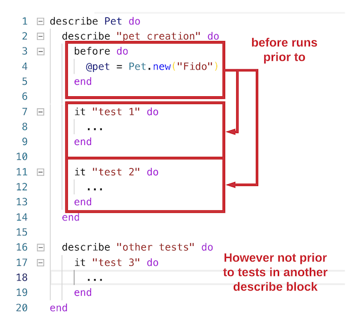

# Testing with Before and Let

## Learning Goals

- Understand how to use `before` syntax in Minitest to run "Arrange" code before each test
- Understand how to use `let` syntax in Minitest to use lazy-loading for variables

## Introduction

Consider writing tests for a `Pet` class like this:

```ruby
# pet.rb

class Pet
  attr_reader :name

  def initialize(name, species, color, favorite_toy)
    @name = name
  end

  # .. more methods
end
```

In your Minitest code you will often find yourself creating instances over and over again in each test case like this:

```ruby
it "must have a name" do
  pet = Pet.new("Fido")

  # expectations go here
end

it "must have a species" do
  pet = Pet.new("Fido")

  # expectations go here
end

it "must have a color" do
  pet = Pet.new("Fido")

  # expectations go here
end

# ... etc
```

In most test cases we're creating a new identical instance of `Pet` to work with. This doesn't seem *DRY*.

What code can we write in order to reduce declaring the `pet = Pet.new("Fido")` "Arrange" step in _every. single. test_?

## Solution 1:  Before Blocks

One solution is to use Minitest's `before` block.  In Minitest a `before` block runs before each test case, which allows you to dry up common code in the arrange step of testing.

```ruby
require 'minitest/autorun'
require 'minitest/reporters'
require 'pet'

describe Pet do
  before do
    puts "Creating a pet named Fido" # This line isn't doing anything useful, it's just to illustrate that we can do as much Ruby code as we want within a before block
    @pet = Pet.new("Fido")
  end

  it "must have a name" do
    expect(@pet.name).must_equal "Fido"
  end
  ...
end
```

We can use the `before` block to set up the variable `@pet = Pet.new("Fido")`, and any other variables or setup actions we may need in our tests.

However, **`before` blocks do not share scope with our `it`-level tests, so if we use `before` in Minitest, we must make all variables used in `it`-level tests _instance_ variables.** This isn't a pattern we see often, and is specific to this context of Minitest.

In the above example the `before` block runs before each test and provides an instance variable `@pet`. Then, we use `@pet` in our test `it "must have a name"`. This can often serve as a helpful way to DRY testing code.  It's also important to note that a `before` block runs prior to any `it` block inside the same `describe`.  


<!-- Image origin https://www.lucidchart.com/invitations/accept/2adc99a3-fc7a-47d8-b9f1-342c1377b940 -->

Unfortunately `before` blocks **always** run before each test case.  Even if we don't want to use `@pet` in a few test cases, like for instance if we want to try creating a Pet with no arguments the before block will still run.

## Solution 2: Let

If our `before` block runs before **every** test, when we have very complex "Arrange" steps for tests, this might get problematic. There are plenty of "Arrange" steps that are relevant to **some** tests, **but not all.**

Is there a way to make variables in our tests only exist when they need to?

`let` syntax lets us set up variables that we can use in tests. Variables created with `let` syntax are only executed when we need them.

### `let` Syntax

If you recall, when using `attr_reader :name`, you pass in a _symbol_ (:name), and the `attr_reader` method uses the symbol to create a method with the same name.  

`let` works in a similar fashion.  It takes a symbol for a variable name and a block to give the variable a starting value.  `let` is called an initializer, because it provides an _initial_ value for the given variable name.

The **first** time ruby encounters the variable in a test, it will execute the given block to give the variable an initial value.  Subsequently it will function as a regular local variable.

```ruby
# pet_test.rb
require 'minitest/autorun'
require 'minitest/reporters'
require 'pet'

describe Pet do
  let (:pet)  {              # <-- The name used
    Pet.new("Fido") # <-- The initial value of 'pet'
  }


  it "must have a name" do
    expect(pet.name).must_equal "Fido"
  end
end
```

Because the block is only executed the when it is referenced, `let` is often called "lazy."  The code inside the block doesn't execute until the variable is first used, in this case when we do `expect(pet.name).must_equal "Fido"`.

The block is only executed the first time the variable is encountered in a given test.  So the let runs **once** for each test case that uses it and **never** in test cases where it isn't needed.  Neat!

Just like `before` each test case runs autonomously with a fresh `pet` so that no test case will interfere with another.

### Proof that let is lazy

In the first example here, when using `before` the statement "Creating a pet named Fido" is printed twice, once for each `it` block.

#### Using `before`

```ruby
# sample_test.rb
require 'minitest/autorun'
require 'minitest/reporters'
require 'pet'

describe "Pet" do
  before do
    puts "Creating a pet named Fido"
    @pet = Pet.new("Fido")
  end
  
  it "must have a name" do
    expect(@pet.name).must_equal "Fido"
  end

  it "Throws an ArgumentError if created without a name" do
    expect {
      Pet.new
    }.must_raise ArgumentError
  end
end
```
Output:

```bash
$  ruby test/sample_test.rb
Run options: --seed 62527

# Running:

Creating a pet named Fido
.Creating a pet named Fido
.

Finished in 0.011018s, 272.2817 runs/s, 272.2817 assertions/s.

2 runs, 2 assertions, 0 failures, 0 errors, 0 skips
```

#### Using `let`

But if we use let instead the statement is only printed **once** because `pet` is only referenced in one test.

```ruby
require_relative "test_helper"

describe "Pet" do
  let (:pet) {
    puts "Creating a pet named Fido"
    Pet.new("Fido")
  }

  it "must have a name" do
    expect(pet.name).must_equal "Fido"
  end

  it "Throws an ArgumentError if created without a name" do
    expect {
      Pet.new
    }.must_raise ArgumentError
  end
end
```

```bash
ruby test/sample_test.rb
Run options: --seed 49538

# Running:

Creating a pet named Fido
.

Finished in 0.005194s, 770.1194 runs/s, 770.1194 assertions/s.

2 runs, 2 assertions, 0 failures, 0 errors, 0 skips
```

Notice the `puts` ran only once using `let`, and only in the test-case where it was used.  So `let` can often be more efficient because it only executes where it is referenced.

Unlike life, in Minitest being lazy pays off!

## Conclusion

When we write tests, we may have similar "Arrange" and "Act" code that is repeated in many, many tests, over, and over.

If we want to refactor our tests to have less repetitive code, we have at least two options: `before` blocks and `let` variables.

With `before` blocks, you can define a block of code that is run before every test.

With `let`, you can define a block of code that is used to initialize a variable the first time it is used in a test block. `let` is useful when we have "Arrange" steps that are useful to _some_ tests, but not all, so we shouldn't use `before`.

## Resources
-  [Minitest let() is Lazy](http://ruby-journal.com/minitest-let-is-lazy/)
-  [4 Fantastic Ways To Setup State In Minitest](https://chriskottom.com/blog/2014/10/4-fantastic-ways-to-set-up-state-in-minitest/)
