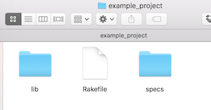

# Testing With Minitest

Minitest is the default testing framework for Ruby.  We will learn and explore writing tests by writing a method which will take in hours, minutes, seconds and returns a string formatted human readable time.  In doing so we will both learn the syntax of Minitest and practice writing code in a TDD fashion.

## Learning Goals
- Discover techniques to verify our code performs as expected using _automated tests_
- Learn the syntax of Minitest spec-style testing
- Test code using _expectations_
- Practice spotting _nominal_ and _edge cases_.
- Have a basic grasp on what _Rake_ & _Rakefiles_ are

## Starter Files

As we work we will use the files located in this [repository](https://github.com/AdaGold/clock).  Fork & Clone the repository and follow along as you go.

Our starter code has 2 files we will focus on.
- `clock.rb` a file we will build our method in to return a string formatted as a time.
- `clock_spec.rb` a file in which we will place tests to verify that our code meets expectations.

### Before We Get Started

Because colored output is so much nicer we'll add a gem called [minitest-reporters.](https://github.com/kern/minitest-reporters)

Run this command in your terminal.

```bash
$  gem install minitest-reporters
```

### How To Use Minitest?

To start with we'll add some code to `clock_spec.rb`.  We will also require `minitest/autorun`

```ruby
# clock_spec.rb

require 'minitest/autorun'
require 'minitest/reporters'
require_relative 'clock'

Minitest::Reporters.use!
```

Note that `clock.rb` which will hold our method is currently empty.

```ruby
# clock.rb
```


We can run the tests by typing:  `ruby clock_spec.rb` and get the following:

```bash
$ ruby clock_spec.rb
Run options: --seed 35264

# Running:


Finished in 0.000751s, 0.0000 runs/s, 0.0000 assertions/s.

0 runs, 0 assertions, 0 failures, 0 errors, 0 skips
```

The code we added to `clock_spec.rb` will automatically run any tests in the file.  When we execute `clock_spec.rb` it scans the file for any test cases and runs them giving us the above output.  Minitest is running (Yippie!), but we haven't actually written a test yet, so we get `0 runs, 0 assertions...`.


### Writing Your First Test

To start we'll need to create a `description` block and place our tests inside that block.


#### Step 1:  Create a `describe` block

```ruby
# clock_spec.rb
require 'minitest/autorun'
require 'minitest/reporters'
require_relative 'clock'

Minitest::Reporters.use!

describe "clock" do

end
```

The `describe` block indicates that this contains a suite of tests.  Minitest will run these tests together and any instance variables created inside this block will be shared among the test cases.

#### Step 2:  Create an `it` block

Now we'll create an `it` block which is a test-case.  Each `describe` block can have many `it` blocks inside it and even many `describe` blocks.  Each `it` block however should focus on testing one specific thing, while `describe` blocks are used to group a set of tests.


```ruby
# clock_spec.rb

require 'minitest/autorun'
require 'minitest/reporters'
require_relative 'clock'

Minitest::Reporters.use!


describe "clock" do

  it "will return a string" do

  end
end
```

#### Step 3:  Add an expectation


So we have a test-case, but it's not actually checking anything yet.  So we can add an _expectation_ which is a method call that describes a condition it **expects** the given item to meet.  In this case we need to **expect** that if we call clock, it will return a string.  Expectations typically start with `must_` or `wont_`.

So lets write our expectation

```ruby
# clock_spec.rb

require 'minitest/autorun'
require 'minitest/reporters'
require_relative 'clock'

Minitest::Reporters.use!

describe "clock" do
  it "will return a string" do
    # Arrange
    hours = 8
    minutes = 14
    seconds = 27

    # Act
    time = clock(hours, minutes, seconds)

    # Assert
    # the `clock` method must return a string
    expect(time).must_be_instance_of String
  end
end
```

Notice the line `expect(time).must_be_instance_of String`.  Minitest adds an `expect` method which returns an object with a bunch of expectations including the `must_be_instance_of` method.  Most expectations take one required argument.  If the required argument to `expect` is a string the expectation passes.

When we run this with `ruby clock_spec.rb` we get:

```bash
ruby clock_spec.rb
Run options: --seed 21626

# Running:

ERROR["test_0001_will return a string", "Clock", 0.0008059999672695994]
 test_0001_will return a string#Clock (0.00s)
NoMethodError:         NoMethodError: undefined method `clock' for #<#<Class:0x00007faa528a19d0>:0x00007faa528e1fa8>
            clock_spec.rb:12:in `block (2 levels) in <main>'

  1/1: [] 100% Time: 00:00:00, Time: 00:00:00

Finished in 0.00333s
1 tests, 0 assertions, 0 failures, 1 errors, 0 skips
```

**This is a good thing.**  We have our first **red** test.  There's an error because we haven't created the Clock method yet.

####  Step 4:  Write Code To Make It Pass

Lets make the test pass by creating the clock method which returns a string.

```ruby
# clock.rb

def clock(hours, minutes, seconds)
  return ''
end
```

Now `ruby clock_spec.rb` gets us:

```bash
$ ruby clock_spec.rb
Started with run options --seed 23098

  1/1: [] 100% Time: 00:00:00, Time: 00:00:00

Finished in 0.00116s
1 tests, 1 assertions, 0 failures, 0 errors, 0 skips
```

Now we have our first **green/passing** test.

There are a [number of expectations](http://mattsears.com/articles/2011/12/10/minitest-quick-reference/) in Minitest beyond the `must_be_instance_of` method.

#### A Word on Parentheses

In the code above, we are calling `must_be_instance_of` without using parentheses `expect(time).must_be_instance_of String`.  Ruby doesn't **force** you to put parentheses around a method's arguments, but [the community-driven style guidelines](https://github.com/bbatsov/ruby-style-guide#method-invocation-parens) suggest that it's good coding style to put parentheses around method arguments **except** for methods which are part of an internal Domain Specific Language (DSL), or basically the syntax of some kind of framework like... Minitest.

So you shouldn't put parentheses around the arguments to expectations like `must_equal`, but you **should** around your own methods.

### Testing Specific Values

We are going to require that clock called with specific arguments returns a string formatted with the time properly.

```ruby
# clock_spec.rb

require 'minitest/autorun'
require 'minitest/reporters'
require_relative 'clock'

Minitest::Reporters.use!

describe "clock" do
  it "can be called with hours, minutes and seconds as arguments" do
    # Arrange
    hours = 8
    minutes = 14
    seconds = 27

    # Act
    time = clock(hours, minutes, seconds)

    # Assert
    # the `clock` method must return a string
    expect(time).must_be_instance_of String
  end

  it "will return a string formatted in hh:mm:ss format" do
    # Arrange
    hours = 8
    minutes = 14
    seconds = 27

    # Act
    time = clock(hours, minutes, seconds)

    # Assert
    expect((time)).must_equal "08:14:27"
  end
end
```

**Exercise** Our new test is **red** or failing now.  Update the `clock` method to make the test pass.  You can see a solution [here](https://github.com/AdaGold/clock/commit/56259f91df17a3f6e18872fd661db8eddfc93786).

## Arrange-Act-Assert

Notice our example followed a pattern from our earlier [introduction to automated tests](../00-programming-fundamentals/intro-to-automated-tests.md).  First we set values for hours, minutes and seconds, or **arranged** the situation.  Then by calling the `clock` method we **acted**, or performed the action we wanted to test.  Lastly we used the expectation to **assert** that the result of our action was correct.    This is a good example of the _Arrange-Act-Assert_ pattern discussed earlier.  Yes you can combine steps here and there's nothing wrong with that, but for clarity we are breaking the Arrange-Act-Assert pattern into discrete steps in our test.

#### Edge Cases

You may remember from the [Introduction to Automated Testing](../00-programming-fundamentals/intro-to-automated-tests.md) that it is important to test the boundaries of possible input values.  In this example we should test if:

1. The hour is equal to or greater than 24, should raise an error
1. The minutes are greater than or equal to 60, should raise an error
1. The seconds are greater than or equal to 60, should raise an error
1. Any parameter is less than 0, should raise an error

**Question** Are there other edge-cases we should test for?  Do any other inputs cause different behaviors in the method?  Talk about it with your SeatSquad members.  If you are unsure check [here](https://gist.github.com/ada-instructor-1/27c2cb78b177a6139241860a6bc54712).

We will choose to ignore for now cases where the user passes a non-integer in as a parameter.  In that case it should cause a runtime error.

So we will add another `it` block.

```ruby
it "will display leading zeros for numbers smaller than 10" do
  time = clock(11, 8, 14)
  expect(time).must_equal "11:08:14"

  time = clock(8, 11, 14);
  expect(time).must_equal "08:11:14"

  time = clock(11, 14, 8);
  expect(time).must_equal "11:14:08"
end
```

Notice that you **can** use multiple expectations per test.

#### Make it pass

**Exercise** Now with your SeatSquad write code to make the test pass.  Remember to run `ruby clock_spec.rb` to verify that your `clock` method passes.  If you get stuck you can refer to [my sample solution](https://github.com/AdaGold/clock/commit/56259f91df17a3f6e18872fd661db8eddfc93786).


### Testing for Errors

We often **want** our code to raise errors if given invalid arguments.  This is to prevent users of our methods from getting into trouble providing invalid data.  In our case we want the user to get an error if they try to provide an invalid hour, minute or second.

```ruby
it "will raise an error when given an invalid argument" do
  expect {
    clock(25, 14, 8)
  }.must_raise ArgumentError

  expect {
    clock(11, 60, 8)
  }.must_raise ArgumentError

  expect {
    clock(11, 14, 60)
  }.must_raise ArgumentError
end
```

The `must_raise` expectation takes in a block of code, and runs it checking to see if the given error was raised.

We can then update our method to make the test pass with:

```ruby
# clock.rb

def clock(hours, minutes, seconds)
  time_fields = [hours, minutes, seconds]
  max_values = [23, 59, 59]

  time_fields.each_with_index do |field, index|
    if field > max_values[index]
      raise ArgumentError.new("#{field} is too large")
    end
  end

  time_fields.map! do |field|
    if field < 10
      "0#{field}"
    else
      "#{field}"
    end
  end

  return "#{time_fields[0]}:#{time_fields[1]}:#{time_fields[2]}"
end
```

**What is this `raise` keyword?!!**

`raise` is used to stop execution and leave the method immediately, and it's used to indicate an error to the user.  In this case it prevents the user from providing `clock` invalid arguments.  We will discuss [raising errors](./exception-handling.md) later at Ada, but for now this is how you can raise ArgumentErrors to prevent users from providing invalid arguments to your methods.

**Exercise:** Now write a test to prevent too small inputs.  Then update `clock` to make the test pass.  Check with your neighbor.  If you get stuck you can verify your answer with the following links.
-  [test](https://github.com/AdaGold/clock/commit/68ae76cac9740bbfeabb63577022eb618b6371d5)
-  [clock method](https://github.com/AdaGold/clock/commit/7b60fdf4ea449f8934ec8229960f5dcd1b0c4371).

**Question** How could you test the code if the arguments were optional?  What if `clock()` should return `00:00:00`?

## Organizing Code

As our projects get larger putting all our code in the same folder gets messy, especially with test files.  So we will be setting up projects like this:



We will be placing our code in the **lib** folder, and our test specs in the **specs** folder.

### Wait What Is This Rakefile Thingy?

[Rake](https://github.com/ruby/rake) is a utility Ruby developers use which lets you set up tasks, like testing and running your programs.  Rake reads the Rakefile and follows the Ruby code in the Rakefile to execute listed tasks.

All we are going to use Rake for now is testing, but later Rake will do all sorts of neat stuff for us.

To install rake please enter:

```bash
gem install rake
```

#### Setting Up

1.  Move your non-testing source code into a folder called `lib`.
1.  Move your testing specs into a folder called `specs`.
1.  Change the **require_relative** line in the spec to point to the lib folder.
1.  Create the following `Rakefile` in the project root directory

```ruby
require 'rake/testtask'

Rake::TestTask.new do |t|
  t.libs = ["lib"]
  t.warning = true
  t.test_files = FileList['specs/*_spec.rb']
end

task default: :test
```

You can now test your code with `$ rake`

```bash
$  rake
Run options: --seed 2866

# Running:

...

Finished in 0.001215s, 2469.1358 runs/s, 3292.1811 assertions/s.

3 runs, 4 assertions, 0 failures, 0 errors, 0 skips
```
Now you can have as many spec files as you want and run all the tests with a single `rake` command.


## Testing Floats

In future methods you may have methods which return floating point values, for example you could write a method which calculates an appropriate tip for a server.  You should **not** use `must_equal` to test a floating point value for equality.

Why?

Computers can only approximate floating point calculations.  Rounding errors can result in values which are _slightly_ off.  Instead you should use the `must_be_close_to` matcher.

For example:

```ruby
describe "Example tip" do
  it "calculates a 20% tip" do
    # Arrange
    bill = 37.50

    # Act
    tip = calculate_tip(37.5)

    # Assert - the answer will be within 0.01 of 7.5
    expect(tip).must_be_close_to 7.5, 0.01
  end

end
```

## List of Minitest Matchers

|   Matcher	|   Example	|   What it does	|   	Negation |
|---	|---	|---	|---	|
|   `must_equal`	|   `expect(obj1).must_equal obj2`	|   The test succeeds if the object equals the given object.  It fails otherwise.	|   	`wont_equal` |
|   `must_be`	|   `expect(num).must_be :>, 5`	|   It lets you compare the given object to another using a given operator.  In this example num must be greater than 5.	|  `wont_be`  |
|   `must_be_empty`	|   `expect(list).must_be_empty`	|   The test passes if the given collection is empty.	|  `wont_be_empty` |
|   `must_be_instance_of`	|   `expect(@bill).must_be_instance_of Bill`	|   The test passes if the object is an instance of the given class.	|  `wont_be_instance_of`  |
|   `must_be_kind_of`	|   `expect(list).must_be_kind_of Enumerable`	|   The test fails if the object is not a kind of the argument.	| `wont_be_kind_of`  |
|   `must_be_nil`	|   `expect(list).must_be_nil`	|   The test fails if the given object is not nil.	|  `wont_be_nil`   |
|   `must_be_same_as`	|   `expect(list).must_be_same_as another_list`	|   The test fails if the object is not the same as the given argument.	|    `wont_be_same_as`  |
|   `must_be_silent`	|   `expect { obj1.do_something }.must_be_silent`	|   The test fails if the given block outputs something to the terminal (like using puts etc).  	|  `wont_be_silent`   |
|   `must_be_close_to`	|   	`expect(Math::PI, (22.0 / 7.0)).must_be_close_to 0.01` |  In the documentation's example: `expect(Math::PI, (22.0 / 7.0)).must_be_within_delta 0.01`, this expectation will pass because 22.0/7 - Math::PI == 0.001264..., which is less than the allowed delta of 0.01.	|  `wont_be_close_to`  |
|   `must_include`	|   `expect(list).must_include 31`	|   The test fails if the collection does not contain the given value.	|  `wont_include`  |
|   `must_match`	|   `expect(name).must_match /silly/`	|   The test fails if the object doesn't match the given regular expression.	|  `wont_match`  |
|   `must_output`	|   `expect { obj.do_something }.must_output "something"	`|   The test fails if the given block does not output the given value.	|
|   `must_respond_to`	|   `expect(bill).must_respond_to :tax`	|   The test fails if the object does not respond to the given method name.  	|  `wont_respond_to`  |
|   `must_raise`	|   `expect { obj1.do_something }.must_raise NoMethodError`	|   The test fails if the given block does not raise the given exception.	|    |
|   `must_throw` |   	`expect { obj1.do_something }.must_throw Exception` |   	Similar to `must_raise`  You can probably safely ignore this, but you can see [here](http://stackoverflow.com/questions/51021/what-is-the-difference-between-raising-exceptions-vs-throwing-exceptions-in-ruby) for an explanation on the differences between raise and throw..  | `wont_throw`  |


## Resources
-  [Minitest Quick Reference](http://www.mattsears.com/articles/2011/12/10/minitest-quick-reference/)
-  [Getting Started With Minitest](https://semaphoreci.com/community/tutorials/getting-started-with-minitest)
-  [Want to change how Minitest results are reported?  Check here](https://github.com/kern/minitest-reporters)
