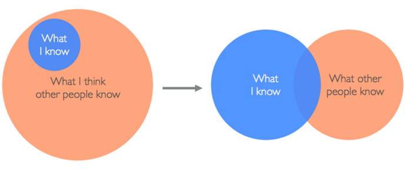

# Imposter Syndrome

## Prepwork

### Learning Goal
+ To learn more about Imposter Syndrome
+ Perspective on what you know and what you don't

#### Resources
Watch:
+ [she++ The Documentary - Good Girl Gone Geek](https://www.youtube.com/watch?v=DqrfPCGo2aQ)
+ [Feel Like You're Faking It? That Might Not Be a Bad Thing](http://lifehacker.com/5928639/feel-like-youre-faking-it-that-might-not-be-a-bad-thing)
+ [RailsConf 2014 - You are Not an Impostor by Nickolas Means (33 mins)](https://www.youtube.com/watch?v=l_Vqp1dPuPo)

Think about this graphic: 

#### HW: SLACK CRYSTAL
+ Reflections on Imposter Syndrome
+ (optional) 1+ of your fears of Ada
+ (optional) 1+ new coding-related learning you've made in the last month
+ (optional) 1+ thing that makes you a great addition to the Ada Family! \<3 (programming aside)

## In Class Discussion

### Learning Goals
+ Recognizing we are all human (fears, strengths, accomplishments)
+ Vulnerability in talking about Imposter Syndrome

### Presentation
+ [Imposter Syndrome](https://docs.google.com/presentation/d/1b2_3v4gn14ArR3p4VEsbS71b8aU9PnEpL3pLCwRoJVI/edit?usp=sharing)

### Activities
+ Share with small group at least one of the following:
  + fears
  + accomplishments
  + things that make you awesome
+ Share out 
+ Open discussion
+ Talk about exposing to others our "behind the scenes" and not letting them only see our "highlight reel"
+ It's ok if you don't have imposter syndrome!

### Challenge
+ Intentionally compliment one another during pair projects
+ Be willing to intentionally share struggles and broken code
