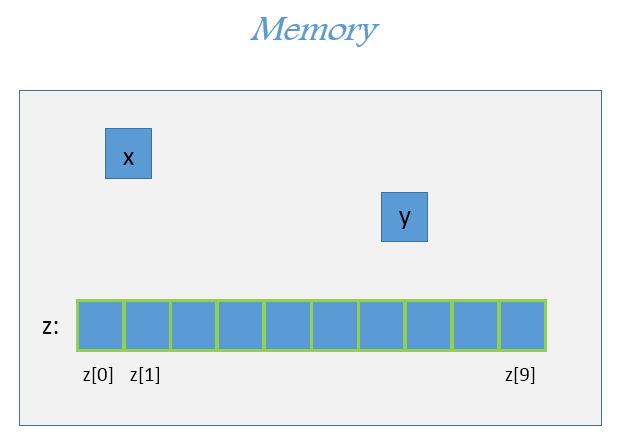
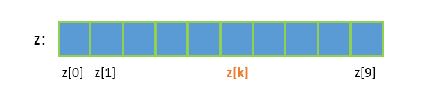

# Array Data Structure & Intro To Algorithmic Efficiency

## Learning Goals

By the end of this lesson you should be able to:

- Explain how arrays in Ruby differ from arrays in lower-level languages and strongly typed languages
- Explain how array algorithms work including
  - Linear Search
  - Binary Search
  - Reversing an Array in place vs creating a new array
- Write methods to perform searches on an array
- Explain how the time and space complexity of an algorithm is measured with Big-O
- Deduce the algorithmic complexity of an algorithm involving an array

## Video Lesson & Exercises

- [Video Lesson]()
- [Slide Deck used in video](https://drive.google.com/file/d/0B__DV26QHsH4eHJqTWttLUdNZk0/view?usp=sharing)</br>
- [**Exercise**: Arrays and efficiency and algorithms](../homeworks.md#arrays-and-efficiency-of-algorithms)

## Introduction

Before computers entered the marketplace companies hired [human computers](https://www.newscientist.com/article/2118526-when-computers-were-human-the-black-women-behind-nasas-success/) to perform calculations.  These mathematicians contributed greatly to finance, science and even the space race.  Over time they were replaced by machines because electronic computers can repeatably process huge blocks of data efficiently without becoming bored.  For example the College Board processes millions of answers on it's SAT & ACT tests performing statistical analysis to identify outlier questions and identifying pass-rates and grades.

A core problem in Computer Science is organizing and performing operations on huge datasets.  How a developer chooses to organize their data strongly impacts performance both in the amount of time operations take to complete and the amount of memory needed to solve them. **Data Structures** provide well-known ways to organize data. Each data structure follows its own set of rules on how the data should get organized. The study of data structures is to understand these rules, the benefits they provide, and the limitations of each data structure. Alongside these governing rules, we are also looking to understand how different common operations like insert, delete and search work on each of these data structures and understand the average and worst case efficiency for the common operations. Knowledge of well-known data structures allows us come up with optimal designs to our real world, practical coding projects. The first data structure we will consider is the **Array data structure**.

## Properties

In traditional and low-level languages **Arrays** or **Array data structures** have the following properties:

1. **Homogeneous data structure**:  All the elements in the array are of the same type. E.g. integer array, character array etc. (Aside: a string is really an array of characters).
1. **Contiguous block of memory**:  Elements in an array are allocated in a block of memory with each element adjacent to the next. This means that the array element at index `i + 1` will always be next to (and at a higher memory address than the) array element at index `i`, where `i` is an index into the array such that `i` is greater than or equal to 0 and less than the length of the array.
1. **Static data structure**:  Once created, the size of an array is fixed throughout its lifetime. This means the array length is fixed once the array is created. We cannot add more items to the array than the array length allows.

### Arrays In Ruby

 Since Ruby is the primary language we will be using at Ada, it is important to note that the **Array class in Ruby** does not implement the Generic **Array data structure**. Let's contrast the above properties of the array data structure with the objects of the Ruby Array class:

1. **Not homogenous**: Objects of the Array class in Ruby are not confined to elements of the same type. Element at one index may be a string, while the next could be an integer. You could even have some intermediate element be `nil`.
1. Array class in Ruby makes no claims about where the objects in the Array will be located in memory. Therefore, the elements in a Ruby Array object are not guaranteed to be in a **contiguous block of memory** with the elements next to each other.
1. The objects of the Ruby Array class can dynamically resize. We can add more elements than the initial size with which we created an Array object in Ruby. Ruby Arrays behave more like **dynamic data structures** rather than **static data structures**.  In other words, an array in Ruby is dynamic in that it can adjust it's size as more elements are added whereas a static array, like in Java or C has a fixed size.

Ruby's interpreter does this by building on top of a static array.  You can read more about how [Ruby's static arrays work on Medium.](https://medium.com/@glayatle/the-magic-of-arrays-in-ruby-59ae2cc9ff8b)

### Example Static Array

Consider the following C code defining two integer variables and an array of integers of size 10:
```c
// Create an integer x and assign it 1
int x = 1;
// Create an integer y and assign it 2
int y = 2;
// An array of only integers in C
int z[10];
```

Here's an imagination of how this may look like in memory:



In the example code and imagination of memory above;

- `x` is a variable of type integer. If integers take up 2 bytes on an example system, then `x` takes 2 bytes in memory.
- `y` is also an integer variable and takes 2 bytes in memory.
- `z` is an array of ten integers. The array `z` is allocated in a contiguous space in memory. This array will take up 10 times the size of integer number of bytes. In our example system, `z` will take 10 × 2 bytes i.e. 20 bytes.

So the `z` array could **only** contain 10 elements and each element **must** be an integer.  With Ruby, an array can contain a variety of elements and each element could be of a different type.  The 1st element might be an integer, while the second a float, and the third another object or even another array.

### Indexing

If there are *n* elements in an integer array `z`, then the first integer value is said to be at index 0, the second element is at index 1 and so on. The last element in the array is at index _n - 1_.

Index | 0 | 1 | 2 | 3 | 4 | 5 | 6 | 7 | 8 | 9
------|---|---|---|---|---|---|---|---|---|---
Value | 8 | 3 | 5 | 2 | 6 | 8 | 4 | 1 | 7 | 2

Because elements in an array are **homogenous**, every element at each index in the array takes up the same amount of space in memory. As we learned earlier, arrays are always **allocated in a contiguous block of memory** such that the array element at index `i` i.e. `array[i]` is always next to and at a lower address than the array element at index `i + 1`. The index `i` into the array has a range such that **0 <= `i` < array's length**.



**Number of operations**: No matter how long the array is, indexing into an array is a really fast operation. The time it takes to index into an array does not depend on the length of the array. This is because the indexing operation leverages the homogenous nature of array elements along with the fact that the array elements are allocated in contiguous blocks of memory.

### Search

**Exercise**: Given an unsorted integer array and its length, devise an algorithm to find if a given value is in the array or not. The algorithm should return `true` if the value is found in the array, and return `false` otherwise. How would you design this algorithm?

**Requirements' gathering**: Before we get to considering the actual steps in an algorithm, let us consider our requirements. Here's what we know:

- Inputs to the method being designed:
  - Integer array
  - Length of the array
  - an integer value to find
- Output from the method:
  - `true`, if value is found in the array
  - `false`, if value is not found in the array

**Aside note**: Requirements' gathering is an important step before we get to algorithm design. This steps helps us confirm that we have captured all of the essentials and there is no ambiguity or misunderstanding in capturing the requirments.

**Approach**: It's a good practice to **always validate or check the input** provided to any method. e.g. if the input is an object, always check if the input object value is `nil`. Similarly, if the input is a string, always check if the string is empty. For the problem at hand, to check if a given value exists in the array, it seems useful to check if the array has at least one element. Otherwise, there are no elements in the array and we can safely conclude that the value we are looking for is not in the array and return `false`.  Once we have checked the input validity, we could start looking for the value in the array. We can do this by comparing each value in the array one by one with the value we are looking for. If we ever find a match, we can immediately return `true`. If we reach the end of the array and no match was found, then we can return `false`. With that, here's what our solution would look like (in pseudo code):
    
```c
bool search(array, value_to_find)
  // i is an index into the first element in the array
  i = 0 
  repeat while i < array's length
    // check if value_to_find is the same as value at index i
    if value_to_find == array[i]
      return true
    // increment i
    i = i + 1
  end loop

  // value_to_find is not in array
  return false
```

**Exercise**: Try the above algorithm on a sample array and sample value to find. e.g. {4, 8, 0, 3, 9} and value to find is 3. You may try the algorithm on any other sample inputs.

**Number of operations**:

<details>
  <summary>With an array of size 5, what situations will require the loop to execute the least times?</summary>
  
  In the best case, the value being sought is in the array at index 0 and the loop will execute only one time before returning `true`.
</details>

<details>
  <summary>With an array of size 5, what situations will require the loop to execute the **most** times?</summary>
  
  In the worst case, the value being sought is not in the array or it is in the last element of the array and the loop will execute a number of times equal to the array's length before returning.  In this case 5 times.
</details>

<details>
  <summary>Now double the size of the array.  What happens to the number of times the loop executes in the best, and worst cases?</summary>

  In the best-case the item being sought is at index 0, and thus the loop executes 1 time and doubling the size of the array does not change this.

  On the other hand, in the worst case doubling the number of elements from 5 to 10, also doubles the number of times the loop executes.
</details>

<details>
  <summary>Assuming the element **is** in the array, on average how many times will the loop execute for a 10 element array?  How about a 20 element array?  How does the average case change as you increase the array's size?</summary>

  On average you would traverse 1/2 way through the array before finding the element being sought.  So for a 10 element array it would take 5 iterations of the loop.  For a 20 element array it would take 10 iterations.  Every time you increase the size of the array the number of iterations would be 1/2 the new size.
</details>

This algorithm is known as a _Linear Search_ because it traverses the array in order searching for `value_to_find` until it is found or the end of the list is encountered.  Notice that the number of iterations of the loop increases proportionally with the size of the list.  So if the array doubles in length, the average and worst-cases scenarios will take roughly twice as long.  We will discuss this more later.

### Minimum and Maximum

**Exercise**: Given an unsorted integer array and its length, devise an algorithm to find the largest integer value is in the array and return it. Following the approach we applied to the search exercise above, use a paper and pencil to gather the requirements, check the input and author the main algorithm.

We begin again, with **gathering the requirements**. Here's what we know:

- Inputs to the method being designed:
  - Integer array
  - Length of the array
- Output from the method:
  - largest integer value in the array

**Question**: What should the algorithm return if the array is empty? This is a requirement that is missing in the specification above. Let's say, we want to return `nil` if the array is empty.

Once we know the expected inputs and outputs it is time to think about our **algorithmic approach**. How do we find the largest value in a list of unsorted integer values? One way is to assume that the first value we see if the largest value. Then, we compare this, so far largest known value with the next value in the array. If we find a value that is greater than the largest known value thus far, we update the largest known value. Once we have reached the end of the array, we have found the largest value in the array. Here's what the pseudo code may look like:

```c
int largest_value(array)
  if array's length == 0
    return nil

  largest_value = array[0]
  i = 1
  while i < array's length
    if array[i] > largest_value
      largest_value = array[i]

    i = i + 1
  end loop

  return largest_value
```

<details>
    <summary> If the array is of length 5, how many times will the loop execute?  Are there some situations where it will run more or less times?
    </summary>
    The comparison inside the loop will happen exactly one less time than the number of elements in the input array. If there are 5 elements in the input array, then the instructions within the loop will run 4 times. If there are 101 elements in the input array, then the instructions within the loop will run 100 times.  

    Because there is no code to break out of the loop early, the number of iterations is **always** equal to the length of the array minus 1.
</details>

<details>
    <summary> Do you notice any similarities in the number of iterations between the `find_largest` and the linear search further above?
    </summary>
    Because this algorithm starts at the beginning and repeats until it reaches the end of the array, it behaves in a very similar pattern with the average and worst-case scenarios of linear search.  Doubling the number of elements causes the number of loop iterations to similarly double.
</details>

**Exercise**: Modify the algorithm above to devise an algorithm that would return the minimum value in the input array. Try this algorithm and the one above on sample input values.

### Sorted Arrays

There are several real world scenarios where we want our data to be ordered in ascending or descending way. Example:

- Sort test scores in descending way
- Sort song playtime in descending way
- Sort identification numbers in ascending way
- Sort names from *A* to *Z* (ascending way) like in the contacts' list on the phone.
- Sort prices in an online search from least to most expensive.

Having the data sorted, simplifies some of the algorithms.

**Question**: If the array is sorted in ascending manner, how would you find the min value, or max value?

<details>
  <summary> Minimum and maximum value in a sorted array</summary>
  The algorithms for finding the minimum and maximum values get simplified if the array is sorted. The **minimum value** in an array that is sorted in an ascending manner will always be the first entry in the array i.e. array[0]. The **maximum value** in an array that is sorted in an ascending manner will always be the last entry in the array i.e. array[*n*-1], where *n* is the length of the array. If you compare the number of steps needed in this approach, with the approach needed for unsorted arrays, you'll find that the algorithm is significantly simpler and faster if the array is sorted.
</details>

You'll learn more about [algorithms to sort an array](Sorting.md) soon. For now, we can already see how having the array sorted makes finding the maximum and minimum value a faster and simplified algorithm. With that, let's consider searching for a value in a sorted array.

### Binary Search

The **binary search** algorithm leverages the sorted property while searching for a value in the array. Instead of comparing with each value in the array from index 0 to *n*-1, (where *n* is the number of elements in the array), we can be more methodical in eliminating where the value we are searching for will not be. We already apply the binary approach in our everyday life. E.g. Let's say we are looking for a word in dictionary, or while looking up a name in the physical phone book. If the word/name starts with 'h', it will likely be in the first half of the book. We open the book to somewhere in the middle, compare the beginnig letter on that page to the word/name we are looking for. After comparing, we can safely eliminate the second half of the book. We keep eliminating half of the remaining pages in each step after repeating the process of opening a page to somewhere in the middle of valid pages and comparing. Unlike [linear search](#search), where after each comparison, one element is eliminated, with binary search, after each comparison, half of the remaining elements are eliminated.

Here's the pseudo code for binary search algorithm. As you read through it, try the algorithm on different set of input arrays and value to find.

```c
bool binary_seach(array, value_to_find)
  if array length == 0
    return false

  low = 0
  // initialized to the index of the first element in the array

  high = array length - 1
  // initialized to the index of the last element in the array

  while low <= high
    mid = (low + high) / 2
    // calculate the index value between low and high

    if array[mid] == value_to_find
      // compare the element at index mid with the value to find
      return true
    else if array[mid] > value_to_find
      // value to find is less than the value at mid index
      // eliminate the second half
      high = mid - 1
    else // array[mid] < value_to_find
      // value to find is greater than the value at mid index
      // eliminate the first half
      low = mid + 1
    end if-else block

  end loop
  // value not found in the array
  return false
```

After each iteration through the loop, we eliminate half of the remaining elements in the array:

1. In the beginning the value we are looking for could be anywhere amongst the *n* elements in the array.
1. After the first iteration, i.e. after one comparison, we eliminate either the top half or the bottom half of the array and the value could be somewhere in the remaining *n*/2 elements in the array.
1. After the second iteration, i.e. after one more comparison, we eliminate half of the remaining values, thereby reducing the scope of where the value could be to *n*/4 elements.

Eventually, one or no elements will be left and we'll exit the loop.

Such a change is known as logarithmic change. As we saw in [essential mathematics](Essential%20Mathematics.md#exponents-and-logarithms), logarithmic change is related to exponential. _Log<sub>2</sub> n_ means at each step the value reduces by half of the remaining.

The main loop in binary seach runs **_log<sub>2</sub> n_** number of times where *n* is the number of elements in the input array.

### Reverse

**Exercise**: Devise an algorithm to reverse the elements in the input array _in-place_. e.g. If the input array is:

Index | 0 | 1 | 2 | 3 | 4
------|---|---|---|---|---
Value | 8 | 3 | 5 | 2 | 6

then, after the algorithm is complete, the same array should look like:

Index | 0 | 1 | 2 | 3 | 4
------|---|---|---|---|---
Value | 6 | 2 | 5 | 3 | 8

**Note**: _in-place_ means the updates should happen in the same location in memory i.e. in the same location as the original array.

#### Reverse solution 1 - using an auxiliary array

One approach to solve this problem would be create a new array of the same size as the input array. We copy over the element at index 0 in the original array over to index *n*-1 in the new array, where *n* is length of the input array. Then we copy over the element at index 1 in the original array over to index *n*-2 in the new array. We keep repeating the process until all values are copied over. Then, we copy the elements from the new array sequentially from index 0 to *n*-1 to the same index in the original array.

Here's what the pseudo code for this approach look like:

```c
// array is the input integer array to the algorithm
if array.length <= 1
  return // nothing to reverse

i = 0
j = array.length - 1

// create a new array of the same size as input array
temp_array = new array of size array.length

while i < array.length
  // copy over the values in input array 
  // into the temp array in reverse order
  temp_array[i] = array[j]
  increment i
  decrement j
end while loop

i = 0
while i < array.length
  // copy over values from the temp array 
  // into the input array
  array[i] = temp_array[i]
end while loop

// array is reversed
```

You'll notice that the solution above has two `while` loops in addition to a set of single line code instructions. The two while loops are one after the other.

- The first while loop copies over each of the elements in the input array into a new array in reverse order of their position. The means, if there are 100 elements in the input array, then the loop will execute 100 times. If there are 700,000 elements in the input array, then the loop will execute 700,000 times and so on. Therefore, we can conclude that in the instructions in the first loop run as many times as the number of elements in the input array.
- The second loop copies for each element of the temporary array back into the input array. So, the second loop will also run as many times as the number of elements in the input array.

<details>
  <summary>What happens to the number of loop iterations if you go from 100 nodes to 200?  What about from 700,000 to 1,400,000?</summary>
  With 200 nodes, the first loop will execute 100 times, and the second loop 100 times for a total of 200 iterations.  When the array becomes 200, the loops will execute 200 and 200 times, doubling when the length of the array doubles.  The same applies from 700K to 1.4 million elements.  This is a very similar effect to linear search.
</details>

#### Reverse solution 2 - using swap

Is there any algorithmic approach where we can avoid creating an additional array of the same size as the input array? In order to reverse the elements in the array, we could consider swapping the element at index 0 with the element at index *n*-1, where *n* is the number of elements in the input array. Then, we could swap the element at index *n*-2 with the element at index 1, and so on.
Here's what the pseudo code for this approach would look like:

```c
// array is the input integer array to the algorithm

if array.length <= 1
  return // nothing to reverse

i = 0
j = array.length - 1

while i < j
  // swap values at i and j
  temp = array[i]
  array[i] = array[j]
  array[j] = temp

  increment i
  decrement j
end while
```

You'll notice that the loop in this approach will run roughly half the number of times as the number of elements in the input array.

<details>
  <summary>What about the trend, what happens to this algorithm if you double the number of elements in the array?</summary>
  The reverse in place method above, still doubles the number of iterations when you double the number of elements in the array.  In other words, it faster than the 1st solution, but scales similarly.
</details>
