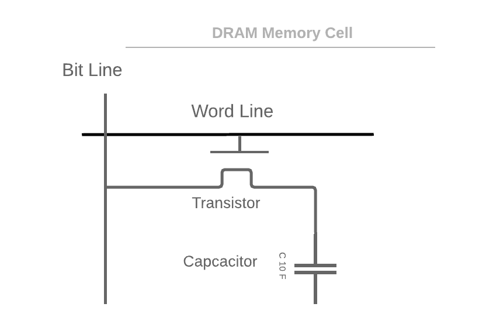

# Introduction to Binary & Memory

## Prerequisites

Before this first CS Fundamentals lesson, please read, view and complete the exercises on the following items:

- [Essential Mathematics for Software Engineers](https://github.com/Ada-Developers-Academy/textbook-curriculum/blob/master/04-cs-fundamentals/classroom/Essential%20Mathematics.md)
- [Computer Data Basics](https://docs.google.com/document/d/1g-Dxn1rVTChBs9ZZSOgmohjP_RoWNyPJTE-m_n35aZ0/edit)
- [Video: Understand how memory addressing works](https://www.youtube.com/watch?v=F0Ri2TpRBBg) by Prof. Abelardo Pardo, University of Sydney
If you have any questions, please email or slack your instructor.

## Learning Goals

By the end of this lesson you should be able to:

- Explain the core parts of a computer and what they do
- Describe the structure of a computer
- Compare binary numbers to decimal numbers
- Convert between binary and decimal numbers
- Explain why computers use binary numbers
- Algorithm to convert from binary to decimal and vice versa
- Give a high-level overview of memory organization on computers

## Typical Computer Structure

A _Computer_ is a device for storing and processing data according to a series of commands or instructions provided to it.  It is normally structured with a Central Processing Unit, system memory and an I/O bus, which is often called a _motherboard_ connecting them to a variety of peripheral devices (mice, keyboards, etc).  

| Term 	| Definition 	|
|---	|---	|
| CPU 	| The **C**entral **P**rocessing **U**nit of a computer.  This is the main processor which executes program instructions, performs arithmetic and coordinates the other components of a computer. 	|
| Peripherals 	| External components to a computer which can provide input and/or output.  An example is a monitor or keyboard. 	|
| MAR 	| The Memory Address Register is where the CPU stores an address of an instructor or data in memory.  When data is transferred to or from RAM this is the address used by the CPU.  |
| MDR | The Memory Data Register is where the CPU stores an information while it is transferred to or from RAM.  |
| IR 	| The Instruction Register is where the CPU stores the current command to execute.  |
| PC 	| The Program Counter is where the CPU stores the address of the next instruction to execute.  |
| Cache 	| A type of very fast memory, close to or on the CPU chip which is used to store information the CPU will likely need to access soon.  It can also be a term for storing information likely to be used in a location which can be quickly accessed.  This technique of pre-staging information likely to be used in proximate locations is called _caching_. 	|
| Accumulator 	| The accumulator is used to store an input or output operand during execution of the instructions. Operand is the data to be operated by the computer. 	|
| Register 	| A type of very fast memory, close to or on the CPU chip which is used to store information the CPU will likely need to access soon.  It can also be a term for storing information likely to be used in a location which can be quickly accessed.  This technique of pre-staging information likely to be used in proximate locations is called _caching_. 	|

## Electical Circuits

This may amaze you but modern computers use electricity to function.  Power is routed through a tiny circuits and capcacitors.  To signal particular numeric values in the circuitry the computer uses amount of electrical charge.  For example in a memory cell, the computer uses a capcacitor which can hold an electrical charge over time.  If the capacitor has a low amount of charge, it is considered a 0, or off.  If the capacitor has a high amount of charge it is considered 1 or on.

<!-- Original Image at https://www.lucidchart.com/invitations/accept/95d52db7-653f-442c-afc6-6239c84c3090 -->

For example in the image above, if electricity is provided via the Bit Line, the capacitor will charge up until it can hold a certain voltage.  When the computer wants to read the value the transistor can connect the word line and electricity will flow from the capacitor to the Word Line.  If the capacitor is empty, or close to it, a zero is registered, if the capacitor provides an electrical charge the value is considered a one.  This is actually a simplified description of how the RAM in your laptop functions.

By collecting groups of these 0 or 1 values the computer can represent numbers by using base 2 or binary numbers.

## So What Are Binary Numbers

Our number system is the _decimal_ system where there are 10 symbols 0-9, and each digit represents a value (0-9) times a power of 10.

For Example: 135 = (5 * 100) + (3 * 101) + (5 * 102)

Binary numbers work off powers of 2 with two symbols 0 and 1.  A binary number is one or more digits composed of only 0s and 1s, each digit representing a power of two.

For Example: 11012 = (1 * 20) + (0 * 21) + (1 * 22) + (1 * 23)

Because the electrical circuits and cells in a modern computer can only hold 2 values, binary becomes a natural base computer numbers.

### A Note On Subscripts

When we use subscripts like the 2 in 11012 to indicate that the number is a binary number.  Likewise we could use 10 as a subscript for a decimal number. 13510

## Bits & Bytes

Computers organize binary digits into units called _Bits_.  A _Bit_ is one binary digit, either a 0 or a 1.  Each _memory cell_ is an electronic circuit which stores one bit of data.  However one bit by it's lonesome isn't terribly useful, so the memory cells are grouped into units of 8, called a _Byte_.  In the early days of computers the smallest unit you could work with on a computer was a byte, but in modern computers bytes are too small, and so the smallest individual unit of memory that you can work with is called a _word_.  That means at each memory address is one word of data, which could be multiple bytes in size.  On a 32-bit platform a word is usually 4 bytes in size (32 bits).  

From there bytes are gouped into larger and larger groups.  You may have heard about _Kilobytes_, _Megabytes_, and _Terabytes_ etc.  A KiloByte is 210 Bytes or 1024.  A Megabyte is 220 Bytes, and so on. 

When you see a system labeled 32-bit or 64-bit, that refers to the number of individual addresses in memory.  So a 64-bit system can have more memory to store information, there are 264 different memory addresses and for a 32-bit system there would be 232.  Often the same value indicates the word size or the largest integer the computer can process in a single instruction.  So a 32-but system would usually have integers composed of 32-bits.  These are often, but not always the same.

Interestingly as people research [quantum computing](https://www.newscientist.com/article/dn17575-ditching-binary-will-make-quantum-computers-more-powerful/) we might move to a base-5 or more system each qubits can represent multiple states.  

## Computer Organization

You can think of a modern computer as having one central processing unit (CPU) which does the calculations and manages the sytem, system memory (RAM) and an I/O Bus which connects the computer to other devices, hard drives, printers, network etc.

As programs run information is pulled from memory across a set of wires known as the _system bus_ into storage spaces on the CPU known as registers.  The CPU will perform operations on data in the registers and transfer data back across the system bus to memory.  It will also use the bus to communicate to other components.  The transfer of information to and from RAM is relatively fast, but saving information to long-term storage (think hard drives, disks, DVDs etc), is orders of magnitude slower.

Naturally things are a lot more complicated with each computer having numerous "cores" (CPUs), different levels of memory and a large variety of devices.

  
If a system is 16-bit how many addressible memory locations can it have?

  216 = 65536

## Former Slide Deck

- Former Slide Deck used in class 
<a href="https://drive.google.com/file/d/0B__DV26QHsH4YzhFWFVnbEp2akU/view?usp=sharing">A brief introduction to Binary and Memory</a> is licensed under a <a rel="license" href="http://creativecommons.org/licenses/by-nc-nd/4.0/">Creative Commons Attribution-NonCommercial-NoDerivatives 4.0 International License</a>. 
 

## Resources

- [Geeks for Geeks Representing a Binary Number](https://www.geeksforgeeks.org/binary-representation-of-a-given-number/)
- [Khan Academy: Binary Numbers & AP CS](https://www.khanacademy.org/computing/ap-computer-science-principles/computers-101/digital-data-representation/a/bits-and-binary)
- [Converting Base 2 to Base 10 (video)](https://www.youtube.com/watch?v=jdfrwxUkXOk)