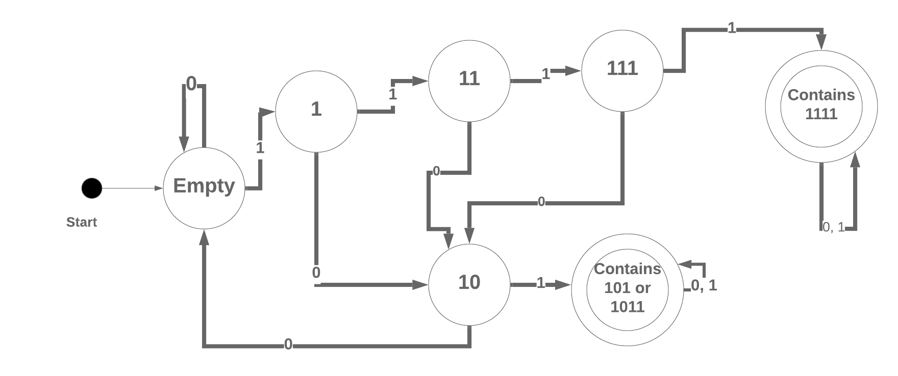

# Finite State Machines

People have been struggling with the theory of computation long before computers existed.  Mathematics is a powerful tool and mathematicians have long sought to answer, "What can I compute?"  There are problems that **cannot** be solved computationally and there are problems we cannot solve in a reasonable (non-exponential) amount of time.

The study of this field is called [**Automata Theory**](https://en.wikipedia.org/wiki/Automata_theory).  It's really about what can and cannot be computed and how to represent it.  

We will only touch on the 1st level of Automata theory, **Finite State Machines** (FSMs).  This is one of several ways to model computation, and a good place to start.

## Learning Goals

By the end of this lesson you should be able to:

- Explain what a Finite State Machine (FSM) is
- Identify the languages a FSM can solve
- Design a FSM to solve for a specific language pattern
- Explain what kinds of problems a DFA cannot solve

## What is a Finite State Machine

A Finite State Machine is a relatively simple model of computation.  An FSA is a model of a machine which can be in exactly *one* of a limited (i.e. finite) set of states.  The machine can take in input which causes the machine to change from one state to another.  Moving from one state to another is called a **transition**.  An FSA always has one state in which it starts and one or more states which are valid end-points.  If a FSA takes in input and ends at a valid end-point, the input is considered valid.  Otherwise the input is considered invalid and rejected.  

Below is a state machine that takes in input consisting of zeros (0) or ones (1), and is satisfied if the input ends with a zero.

The machine starts in state **A** and if it receives an input of `0` it will move to state **B**.  If the machine is in state **A** and receives a `1` it will remain in state **A**.  If the machine is in state **B** and receives a `1` it will move to state **A**.  If it is in state **B**, and recieves a `0` it will remain in state **B**.  State **B** is an **End-State** which is indicated by the two circles around it.  

So given the input:  `1010` the FSM will end in state **B** and accept the input.  If the input was `1011` the machine will end in state **A** and not accept the input.  

It's important to note, **a Finite State Machine can only remember it's current state**.  An FSM does not remember previous actions and only consideres it's *current* state and the input when deciding which state to transition into.  This is a limiting factor as we shall see, but it makes the system easier to model, test and understand.

### Ok That's What an FSM is, why learn about'em

Good question!

Finite State Machines are used in a wide variety of applications including:

- The design and verification of computer circuits
- The design of communication protocols
- Processing text
- Verifying Regular Expressions
- Developing compilers and interpreters like the Ruby interpreter
- Modeling simple patterns of events, think of the checkout process in bEtsy

FSAs can make an effective tool to help design systems which have a limited number of states, like authenticating into a website, or processing a credit card purchase.

When you are building a system it can be a very good idea to look at the problem and see if it can be modeled as a FSM.  By doing so you can acquire a more solid understanding of the application and more easily track and identify how the application or feature can flow.

## Definitions

There are several terms we use when talking about Finite Automata.  

Term | Symbol | Definition
--- | --- | ---
Alphabet | &Sigma; | The list of symbols the machine can take as input.  This must be a finite list.
States | _S_ | The list of states the FSM can be in.
Start State | S0 | The single starting state for the FSM.
Transition Function | 	&Delta; | A function which takes in the current state, the input and returns the next FSM's next state.

## Writing a State Machine for an Input Pattern

### Example 1

If we have an alphabet  &Sigma; consisting of {0, 1}, and need to design an FSM to determine of the input has the pattern 1111, 1011 or 101?

### Example 2

Now try draw a FSM which determines if 1111, 1011, 101 are contained in the input string.  You can assume the same alphabet.  

    
Solution
  
    
    You can find the solution [here](fsm-images/fsm-example2.png)
  

### A Real-Life Example

Consider a tennis game, there are a finite number of states a tennis game can be in and for each round two possible results, the server wins, or the opponent wins.

Knowing the rules of tennis doesn't matter, at the start the state is `Love` (score 0 for both), and if the server wins, the state becomes `15 / Love`.  If the server wins again the state becomes `30 / Love`.  Then if the opponent wins the state becomes `30 / 15`.  If the server wins twice more the state will go to `40 / 15` and then `Server Wins`.  

Take a look at the state diagram, even with only 2 possible inputs at each state and a limited number of states, as the number of states increases the machine grows in complexity.  

## A State Machine in a Table

## Summary

## Further Concepts

### Nondeterministic Finite State Machines

### Push Down Automata

### Turing Machines

### 

## Exercises

## Resources

- [Free Stamford Course on Finite Automata]()
- [State Machine Design pattern —Part 1: When, Why & How](https://medium.com/datadriveninvestor/state-machine-design-pattern-why-how-example-through-spring-state-machine-part-1-f13872d68c2d)
- [freeCodeCamp - Understanding State Machines](https://www.freecodecamp.org/news/state-machines-basics-of-computer-science-d42855debc66/)
