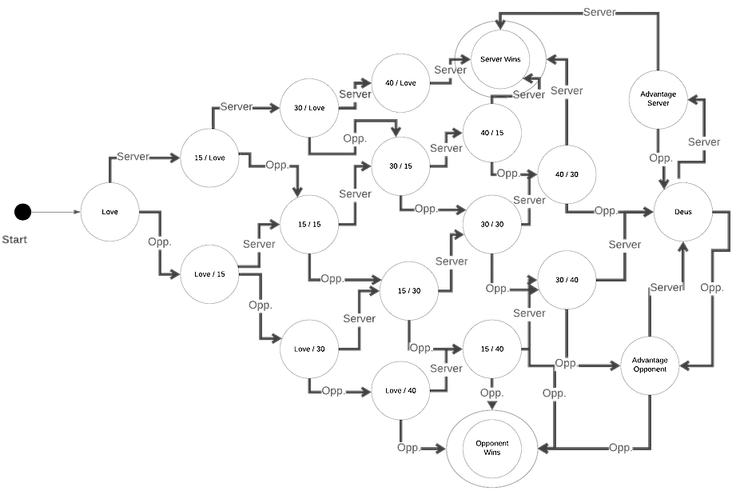
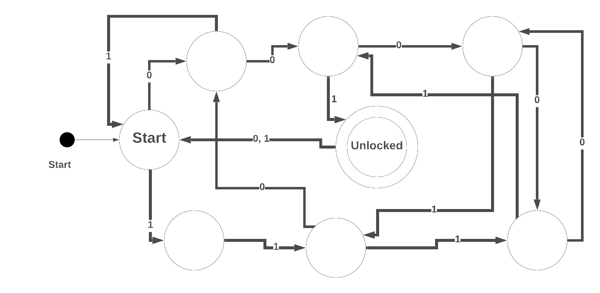

# Finite State Machines

People have been struggling with the theory of computation long before computers existed.  Mathematics is a powerful tool and mathematicians have long sought to answer, "What can I compute?"  There are problems that **cannot** be solved computationally and there are problems we cannot solve in a reasonable (non-exponential) amount of time.

The study of this field is called [**Automata Theory**](https://en.wikipedia.org/wiki/Automata_theory).  It's really about what can and cannot be computed and how to represent it.  If you are curious for an example of what **cannot** be computed, a good example is the [_halting problem_](https://www.wired.com/2014/02/halting-problem/), which states that you cannot write a program which will analyze another program and tell you if it will **ever** finish.

We will only touch on the 1st level of Automata theory, **Finite State Machines** (FSMs).  This is one of several ways to model computation, and a good place to start.

## Learning Goals

By the end of this lesson you should be able to:

- Explain what a Finite State Machine (FSM) is
- Identify the languages a FSM can solve
- Design a FSM to solve for a specific language pattern
- Explain what kinds of problems a FSM cannot solve

## What is a Finite State Machine

A Finite State Machine is a relatively simple model of computation.  An FSA is a model of a machine which can be in exactly *one* of a limited (i.e. finite) set of states.  The machine can take in input which causes the machine to change from one state to another.  Moving from one state to another is called a **transition**.  An FSA always has one state in which it starts and one or more states which are valid end-points.  If a FSA takes in input and ends at a valid end-point, the input is considered accepted.  Otherwise the input is considered invalid and rejected.  

Below is a state machine that takes in input consisting of zeros (0) or ones (1), and is satisfied if the input ends with a zero.

The machine starts in state **A** and if it receives an input of `0` it will move to state **B**.  If the machine is in state **A** and receives a `1` it will remain in state **A**.  If the machine is in state **B** and receives a `1` it will move to state **A**.  If it is in state **B**, and recieves a `0` it will remain in state **B**.  State **B** is an **End-State** which is indicated by the two circles around it.  

So given the input:  `1010` the FSM will end in state **B** and accept the input.  If the input was `1011` the machine will end in state **A** and not accept the input.  

It's important to note, **a Finite State Machine can only remember it's current state**.  An FSM does not remember previous actions and only consideres it's *current* state and the input when deciding which state to transition into.  This is a limiting factor as we shall see, but it makes the system easier to model, test and understand.

### Ok That's What an FSM is, why learn about'em

Good question!

Finite State Machines are used in a wide variety of applications including:

- The design and verification of computer circuits
- The design of communication protocols
- Processing text
- Verifying Regular Expressions
- Developing compilers and interpreters like the Ruby interpreter
- Modeling simple patterns of events, think of the checkout process in bEtsy

FSAs can make an effective tool to help design systems which have a limited number of states, like authenticating into a website, or processing a credit card purchase.

When you are building a system it can be a very good idea to look at the problem and see if it can be modeled as a FSM.  By doing so you can acquire a more solid understanding of the application and more easily track and identify how the application or feature can flow.

## Definitions

There are several terms we use when talking about Finite Automata.  

Term | Symbol | Definition
--- | --- | ---
Alphabet | Σ | The list of symbols the machine can take as input.  This must be a finite list.
States | _S_ | The list of states the FSM can be in.
Start State | S0 | The single starting state for the FSM.
Transition Function | 	&Delta; | A function which takes in the current state, the input and returns the next FSM's next state.

## Writing a State Machine for an Input Pattern

### Example 1

If we have an alphabet  &Sigma; consisting of {0, 1}, and need to design an FSM to determine of the input has the pattern 1111, 1011 or 101?

.

The trick in this case is to look at the current largest suffix of one of the string we've seen so far at each state which matches one of the patterns we are trying to match.

### Example 2

Now try draw a FSM which determines if 1111, 1011, 101 are contained in the input string.  You can assume the same alphabet.  

When you finish checkout our solution [solution](fsm-images/fsm-example2.png).

### A Real-Life Example

Consider a tennis game, there are a finite number of states a tennis game can be in and for each round two possible results, the server wins, or the opponent wins.

Knowing the rules of tennis doesn't matter, at the start the state is `Love` (score 0 for both), and if the server wins, the state becomes `15 / Love`.  If the server wins again the state becomes `30 / Love`.  Then if the opponent wins the state becomes `30 / 15`.  If the server wins twice more the state will go to `40 / 15` and then `Server Wins`.  

Take a look at the state diagram, even with only 2 possible inputs at each state and a limited number of states, as the number of states increases the machine grows in complexity.  

## A State Machine in a Table

You can also represent an FSM in a table format.  The diagram and chart below illustrate the same FSM.  The left column lists the starting state and subsequent columns list the new state for the given input.  This is called a **transition table**.

Current State | Transition Given a 1 | Transition Given a 0
--- | --- | ---
A | A | B
B | A | B

## Exercises

1. Given an alphabet of {a, b} design a FSM which will determine if the input contains `aabaa`.

1. Given an alphabet of {A, C, D, G, O, T}  design a FSM which will accepts CAT or DOG alone.

1. Given an alphabet of {a, b}, design an FSM which will determine if the input has an even number of `b`s.

1. Given an alphabet of {BCOTY} construct an FSM which accepts CYBOT followed by any number of characters.  

1. Given an alphabet of {a, b} design a FSM which will accept an only inputs with an equal number of `a`s and `b`s.

1. Given an alphabet of {0, 1} design an FSM which will accept any input which does not contain `100`.

1. Chris has decided to go into the smart-lock business with a keypad consisting of only 1s and 0s, along with a reset button.  He's provided the following FSM diagram to show how his lock works.
  

- What is the shortest combination of keys which will open the lock?
- Is there a longest sequence of keys which will open the lock without triggering an earlier opening?
- Suppose Chris wanted to design a lock that required exactly 10 entries to open.  What is the minimum number of states that would be required counting the start state?

8. Translate the FSM below into a table format.  You can assume things start at home.  
  

9. A farm road and a highway intersect as shown below.  Detectors are placed along the farmroad to signal a vehicle is waiting to cross the highway. The traffic light controller should operate as follows. As long as no vehicle is detected on the farmroad, the lights should remain green in the highway direction. If a vehicle is detected on the farmroad, the highway lights should change from yellow to red, allowing the farmroad lights to become green. The farmroad lights stay green only as long as a vehicle is detected on the farmroad and never longer than a set interval to allow the traffic to flow along the highway. If these conditions are met, the farmroad lights change from green to yellow to red, allowing the highway lights to return to green. Even if vehicles are waiting to cross the highway, the highway should remain green for a set interval.  Design a FSM for this problem.
  States

  Current State | State symbols
  --- | --- 
  Farm lights Red - Highway Green | FR - HG
  Farm lights Yellow - Highway Red | FY - HR
  Farm lights Green - Highway Red | FG - HR
  Farm lights Red - Highway Yellow | FR - HY

  Inputs (Alphabet)

  Input | State symbols
  --- | --- 
  Farm Sensor - Timer Expired | FS - TEX
  Farm Sensor - Timer Running | FS - TR
  No Farm Sensor - Timer Running | NFS - TR
  No Farm Sensor - Timer Expired | NFS - TEX

**Bonus**

Can you write a FSM which will determine if given the alphabet {a, b} that the input has an even number of the letter `a` or `b`?

## Summary

A Finite State Machine is a mathematical way to model computation.  The model consists of a limited number of states and a finite alphabet of possible input characters.  The machine transitions from state to state as it reads in each item of input.  An FSM does not remember previous input, but only the current state it is in.  

FSMs are used in a variety of applications and can be an effective way to model and understand systems which consist of a limited number of potential states.  

## Further Concepts

An FSM isn't a complete computational system.  Full computers can **remember** more than one particular value.  To model this mathematicains have developed additional systems which build on FSMs.

### Nondeterministic Finite State Machines

A nondeterministic finite state machine is a machine which can take multiple paths given a specific input.  The machine will accept input if there is *at least* one path it can follow to accept the input.  The FSMs we've been using are called Deterministic Finite State Machines as they can only take one path for each given input.  It's been shown that you can build a deterministic finite state machine that is equivalent to a nondeterministic state machine.

### Pushdown Automata

A Pushdown Automata is a finite state machine that also has access to a **stack**.  Because it can access the stack to remember past inputs or states a Pushdown Automata is more powerful than a finite state machine.

### Turing Machines

[Alan Turing](https://en.wikipedia.org/wiki/Alan_Turing) is one of the father's of computer Science and developed this "complete" model of computation.  In a Turing machine the machine has an infinitely long "tape" of cells.  It can move to individual cells, read and write the value at each cell.  With this the machine has infinite storage capcacity.  In real life no machine has infinite storage, but modern computer systems usually have much more than is needed, and a Turing Machine has been shown to be able to compute an answer to any problem a computer can solve (speed is another issue).  Thus the term **Turing Complete** is used to indicate a programming language that can accomplish all tasks that a computer can accomplish, if you ignore the limitations of memory.  

Turing machines were used in mathematical proofs to illustrate a class of problems which are not computable.  In other words, you cannot write a computer program to solve them in all cases.  A classic example is that you cannot write a program which will read in another program and predict with perfect accuracy if that program will ever end (no infinite loops).

## Resources

- [Free Stamford Course on Finite Automata]()
- [State Machine Design pattern —Part 1: When, Why & How](https://medium.com/datadriveninvestor/state-machine-design-pattern-why-how-example-through-spring-state-machine-part-1-f13872d68c2d)
- [freeCodeCamp - Understanding State Machines](https://www.freecodecamp.org/news/state-machines-basics-of-computer-science-d42855debc66/)

## References

Selected questions were taken from:

- [Professor Leopoldo Silva's Book](http://www2.elo.utfsm.cl/~lsb/elo211/aplicaciones/katz/chapter8/chapter08.doc5.html)
- [Professor Tom Mitchel's course at CMU](http://www.cs.cmu.edu/~tom7/211/fsm1-answers.html)