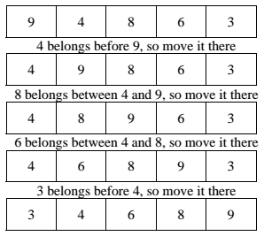

# Sorting and Efficiency

## Presentation
+ [Sorting and Efficiency](https://drive.google.com/open?id=1elJdFGo1ZcEI8rcmWgbSUFS33b-DoB2z_cA1yRaM1ec)

## Assignment
+ [AdaGold/big-o](https://github.com/AdaGold/big-o)

## Notes

### Selection Sort
The selection sort works by selecting the smallest unsorted item remaining in the list, and then swapping it with the item in the next position to be filled.

Selection sort has a complexity of O(n^2).

### Insertion Sort
The insertion sort works by inserting each item into its proper place in a final list. The simplest implementation of this requires two list structures - the source list and the list into which sorted items are inserted. To save memory, most implementations use an in-place sort that works by moving the current item past the already sorted items and repeatedly swapping it with the preceding item until it is in place.

The insertion sort has a complexity of O(n^2).

### Algorithm Efficiency
An _efficient algorithm_ is one that runs as fast as possible and requires as little computer memory as possible. You often have to settle for a trade-off between these two goals, compromising memory to make things faster, or speed to use less memory.

There are three ways of expressing performance: Best-case, worst-case and average case.

Consider the task of performing a sequential search on some sort of list, i.e. an array. Best-case would be that your target value was found in the first element. Worst-case would be that the value was not there at all (so all elements would have to be compared and tested, including the last). Average-case would be mid-way between the two.

*In Computer Science, we care about worst case, which we call Big-O.*

### Order Breakdown
- *O(1)* is the no-growth curve. An O(1) algorithm's performance is conceptually independent of the size of the data set on which it operates. Array element access is O(1).
- *O(log N)* means that the data set size does affect the efficiency of the algorithm, but only in a logarithmic fashion. The key thing to note is that log (base 2) N grows slowly. Doubling N has a relatively small effect. Logarithmic curves flatten out nicely.
- *O(N)* says that the algorithm's performance is directly proportional to the size of the data set being processed. Scanning an array takes O(N) time.
- *O(N^2)* says that the algorithm's performance is proportional to the square of the data set size. This happens when the algorithm processes each element of a set, and that processing requires another pass through the set.

### Nuances
- Usually when an algorithm's growth rate is a mix of orders, the dominant order is shown, and the rest are dropped. O(N^2 + N) would be shortened to O(N^2).
- Likewise, constants are dropped. Constants only shift our graph slightly, but do not affect the overall look of the graph by much. O(2N) is shortened to O(N). O(1⁄2 N) is shortened to O(N).

### Complexity Analogy
This stackoverflow answer does a great job in illustrating Big O notation for algorithm complexity. The author has a use case related to phone books for each level of complexity:

- *O(1)* – Find a random person’s phone number by flipping open any page in the phone book.
- *O(log n)* – Given a person’s name, find the corresponding phone number (This is a binary search for a person’s phone number).
- *O(n)* – Find all people whose phone numbers contain the digit “5″.
- *O(n log n)* – Sort a phone book’s pages by looking at the first name on each page.
